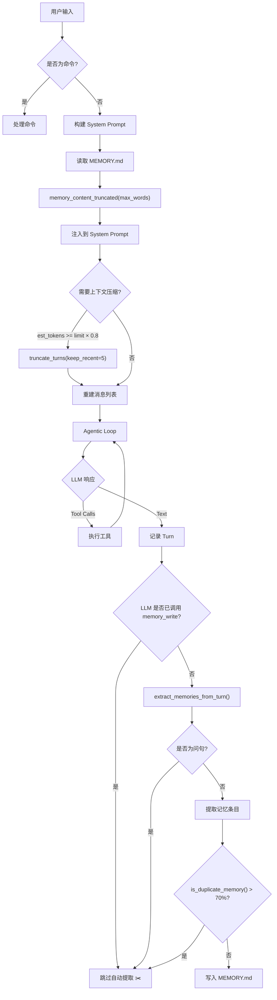
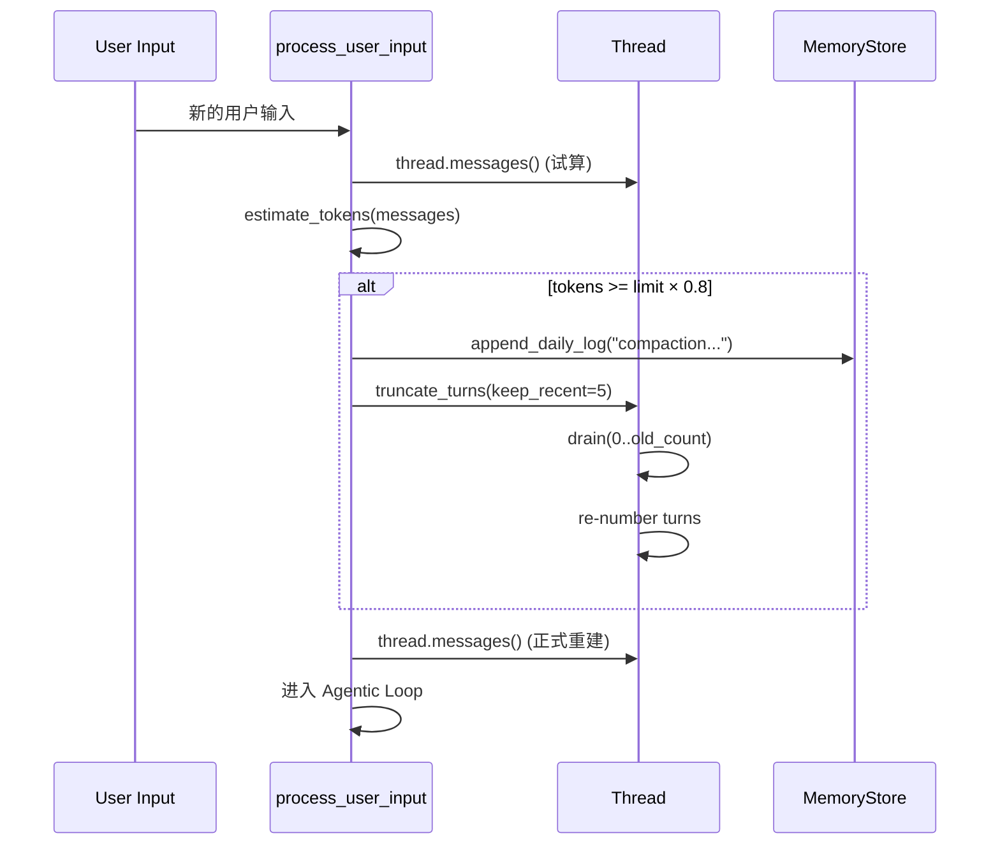

# Mini-Agent-Compress 优化指导文档

> 本文档详细描述 `mini-agent-compress` 相对于 `mini-agent-memory` 的五项核心优化，
> 包括设计思路、实现细节、代码映射关系，以及与 IronClaw 主项目的对应关系。

---

## 目录

1. [优化总览](#1-优化总览)
2. [记忆去重（Similarity-Based Scoring）](#2-记忆去重similarity-based-scoring)
3. [提取质量（Question Filtering + Response Analysis）](#3-提取质量question-filtering--response-analysis)
4. [Prompt Token 控制（MEMORY.md 截断）](#4-prompt-token-控制memorymd-截断)
5. [上下文压缩（Auto-Truncate Turns）](#5-上下文压缩auto-truncate-turns)
6. [智能跳过（LLM 已写入则跳过自动提取）](#6-智能跳过llm-已写入则跳过自动提取)
7. [配置参数一览](#7-配置参数一览)
8. [IronClaw 映射关系](#8-ironclaw-映射关系)
9. [测试覆盖](#9-测试覆盖)

---

## 1. 优化总览

### 问题背景

`mini-agent-memory` 在引入长期记忆后暴露了以下问题：

| 问题 | 表现 | 影响 |
|------|------|------|
| 记忆重复写入 | "favorite color is blue" 被写入 25 次 | MEMORY.md 膨胀，信噪比下降 |
| 提取质量差 | 问句 "What languages do I prefer?" 被存为偏好 | 错误记忆污染上下文 |
| Prompt Token 膨胀 | MEMORY.md 全量注入 system prompt | Token 成本线性增长，可能超限 |
| 上下文无限增长 | 对话 Turn 只增不减 | 长对话后 LLM 请求超时或截断 |
| 双重写入 | LLM 调用 memory_write + 自动提取同时写入 | 同一事实写入两次 |

### 优化对照表

```
mini-agent-memory                    mini-agent-compress
─────────────────────────────────    ─────────────────────────────────────
No memory deduplication         →    Similarity-based dedup before append
Questions stored as memories    →    Question filtering in extraction
Unbounded MEMORY.md injection   →    Truncated to max_memory_words
No context compaction           →    ContextMonitor + truncation compaction
LLM + auto both write same      →    Skip auto-extract if LLM wrote memory
No prompt guidance on dedup     →    System prompt tells LLM to skip dupes
```

### 数据流全景



---

## 2. 记忆去重（Similarity-Based Scoring）

### 设计思路

在 IronClaw 中，记忆去重依赖数据库层的 chunk-based FTS + vector similarity。
本项目采用轻量级的**关键词重叠评分**作为近似方案：提取新条目的"有意义词汇"，
与 MEMORY.md 中每条已有记录计算重叠比例，超过 70% 则判定为重复。

### 核心算法

```
similarity_score = |new_words ∩ existing_words| / |new_words|
```

其中 `new_words` 是经过停用词过滤后的有意义词汇集合（长度 > 2 的非停用词）。

### 实现文件

**`host/src/memory.rs`**

#### 入口方法：`append_memory()`

```rust
pub fn append_memory(&self, content: &str) -> Result<(), String> {
    let existing = self.memory_content();
    if self.is_duplicate_memory(content, &existing) {
        info!("🧠 Skipping duplicate memory (already exists)");
        return Ok(());
    }
    let entry = format!("\n- {}", content);
    self.append(paths::MEMORY, &entry)
}
```

**流程**：
1. 读取当前 MEMORY.md 全文
2. 调用 `is_duplicate_memory()` 检查是否重复
3. 重复则跳过（返回 Ok），否则追加

#### 重复检测：`is_duplicate_memory()`

```rust
fn is_duplicate_memory(&self, new_entry: &str, existing_content: &str) -> bool {
    let new_words = Self::significant_words(new_entry);
    for line in existing_content.lines() {
        let line = line.trim();
        if !line.starts_with("- ") && !line.starts_with("* ") { continue; }
        let existing_entry = &line[2..];
        let score = Self::similarity_score(&new_words, existing_entry);
        if score > 0.70 { return true; }
    }
    false
}
```

**逻辑**：
- 只对以 `- ` 或 `* ` 开头的行（即记忆条目）进行比较
- 阈值 `0.70`：70% 以上的关键词重叠即判定为重复

#### 关键词提取：`significant_words()`

```rust
fn significant_words(text: &str) -> Vec<String> {
    const STOP_WORDS: &[&str] = &[
        "the", "a", "an", "is", "are", /* ... 100+ 停用词 ... */
        "user", "asked", "remember", "preference", "info", "note",
    ];
    text.to_lowercase()
        .split(|c: char| !c.is_alphanumeric())
        .filter(|w| w.len() > 2 && !STOP_WORDS.contains(w))
        .map(|w| w.to_string())
        .collect()
}
```

**特点**：
- 停用词表包含通用英语停用词 + 记忆特定词（`user`, `asked`, `remember` 等）
- 过滤长度 ≤ 2 的词（如 "is", "at", "my"）
- 全部转小写，确保大小写不敏感

#### 相似度计算：`similarity_score()`

```rust
fn similarity_score(new_words: &[String], existing_text: &str) -> f64 {
    let existing_lower = existing_text.to_lowercase();
    let matches = new_words.iter()
        .filter(|w| existing_lower.contains(w.as_str()))
        .count();
    matches as f64 / new_words.len() as f64
}
```

**注意**：使用 `contains()` 而非精确匹配，这意味着 "rust" 会匹配 "rusty"。
这是有意为之的宽松匹配策略，宁可多去重也不要重复写入。

### IronClaw 对应

| 本项目 | IronClaw |
|--------|----------|
| `significant_words()` | chunk-based FTS tokenizer |
| `similarity_score()` | vector embedding cosine similarity |
| 70% 阈值 | RRF (Reciprocal Rank Fusion) 融合分数 |
| 逐行扫描 | 数据库索引查询 |

---

## 3. 提取质量（Question Filtering + Response Analysis）

### 设计思路

`mini-agent-memory` 的 `extract_memories_from_turn()` 存在两个缺陷：
1. **问句误提取**：`"What programming languages do I prefer?"` 包含 "i prefer"，
   被错误地存为 `"User preference: What programming languages do I prefer?"`
2. **忽略 LLM 响应**：`_response` 参数未使用，丢失了 LLM 确认存储的信号

### 实现文件

**`host/src/memory.rs`** — `extract_memories_from_turn()`

#### 改进 1：问句过滤

```rust
let is_question = user_input.trim().ends_with('?')
    || lower_input.starts_with("what ")
    || lower_input.starts_with("who ")
    || lower_input.starts_with("where ")
    || lower_input.starts_with("when ")
    || lower_input.starts_with("how ")
    || lower_input.starts_with("why ")
    || lower_input.starts_with("do you ")
    || lower_input.starts_with("can you ")
    || lower_input.starts_with("could you ");

if is_question {
    return memories;  // 直接返回空列表
}
```

**判定规则**：
- 以 `?` 结尾
- 以疑问词开头（what/who/where/when/how/why）
- 以请求句式开头（do you/can you/could you）

满足任一条件即跳过整个提取流程。

#### 改进 2：LLM 响应分析（Heuristic 4）

```rust
if memories.is_empty() && !response.is_empty() {
    let lower_response = response.to_lowercase();
    if lower_response.contains("i've noted")
        || lower_response.contains("i've saved")
        || lower_response.contains("i'll remember")
        || lower_response.contains("stored in my")
        || lower_response.contains("saved to memory")
    {
        if user_input.len() > 10 {
            memories.push(format!("Noted from conversation: {}", user_input));
        }
    }
}
```

**逻辑**：
- 仅在前三个启发式规则未提取到任何记忆时触发
- 检测 LLM 响应中是否包含"已保存"类确认语句
- 如果 LLM 确认保存了什么，将用户输入作为记忆条目

### 四个启发式规则总览

| # | 触发条件 | 输出格式 | 示例 |
|---|---------|---------|------|
| 1 | 包含 "remember"/"note that"/"keep in mind" 等 | `User asked to remember: {fact}` | "Remember the deadline is March 15th" |
| 2 | 包含 "i prefer"/"i like"/"i always" 等 | `User preference: {input}` | "I prefer dark mode" |
| 3 | 包含 "my name is"/"i work at"/"i'm a" 等 | `User info: {input}` | "My name is Erick" |
| 4 | LLM 响应确认存储（前三条未命中时） | `Noted from conversation: {input}` | LLM 说 "I've saved that" |

---

## 4. Prompt Token 控制（MEMORY.md 截断）

### 设计思路

MEMORY.md 随使用不断增长，全量注入 system prompt 会导致：
- Token 成本线性增长
- 可能超过模型上下文窗口限制
- 旧记忆稀释新记忆的注意力权重

解决方案：保留文件头 + 最近的条目，截断到 `max_memory_words` 词以内。

### 实现文件

**`host/src/memory.rs`** — `memory_content_truncated()`

```rust
pub fn memory_content_truncated(&self, max_words: usize) -> String {
    let content = self.memory_content();
    let word_count = content.split_whitespace().count();
    if word_count <= max_words { return content; }

    // 分离 header 和 entries
    let header_end = lines.iter()
        .position(|l| l.starts_with("- ") || l.starts_with("* "))
        .unwrap_or(0);
    let header: String = lines[..header_end].join("\n");
    let entries: Vec<&str> = lines[header_end..].to_vec();

    // 从末尾（最新）开始保留，直到用完 word budget
    let budget = max_words.saturating_sub(header_words + 10);
    let mut kept_entries: Vec<&str> = Vec::new();
    for entry in entries.iter().rev() {
        let entry_words = entry.split_whitespace().count();
        if used_words + entry_words > budget { break; }
        kept_entries.push(entry);
        used_words += entry_words;
    }
    kept_entries.reverse();

    // 输出格式
    format!(
        "{}\n\n[... {} older entries truncated for brevity ...]\n\n{}",
        header, truncated_count, kept_entries.join("\n")
    )
}
```

### 截断策略

```
┌─────────────────────────────────────────┐
│ # Memory                                │  ← header（始终保留）
│                                         │
│ Long-term notes, decisions...           │
│                                         │
│ [... 42 older entries truncated ...]    │  ← 截断提示
│                                         │
│ - User prefers Rust for backend         │  ← 最近的条目（保留）
│ - Project Phoenix uses PostgreSQL       │
│ - Deadline is March 15th                │
└─────────────────────────────────────────┘
```

**关键设计决策**：
- **保留最新**：从文件末尾向上保留，因为最近的记忆通常最相关
- **保留 header**：文件头包含说明文字，帮助 LLM 理解记忆的用途
- **预留 10 词**：给截断提示信息留出空间

### 调用位置

**`host/src/main.rs`** — 每轮对话前刷新

```rust
let memory_content = {
    let store = memory_store.read().await;
    store.memory_content_truncated(loop_config.max_memory_words)
};
let system_prompt = agent::build_system_prompt_with_memory(&current_model, &memory_content);
```

每轮对话都重新读取并截断 MEMORY.md，确保：
1. 包含最新写入的记忆
2. 不超过 token 预算

### 默认配置

```rust
pub max_memory_words: usize,  // 默认值: 500
```

500 词 ≈ 650 tokens（按 1.3 tokens/word 估算），占 8000 token 上下文限制的约 8%。

---

## 5. 上下文压缩（Auto-Truncate Turns）

### 设计思路

对话越长，Turn 越多，重建的 ChatMessage 列表越大。当接近上下文窗口限制时，
需要自动移除旧的 Turn，只保留最近的几轮对话。

这对应 IronClaw 的三种压缩策略中的 **Truncate** 策略：

```
IronClaw 压缩策略:
├── Summarize    → LLM 生成旧 Turn 的摘要（最智能，成本高）
├── Truncate     → 直接移除旧 Turn（最简单，本项目采用）
└── MoveToWorkspace → 归档到 daily log（中间方案）
```

### 实现文件

#### Token 估算：`host/src/agent.rs`

```rust
const TOKENS_PER_WORD: f64 = 1.3;

fn estimate_message_tokens(message: &ChatMessage) -> usize {
    let word_count = message.content.split_whitespace().count();
    let overhead = 4;  // ~4 tokens for role and message structure
    (word_count as f64 * TOKENS_PER_WORD) as usize + overhead
}

pub fn estimate_tokens(messages: &[ChatMessage]) -> usize {
    messages.iter().map(estimate_message_tokens).sum()
}
```

#### 压缩触发判断：`needs_compaction()`

```rust
pub fn needs_compaction(messages: &[ChatMessage], config: &AgenticLoopConfig) -> bool {
    let tokens = estimate_tokens(messages);
    let threshold = (config.context_token_limit as f64 * config.compaction_threshold) as usize;
    tokens >= threshold
}
```

**触发条件**：`estimated_tokens >= context_token_limit × compaction_threshold`

默认值：`8000 × 0.8 = 6400 tokens`

#### Turn 截断：`host/src/session.rs` — `truncate_turns()`

```rust
pub fn truncate_turns(&mut self, keep: usize) {
    if self.turns.len() > keep {
        let drain_count = self.turns.len() - keep;
        self.turns.drain(0..drain_count);
        // Re-number remaining turns
        for (i, turn) in self.turns.iter_mut().enumerate() {
            turn.turn_number = i;
        }
        self.updated_at = Utc::now();
    }
}
```

**注意**：截断后重新编号，确保 Turn 编号连续。

#### 编排逻辑：`host/src/agent.rs` — `process_user_input()`

```rust
// Step 3: Check if context compaction is needed BEFORE rebuilding messages
{
    let test_messages = thread.messages();
    let est_tokens = estimate_tokens(&test_messages);

    if needs_compaction(
        &[&[system_prompt.clone()], test_messages.as_slice()].concat(),
        loop_config,
    ) {
        // Log to daily log before truncating
        let store = memory_store.read().await;
        let _ = store.append_daily_log(&format!(
            "Context compaction: removed {} old turns (kept {} recent)",
            removed_count, loop_config.compaction_keep_recent
        ));

        thread.truncate_turns(loop_config.compaction_keep_recent);
    }
}
```

### 压缩流程



### 默认配置

```rust
pub context_token_limit: usize,     // 默认: 8000
pub compaction_threshold: f64,       // 默认: 0.8 (80%)
pub compaction_keep_recent: usize,   // 默认: 5
```

---

## 6. 智能跳过（LLM 已写入则跳过自动提取）

### 设计思路

记忆写入有两条路径：
1. **LLM 主动写入**：LLM 调用 `memory_write` 工具
2. **自动提取写入**：`extract_memories_from_turn()` 启发式提取

当 LLM 已经通过 `memory_write` 写入了记忆，自动提取再写一次就是浪费。
更糟的是，两者写入的内容可能措辞不同，导致去重失败。

### 实现文件

**`host/src/agent.rs`** — `process_user_input()` 中的 Step 7

```rust
// Check if LLM already called memory_write successfully during this turn
let llm_already_wrote_memory = tool_calls.iter()
    .any(|tc| tc.name == "memory_write" && tc.result.is_ok());

let memories = if llm_already_wrote_memory {
    info!("🧠 Skipping auto-extraction: LLM already called memory_write this turn");
    Vec::new()
} else {
    memory::extract_memories_from_turn(user_input, &text)
};
```

### 判定逻辑

```
tool_calls 中是否存在:
  name == "memory_write" AND result.is_ok()
    ├── 是 → 跳过自动提取（返回空列表）
    └── 否 → 正常执行 extract_memories_from_turn()
```

**注意**：只检查 `result.is_ok()`，如果 `memory_write` 调用失败了，
仍然会执行自动提取作为兜底。

### System Prompt 协同

**`host/src/agent.rs`** — `build_system_prompt_with_memory()`

```rust
"IMPORTANT: Do NOT call memory_write if the information is already \
 in your Long-Term Memory above."
```

这条指令告诉 LLM：如果信息已经在 MEMORY.md 中（通过 system prompt 注入），
就不要再调用 `memory_write`。这从源头减少了重复写入。

### 双重防护机制

```
Layer 1: System Prompt 指令
  → LLM 看到已有记忆后不再调用 memory_write

Layer 2: 去重检查 (is_duplicate_memory)
  → 即使 LLM 仍然调用了 memory_write，相似内容会被跳过

Layer 3: 智能跳过
  → LLM 已写入时，自动提取不再执行

Layer 4: 问句过滤
  → 问句不会被误提取为记忆
```

---

## 7. 配置参数一览

所有配置集中在 `AgenticLoopConfig`（`host/src/agent.rs`）：

```rust
pub struct AgenticLoopConfig {
    pub max_iterations: usize,        // Agentic loop 最大迭代次数
    pub max_memory_words: usize,      // MEMORY.md 注入 prompt 的最大词数
    pub context_token_limit: usize,   // 上下文 token 上限
    pub compaction_threshold: f64,    // 触发压缩的阈值比例
    pub compaction_keep_recent: usize,// 压缩后保留的最近 Turn 数
}
```

| 参数 | 默认值 | 说明 |
|------|--------|------|
| `max_iterations` | 10 | 单轮对话中 LLM ↔ Tool 的最大循环次数 |
| `max_memory_words` | 500 | MEMORY.md 注入 system prompt 的最大词数（≈650 tokens） |
| `context_token_limit` | 8000 | 上下文窗口 token 上限（保守值，适合 demo） |
| `compaction_threshold` | 0.8 | 达到上限的 80% 时触发压缩 |
| `compaction_keep_recent` | 5 | 压缩后保留最近 5 个 Turn |

### 调优建议

- **生产环境**：`context_token_limit` 应设为模型实际上下文窗口的 80%（如 GPT-4 128K → 102400）
- **长对话场景**：增大 `compaction_keep_recent` 以保留更多历史
- **记忆密集场景**：增大 `max_memory_words`，但注意 token 成本
- **去重阈值**：当前硬编码为 0.70，如需调整需修改 `is_duplicate_memory()` 中的常量

---

## 8. IronClaw 映射关系

### 模块级映射

| 本项目模块 | IronClaw 模块 | 简化程度 |
|-----------|--------------|---------|
| `memory.rs` → `is_duplicate_memory()` | `workspace/` + DB chunk dedup | 关键词重叠 vs. 向量相似度 |
| `memory.rs` → `extract_memories_from_turn()` | AGENTS.md passive profile building | 启发式规则 vs. LLM 自主决策 |
| `memory.rs` → `memory_content_truncated()` | Context window management | 词数截断 vs. token-aware 截断 |
| `agent.rs` → `needs_compaction()` | `context_monitor.rs` | 估算 vs. 精确 tokenizer |
| `agent.rs` → `estimate_tokens()` | `context_monitor.rs` → token counting | 1.3x 估算 vs. tiktoken |
| `session.rs` → `truncate_turns()` | `compaction.rs` → Truncate strategy | 相同策略 |
| `agent.rs` → smart skip logic | Agent guidelines in AGENTS.md | 工具调用检查 vs. 行为规范 |

### 架构级差异

```
IronClaw (生产级)                    mini-agent-compress (教学级)
─────────────────────────────────    ─────────────────────────────────
PostgreSQL/LibSQL 数据库存储     →    文件系统存储 (workspace/)
FTS + Vector 混合搜索            →    关键词匹配搜索
tiktoken 精确 token 计数         →    word × 1.3 估算
Summarize/Truncate/Archive 三策略 →   仅 Truncate 策略
LLM 自主决策记忆写入             →    启发式规则 + LLM 工具调用
数据库级去重 (path + content)    →    关键词重叠评分去重
```

---

## 9. 测试覆盖

共 14 个测试（8 个原有 + 6 个新增），覆盖所有优化功能：

### 新增测试

| 测试名 | 文件 | 覆盖的优化 |
|--------|------|-----------|
| `test_extract_memories_question_filtered` | `memory.rs` | 问句过滤 |
| `test_extract_memories_question_with_keyword` | `memory.rs` | 含关键词的问句过滤 |
| `test_duplicate_detection` | `memory.rs` | 记忆去重 |
| `test_similar_but_not_duplicate` | `memory.rs` | 去重不误杀 |
| `test_memory_content_truncated` | `memory.rs` | MEMORY.md 截断 |
| `test_similarity_score` | `memory.rs` | 相似度评分算法 |

### 运行测试

```bash
cd host && cargo test
```

预期输出：`test result: ok. 14 passed; 0 failed; 0 ignored`

---

## 附录：文件结构

```
mini-agent-compress-log/
├── host/src/
│   ├── main.rs              ← 入口 + 配置 + 主循环
│   ├── agent.rs             ← Agentic Loop + 上下文压缩 + 智能跳过
│   ├── session.rs           ← Session/Thread/Turn + truncate_turns()
│   ├── memory.rs            ← 记忆存储 + 去重 + 提取 + 截断
│   ├── tools/
│   │   ├── mod.rs           ← Tool trait + Registry + 执行管线
│   │   ├── memory_tools.rs  ← memory_search/write/read 原生工具
│   │   └── wasm.rs          ← WASM 沙箱工具
│   ├── llm/                 ← LLM 抽象层
│   ├── commands.rs          ← CLI 命令处理
│   └── utils.rs             ← 工具函数 (truncate_str)
├── workspace/
│   ├── MEMORY.md            ← 长期记忆文件
│   └── daily/               ← 每日日志
├── run-trace.sh             ← 自动化测试脚本
└── trace-analysis.md        ← Trace 日志分析文档
```
