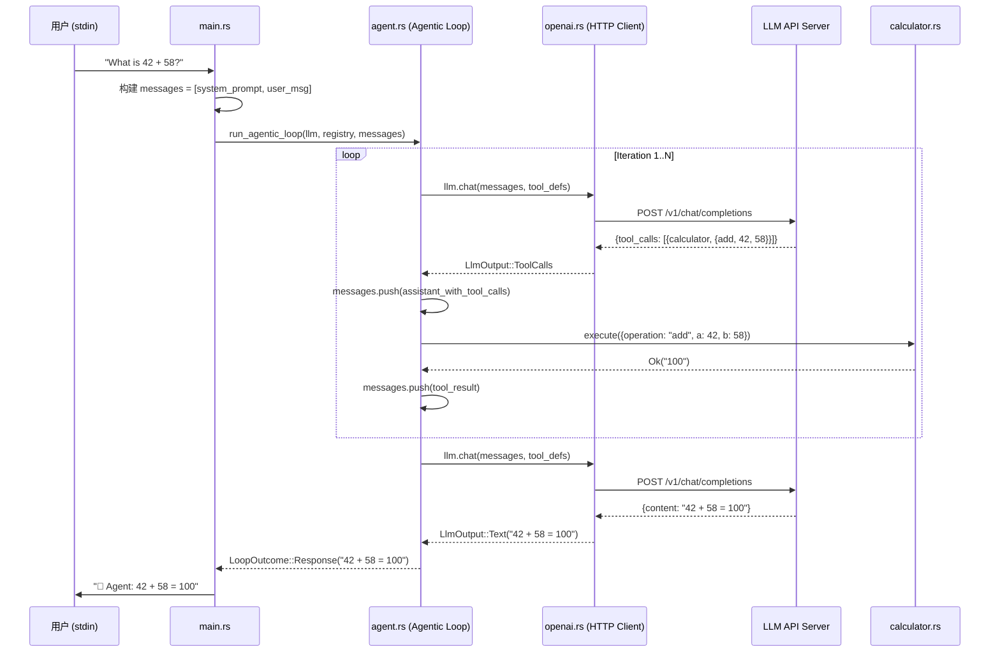

# Mini Agent Loop — 逐行精读教程

> **读者画像**：你是一个 C/C++ 程序员，懂 Python 和 Erlang，想搞懂这个 Rust 项目的每一行代码。
> 本教程会用 C/C++ 的概念做类比，必要时给出 lldb 调试技巧。

---

## 目录

1. [项目全景：它到底在干什么？](#1-项目全景)
2. [工程结构与构建系统](#2-工程结构与构建系统)
3. [从 main.rs 开始：程序入口](#3-从-mainrs-开始)
4. [LLM 类型系统：llm/mod.rs](#4-llm-类型系统)
5. [LLM Provider Trait：llm/provider.rs](#5-llm-provider-trait)
6. [OpenAI 协议实现：llm/openai.rs](#6-openai-协议实现)
7. [工具系统：tools/mod.rs](#7-工具系统)
8. [Calculator 工具：tools/calculator.rs](#8-calculator-工具)
9. [核心引擎：agent.rs — Agentic Loop](#9-核心引擎-agentic-loop)
10. [数据流全景图](#10-数据流全景图)
11. [LLDB 调试指南](#11-lldb-调试指南)
12. [与 C/C++ 的概念对照表](#12-与-cc-的概念对照表)

---

## 1. 项目全景

这个项目是一个 **~600 行的最小 AI Agent**。它实现了一个完整的 "Agentic Loop"（智能体循环）：

```
用户输入 → 发给 LLM（大语言模型）→ LLM 决定是否调用工具
  → 如果调用工具：执行工具 → 把结果喂回 LLM → LLM 再次决策
  → 如果直接回答：输出给用户
```

用 Erlang 的思维来理解：这就是一个 **gen_server**，`handle_call` 里面有一个循环，每次循环要么返回结果（`{reply, ...}`），要么继续处理（`{noreply, ...}`）。

用 C 的思维来理解：这就是一个 **事件循环（event loop）**，类似 `epoll_wait` + 状态机，只不过"事件源"是 LLM 的 HTTP 响应。

### 为什么叫 "Agentic"？

传统的 LLM 调用是 **一问一答**：你问一个问题，LLM 回一段文字，结束。

Agentic 的区别在于：LLM 可以 **主动决定调用工具**，拿到工具结果后 **继续思考**，可能再调用工具，直到它认为可以给出最终答案。这个"自主决策 + 多轮执行"的循环，就是 Agentic Loop。

---

## 2. 工程结构与构建系统

### 目录结构

```
mini-agent-loop/
├── Cargo.toml              # 类似 CMakeLists.txt / Makefile，Rust 的包管理配置
├── Cargo.lock              # 类似 package-lock.json，锁定依赖版本
├── Makefile                # 方便操作的 Make 封装
├── HAI_WOA.template.json   # 配置模板（不含 API Key）
├── HAI_WOA.json            # 实际配置（含 API Key，不入 git）
└── src/
    ├── main.rs             # 程序入口，相当于 C 的 main()
    ├── agent.rs            # Agentic Loop 核心引擎
    ├── llm/
    │   ├── mod.rs          # LLM 模块的类型定义（ChatMessage, ToolCall 等）
    │   ├── provider.rs     # LLM Provider trait（接口定义）
    │   └── openai.rs       # OpenAI 兼容协议的具体实现
    └── tools/
        ├── mod.rs          # Tool trait + ToolRegistry + 执行管线
        └── calculator.rs   # 一个示例工具：计算器
```

### Cargo.toml 逐行解读

```toml
[workspace]
# 声明这是一个 workspace 根。即使只有一个 crate，
# 这行也能让 cargo 知道不要向上级目录查找 workspace。
# C 类比：相当于顶层 CMakeLists.txt 里的 project()

[package]
name = "mini-agent-loop"    # crate 名，类似 target_name
version = "0.1.0"           # 语义化版本
edition = "2021"            # Rust edition，决定语法特性集
                            # 类似 C++ 的 -std=c++17

[dependencies]
tokio = { version = "1", features = ["full"] }
# 异步运行时。Rust 的 async/await 需要一个 runtime 来驱动。
# 类似 libuv（Node.js）或 Erlang 的 scheduler。
# "full" 开启所有特性：多线程、定时器、IO、信号等。

serde = { version = "1", features = ["derive"] }
# 序列化/反序列化框架。features = ["derive"] 开启 #[derive(Serialize, Deserialize)]。
# 类似 protobuf 的代码生成，但通过 Rust 宏在编译期完成。

serde_json = "1"
# JSON 解析库。类似 cJSON 或 Python 的 json 模块。

async-trait = "0.1"
# 让 trait 支持 async 方法。Rust 原生 trait 还不能直接写 async fn，
# 这个库通过宏把 async fn 转成返回 Pin<Box<dyn Future>> 的普通 fn。
# 2024 年后的 Rust nightly 已经原生支持，但 stable 还需要这个库。

reqwest = { version = "0.12", features = ["json"] }
# HTTP 客户端库。类似 libcurl，但是异步的。
# features = ["json"] 开启 .json() 方法，可以直接序列化/反序列化请求体。

futures = "0.3"
# Future 相关的工具库。提供 Stream、FutureExt 等扩展。
```

**关键理解**：Rust 没有运行时（no runtime），`async/await` 只是语法糖，生成状态机代码。真正驱动这些状态机的是 `tokio`。这和 Erlang 的 BEAM VM 内置调度器不同——Rust 需要你显式选择一个 runtime。

---

## 3. 从 main.rs 开始

### 模块声明

```rust
mod agent;    // 引入 src/agent.rs
mod llm;      // 引入 src/llm/mod.rs（目录模块）
mod tools;    // 引入 src/tools/mod.rs（目录模块）
```

**C 类比**：这相当于 `#include "agent.h"`，但 Rust 的 `mod` 同时做了两件事：
1. 声明模块存在（类似 `#include`）
2. 定义可见性边界（类似 C++ 的 namespace + access control）

Rust 的模块系统和文件系统绑定：`mod llm;` 会去找 `src/llm.rs` 或 `src/llm/mod.rs`。

### use 导入

```rust
use std::io::{self, Write};
// 导入标准库的 io 模块和 Write trait。
// self 表示同时导入 io 模块本身（用于 io::stdin()）。
// Write trait 是为了让 io::stdout().flush() 可用。
// C 类比：#include <stdio.h>

use agent::{run_agentic_loop, AgenticLoopConfig, LoopOutcome};
use llm::{ChatMessage, HaiConfig, LlmProvider, OpenAiCompatibleProvider};
use tools::{CalculatorTool, ToolRegistry};
// 从我们自己的模块导入具体类型和函数。
// C 类比：从其他 .h 文件导入函数声明和类型定义。
```

### #[tokio::main] — 异步入口

```rust
#[tokio::main]
async fn main() {
```

这是一个 **过程宏（proc macro）**，它把你的 `async fn main()` 展开成：

```rust
fn main() {
    tokio::runtime::Builder::new_multi_thread()
        .enable_all()
        .build()
        .unwrap()
        .block_on(async {
            // 你的 async main 代码
        })
}
```

**Erlang 类比**：这相当于启动 BEAM VM 并运行你的 `init/0` 函数。`tokio` 就是 Rust 世界的 BEAM scheduler。

**C 类比**：相当于在 `main()` 里初始化 `libuv` 的 event loop，然后 `uv_run(loop, UV_RUN_DEFAULT)`。

### 配置加载

```rust
let hai_config = HaiConfig::load().unwrap_or_else(|e| {
    eprintln!("❌ Failed to load ./HAI_WOA.json: {}", e);
    eprintln!("   Please copy HAI_WOA.template.json to HAI_WOA.json and fill in your API key.");
    std::process::exit(1);
});
```

- `HaiConfig::load()` 返回 `Result<HaiConfig, String>`。
- `unwrap_or_else(|e| ...)` 是 Rust 的错误处理惯用法：成功就解包，失败就执行闭包。
- **C 类比**：相当于 `if (config == NULL) { fprintf(stderr, ...); exit(1); }`

### 闭包：make_provider

```rust
let make_provider = |model: &str, config: &HaiConfig| -> Result<Box<dyn LlmProvider>, String> {
    Ok(Box::new(OpenAiCompatibleProvider::new(
        config.api_key()?,
        config.base_url()?,
        model.to_string(),
    )))
};
```

这是一个 **闭包（closure）**，类似 C++ 的 lambda `[&](const char* model, ...) { ... }`。

关键语法：
- `|参数| -> 返回类型 { 函数体 }` — 闭包语法
- `Box<dyn LlmProvider>` — 堆分配的 trait object，类似 C++ 的 `std::unique_ptr<ILlmProvider>`（虚函数指针 + 堆对象）
- `config.api_key()?` — `?` 操作符：如果返回 `Err`，立即从当前函数返回该错误。相当于 C 的 `if (ret < 0) return ret;` 但更简洁。

### 工具注册

```rust
let mut registry = ToolRegistry::new();
registry.register(Box::new(CalculatorTool));
```

- `mut` 表示这个变量可变。Rust 默认不可变（类似 C 的 `const`），需要显式声明 `mut`。
- `Box::new(CalculatorTool)` — 在堆上创建 CalculatorTool 实例。`CalculatorTool` 是一个零大小类型（ZST），没有字段，`Box::new` 后变成一个 trait object。
- **C 类比**：`CalculatorTool` 就像一个只有虚函数表的 C++ 类，没有成员变量。

### 主循环

```rust
loop {
    print!("\n🧑 You: ");
    io::stdout().flush().unwrap();
    // print! 不会自动刷新缓冲区（和 C 的 printf 一样），需要手动 flush。
    // println! 会自动刷新，因为它输出换行符。

    let mut input = String::new();
    match io::stdin().read_line(&mut input) {
        Ok(0) => break,    // EOF，类似 C 的 fgets 返回 NULL
        Err(_) => break,   // 读取错误
        _ => {}            // 正常读取，继续
    }
    let input = input.trim();
    // .trim() 去掉首尾空白（包括换行符）。
    // 注意：这里 let input 重新绑定了变量名（shadowing），
    // 新的 input 是 &str（字符串切片），旧的 String 仍然存活。
    // C 类比：类似 char* trimmed = trim(buffer); 但原 buffer 不释放。
```

**Shadowing（变量遮蔽）**：Rust 允许用 `let` 重新声明同名变量。这不是赋值，而是创建了一个新绑定。旧变量被遮蔽但内存仍有效（因为新变量借用了它）。C/C++ 没有这个特性。

### 斜杠命令处理

```rust
if input.starts_with("/model ") {
    let model_name = input.strip_prefix("/model ").unwrap().trim();
    let resolved = hai_config.resolve_model(Some(model_name));
    current_model = resolved.clone();
    match make_provider(&resolved, &hai_config) {
        Ok(p) => {
            llm = p;    // 替换当前 LLM provider
            println!("✅ Switched to model: {}", resolved);
        }
        Err(e) => println!("❌ Failed to switch model: {}", e),
    }
    continue;   // 跳过本次循环的后续代码，回到 loop 开头
}
```

- `resolved.clone()` — 深拷贝字符串。Rust 的 `String` 不能隐式拷贝（和 C++ 的 `std::string` 不同），必须显式 `.clone()`。
- `llm = p;` — 替换 `Box<dyn LlmProvider>`。旧的 provider 会被自动 drop（析构）。**C++ 类比**：`unique_ptr::operator=` 的移动赋值。

### 构建对话上下文并运行 Agent

```rust
let mut messages = vec![make_system_prompt(&current_model), ChatMessage::user(input)];

match run_agentic_loop(llm.as_ref(), &registry, &mut messages, &config).await {
    Ok(LoopOutcome::Response(text)) => {
        println!("\n🤖 Agent: {}", text);
    }
    Ok(LoopOutcome::MaxIterations) => {
        println!("\n⚠️  Agent: Reached maximum iterations without a final response.");
    }
    Err(e) => {
        println!("\n❌ Error: {}", e);
    }
}
```

- `vec![...]` — 宏，创建 `Vec`（动态数组），类似 C++ 的 `std::vector` 初始化列表。
- `llm.as_ref()` — 把 `&Box<dyn LlmProvider>` 转成 `&dyn LlmProvider`。因为 `run_agentic_loop` 接受 `&dyn LlmProvider`，不需要知道外面是 `Box` 包装的。
- `.await` — 等待异步操作完成。**Erlang 类比**：类似 `receive` 等待消息。**C 类比**：类似 `epoll_wait` 返回后处理结果。
- `match` — 模式匹配，比 C 的 `switch` 强大得多，可以同时解构枚举和绑定内部值。

---

## 4. LLM 类型系统

文件：`src/llm/mod.rs`

### 模块组织

```rust
mod openai;     // 引入 src/llm/openai.rs
mod provider;   // 引入 src/llm/provider.rs

pub use openai::{HaiConfig, OpenAiCompatibleProvider};
pub use provider::LlmProvider;
```

`pub use` 是 **重导出（re-export）**：把子模块的类型暴露到父模块的命名空间。这样外部代码可以写 `use llm::HaiConfig` 而不是 `use llm::openai::HaiConfig`。

**C++ 类比**：类似在头文件里 `using namespace detail;` 或 `using detail::HaiConfig;`。

### Role 枚举

```rust
#[derive(Debug, Clone, PartialEq)]
pub enum Role {
    System,
    User,
    Assistant,
    Tool,
}
```

- `enum` 在 Rust 中是 **代数数据类型（ADT）**，不是 C 的整数枚举。每个变体可以携带数据（这里没有）。
- `#[derive(...)]` — 自动生成 trait 实现：
  - `Debug` → 可以用 `{:?}` 格式化打印（类似 C 的 `printf` 调试）
  - `Clone` → 可以 `.clone()` 深拷贝
  - `PartialEq` → 可以用 `==` 比较
- **Erlang 类比**：类似 atom：`system | user | assistant | tool`

### ChatMessage 结构体

```rust
#[derive(Debug, Clone)]
pub struct ChatMessage {
    pub role: Role,
    pub content: String,
    pub tool_call_id: Option<String>,   // 可选字段
    pub name: Option<String>,           // 可选字段
    pub tool_calls: Option<Vec<ToolCall>>,  // 可选的工具调用列表
}
```

**`Option<T>` 是 Rust 最重要的类型之一**：

```rust
enum Option<T> {
    Some(T),    // 有值
    None,       // 无值
}
```

- **C 类比**：相当于指针可以为 NULL，但 Rust 在编译期强制你处理 None 的情况，不会出现空指针崩溃。
- **Erlang 类比**：类似 `{ok, Value} | undefined`。

`Option<Vec<ToolCall>>` 的含义：要么没有工具调用（`None`），要么有一个工具调用列表（`Some(vec![...])`）。

### ChatMessage 的构造方法

```rust
impl ChatMessage {
    pub fn system(content: impl Into<String>) -> Self {
        Self {
            role: Role::System,
            content: content.into(),
            tool_call_id: None,
            name: None,
            tool_calls: None,
        }
    }
```

- `impl Into<String>` — 泛型约束，接受任何能转成 `String` 的类型（`&str`、`String`、`Cow<str>` 等）。
- **C++ 类比**：类似 `ChatMessage::system(std::string_view content)` 但更灵活。
- `Self` — 指代当前类型 `ChatMessage`，类似 C++ 的类名或 Python 的 `cls`。
- `content.into()` — 调用 `Into<String>` trait 的 `into()` 方法，把 `&str` 转成 `String`。

**为什么有这么多构造方法？** 因为 `ChatMessage` 在不同角色下，字段的使用模式不同：
- `system()` / `user()` / `assistant()` — 只需要 content
- `assistant_with_tool_calls()` — 需要 content + tool_calls
- `tool_result()` — 需要 call_id + name + content

这是 Rust 的 **Builder 模式的简化版**，用静态方法代替构造函数重载（Rust 没有函数重载）。

### ToolCall 结构体

```rust
#[derive(Debug, Clone, Serialize, Deserialize)]
pub struct ToolCall {
    pub id: String,
    pub name: String,
    pub arguments: serde_json::Value,
}
```

- `Serialize, Deserialize` — serde 的派生宏，自动生成 JSON 序列化/反序列化代码。
- `serde_json::Value` — 类似 Python 的 `dict`/`list`/`Any`，表示任意 JSON 值。**C 类比**：类似 cJSON 的 `cJSON*` 节点。

### FinishReason 和 LlmOutput

```rust
pub enum FinishReason {
    Stop,       // 正常结束
    ToolUse,    // LLM 想调用工具
    Length,     // 达到 token 上限，响应被截断
}

pub enum LlmOutput {
    Text(String),                           // LLM 返回了文本
    ToolCalls {                             // LLM 想调用工具
        tool_calls: Vec<ToolCall>,
        content: Option<String>,            // 可能同时有文本
    },
}
```

`LlmOutput` 是一个 **带数据的枚举（tagged union）**：

- **C 类比**：相当于 `struct { enum tag; union { char* text; struct { ToolCall* calls; int count; char* content; } tool_calls; }; }`，但 Rust 的 match 会强制你处理所有变体，不会忘记某个 case。
- **Erlang 类比**：相当于 `{text, Binary} | {tool_calls, [ToolCall], Content}`。

---

## 5. LLM Provider Trait

文件：`src/llm/provider.rs`（全文仅 23 行，是整个系统最精炼的抽象）

```rust
use async_trait::async_trait;
use super::{ChatMessage, LlmResponse, ToolDefinition};

#[async_trait]
pub trait LlmProvider: Send + Sync {
    async fn chat(
        &self,
        messages: &[ChatMessage],
        tools: &[ToolDefinition],
    ) -> Result<LlmResponse, String>;
}
```

### 逐行解析

- `#[async_trait]` — 宏，让 trait 可以包含 `async fn`。底层把 `async fn` 转成返回 `Pin<Box<dyn Future>>` 的普通函数。
- `trait LlmProvider: Send + Sync` — 定义一个接口（类似 C++ 的纯虚基类 / Erlang 的 behaviour）。
  - `: Send + Sync` 是 **trait bound**，要求实现者必须是线程安全的。
  - `Send` = 可以跨线程转移所有权（类似 C++ 的 move 语义是线程安全的）
  - `Sync` = 可以被多个线程同时引用（类似 C++ 的 const 引用是线程安全的）
- `&self` — 不可变引用，类似 C++ 的 `const this`。
- `messages: &[ChatMessage]` — 切片引用，类似 C 的 `const ChatMessage* messages, size_t len`，但打包成一个胖指针（指针 + 长度）。
- `Result<LlmResponse, String>` — 成功返回 `LlmResponse`，失败返回错误字符串。

**这个 trait 是整个系统的核心抽象**。Agent 不关心你用的是 OpenAI、Claude 还是本地模型，只要实现了这个 trait 就行。这就是 **依赖倒置原则（DIP）**。

**C++ 等价代码**：
```cpp
class ILlmProvider {
public:
    virtual ~ILlmProvider() = default;
    virtual std::future<Result<LlmResponse, std::string>> chat(
        std::span<const ChatMessage> messages,
        std::span<const ToolDefinition> tools
    ) const = 0;
};
```

---

## 6. OpenAI 协议实现

文件：`src/llm/openai.rs`（最长的文件，359 行）

### HaiConfig — 配置加载

```rust
#[derive(Debug, Deserialize)]
pub struct HaiConfig {
    pub model: String,
    #[serde(default)]
    pub models: HashMap<String, ModelEntry>,
    pub env: HashMap<String, String>,
}
```

- `#[serde(default)]` — 如果 JSON 中没有 `models` 字段，使用 `HashMap::default()`（空 map）。
- `HashMap<String, String>` — 哈希表，类似 Python 的 `dict` 或 C++ 的 `std::unordered_map`。

```rust
impl HaiConfig {
    pub fn load() -> Result<Self, String> {
        let path = std::env::current_dir()
            .map_err(|e| format!("Cannot determine current directory: {}", e))?
            .join("HAI_WOA.json");
        let content = std::fs::read_to_string(&path)
            .map_err(|e| format!("Failed to read {}: {}", path.display(), e))?;
        serde_json::from_str(&content)
            .map_err(|e| format!("Failed to parse {}: {}", path.display(), e))
    }
```

这里展示了 Rust 的 **链式错误处理**：
1. `current_dir()` 返回 `Result<PathBuf, io::Error>`
2. `.map_err(...)` 把 `io::Error` 转成 `String`
3. `?` 如果是 `Err` 就提前返回
4. `.join("HAI_WOA.json")` 拼接路径（类似 Python 的 `os.path.join`）

**C 等价逻辑**：
```c
char path[PATH_MAX];
if (getcwd(path, sizeof(path)) == NULL) return -1;
strcat(path, "/HAI_WOA.json");
char* content = read_file(path);
if (content == NULL) return -1;
Config* config = parse_json(content);
if (config == NULL) return -1;
```

Rust 的 `?` 操作符把这些 `if (err) return err;` 压缩成了一行。

### resolve_model — 模型名解析

```rust
pub fn resolve_model(&self, name: Option<&str>) -> String {
    let raw = match name {
        Some(n) => {
            if let Some(entry) = self.models.get(n) {
                entry.id.clone()
            } else {
                n.to_string()
            }
        }
        None => self.model.clone(),
    };
    raw.strip_prefix("openai/").unwrap_or(&raw).to_string()
}
```

逻辑：
1. 如果传了名字，先在 `models` 快捷方式表里查找（如 `"ds"` → `"openai/DeepSeek-V3-0324"`）
2. 找不到就原样使用
3. 没传名字就用默认 model
4. 最后去掉 `"openai/"` 前缀（HaiHub API 不需要这个前缀）

`strip_prefix` 返回 `Option<&str>`：如果有前缀就返回 `Some(去掉前缀的部分)`，没有就返回 `None`。`unwrap_or(&raw)` 在 `None` 时返回原字符串。

### OpenAiCompatibleProvider — HTTP 客户端

```rust
pub struct OpenAiCompatibleProvider {
    client: reqwest::Client,    // HTTP 连接池（类似 libcurl 的 multi handle）
    api_key: String,
    base_url: String,
    model: String,
}

impl OpenAiCompatibleProvider {
    pub fn new(api_key: String, base_url: String, model: String) -> Self {
        let client = reqwest::Client::builder()
            .timeout(Duration::from_secs(120))  // 2 分钟超时
            .build()
            .unwrap_or_default();
        Self { client, api_key, base_url, model }
    }
}
```

`reqwest::Client` 内部维护了 **连接池和 TLS 会话缓存**，所以应该复用而不是每次请求都创建。这和 libcurl 的 `CURLM*` 类似。

### OpenAI 请求/响应类型

```rust
#[derive(Serialize)]
struct OpenAiRequest {
    model: String,
    messages: Vec<OpenAiMessage>,
    #[serde(skip_serializing_if = "Vec::is_empty")]
    tools: Vec<OpenAiTool>,
    #[serde(skip_serializing_if = "Option::is_none")]
    tool_choice: Option<String>,
}
```

- `#[serde(skip_serializing_if = "Vec::is_empty")]` — 如果 `tools` 为空，序列化时跳过这个字段。这是因为 OpenAI API 在没有工具时不应该发送空的 `tools` 数组。
- 这些类型是 **私有的**（没有 `pub`），只在 `openai.rs` 内部使用。外部代码通过 `LlmProvider` trait 交互，不需要知道 OpenAI 的协议细节。

### OpenAiMessage 的 content 为什么是 Option<String>？

```rust
#[derive(Serialize)]
struct OpenAiMessage {
    role: String,
    #[serde(skip_serializing_if = "Option::is_none")]
    content: Option<String>,
    // ...
}
```

这是 **OpenAI 协议的要求**：当 assistant 消息包含 `tool_calls` 时，`content` 可以为 `null`。如果用 `String` 类型，序列化出来是 `"content": ""`（空字符串），某些 API 会拒绝。用 `Option<String>` + `skip_serializing_if` 可以在 `None` 时完全省略这个字段。

### convert_messages — 类型转换

```rust
fn convert_messages(messages: &[ChatMessage]) -> Vec<OpenAiMessage> {
    messages
        .iter()                     // 创建迭代器
        .map(|m| {                  // 对每个元素应用转换
            let role = match m.role {
                Role::System => "system",
                Role::User => "user",
                Role::Assistant => "assistant",
                Role::Tool => "tool",
            };
            // ... 构造 OpenAiMessage
        })
        .collect()                  // 收集成 Vec
}
```

`.iter().map().collect()` 是 Rust 的 **函数式迭代器链**：
- **Python 类比**：`[transform(m) for m in messages]`
- **C++ 类比**：`std::transform(messages.begin(), messages.end(), ...)`
- **Erlang 类比**：`lists:map(fun(M) -> transform(M) end, Messages)`

Rust 的迭代器是 **零成本抽象**：编译后和手写 for 循环的性能完全一样（编译器会内联和优化）。

### LlmProvider 实现 — HTTP 调用

```rust
#[async_trait]
impl LlmProvider for OpenAiCompatibleProvider {
    async fn chat(
        &self,
        messages: &[ChatMessage],
        tools: &[ToolDefinition],
    ) -> Result<LlmResponse, String> {
        let url = format!("{}/chat/completions", self.base_url);

        // 构造请求体
        let body = OpenAiRequest { ... };

        // 发送 HTTP POST 请求
        let resp = self.client
            .post(&url)
            .header("Authorization", format!("Bearer {}", self.api_key))
            .header("Content-Type", "application/json")
            .json(&body)        // 自动序列化为 JSON
            .send()
            .await              // 等待 HTTP 响应
            .map_err(|e| format!("HTTP request failed: {}", e))?;
```

`.send().await` 是异步 HTTP 请求的核心。在 `await` 点，当前 task 会被挂起，tokio 可以去执行其他 task。当 HTTP 响应到达时，task 被唤醒继续执行。

**C 类比**：相当于 `epoll_wait` + 非阻塞 socket，但 Rust 的 async/await 让你写出看起来像同步代码的异步逻辑。

### 响应解析 — tool_calls 的处理

```rust
if let Some(tool_calls_in) = choice.message.tool_calls {
    if !tool_calls_in.is_empty() {
        let tool_calls: Vec<ToolCall> = tool_calls_in
            .into_iter()        // 消耗性迭代（取得所有权）
            .map(|tc| {
                let arguments: serde_json::Value =
                    serde_json::from_str(&tc.function.arguments)
                        .unwrap_or(serde_json::Value::Object(serde_json::Map::new()));
                ToolCall {
                    id: tc.id,
                    name: tc.function.name,
                    arguments,
                }
            })
            .collect();
```

注意 `.iter()` vs `.into_iter()` 的区别：
- `.iter()` — 借用迭代，元素是 `&T`，原集合不变
- `.into_iter()` — 消耗迭代，元素是 `T`，原集合被消耗（moved）

这里用 `into_iter()` 是因为我们要把 `OpenAiToolCallIn` 的字段 **移动** 到 `ToolCall` 里，避免不必要的 clone。

**C++ 类比**：`into_iter()` 类似 `std::move_iterator`。

---

## 7. 工具系统

文件：`src/tools/mod.rs`

### Tool Trait

```rust
#[async_trait]
pub trait Tool: Send + Sync {
    fn name(&self) -> &str;
    fn description(&self) -> &str;
    fn parameters_schema(&self) -> serde_json::Value;
    async fn execute(&self, params: serde_json::Value) -> Result<ToolOutput, String>;
}
```

这是工具的接口定义。任何实现了这 4 个方法的类型都可以作为工具注册到 Agent 中。

**C++ 类比**：
```cpp
class ITool {
public:
    virtual const char* name() const = 0;
    virtual const char* description() const = 0;
    virtual json parameters_schema() const = 0;
    virtual std::future<Result<ToolOutput>> execute(json params) const = 0;
};
```

**Erlang 类比**：
```erlang
-callback name() -> binary().
-callback description() -> binary().
-callback parameters_schema() -> map().
-callback execute(Params :: map()) -> {ok, Output} | {error, Reason}.
```

### ToolRegistry — 工具注册表

```rust
#[derive(Default)]
pub struct ToolRegistry {
    tools: Vec<Box<dyn Tool>>,
}
```

- `Vec<Box<dyn Tool>>` — 一个动态数组，每个元素是堆上的 trait object。
- **C++ 类比**：`std::vector<std::unique_ptr<ITool>>`
- `#[derive(Default)]` — 自动生成 `Default` trait，`ToolRegistry::default()` 返回空的 registry。

```rust
pub fn get(&self, name: &str) -> Option<&dyn Tool> {
    self.tools
        .iter()
        .find(|t| t.name() == name)    // 线性查找
        .map(|t| t.as_ref())           // Box<dyn Tool> → &dyn Tool
}
```

`find` 返回 `Option<&Box<dyn Tool>>`，`.map(|t| t.as_ref())` 把它转成 `Option<&dyn Tool>`。这是因为调用者不需要知道工具是 `Box` 包装的。

### execute_tool_with_safety — 带超时的工具执行

```rust
pub async fn execute_tool_with_safety(
    registry: &ToolRegistry,
    tool_name: &str,
    params: serde_json::Value,
) -> Result<String, String> {
    let tool = registry
        .get(tool_name)
        .ok_or_else(|| format!("Tool '{}' not found", tool_name))?;

    let timeout = Duration::from_secs(30);
    let result = tokio::time::timeout(timeout, tool.execute(params)).await;

    match result {
        Ok(Ok(output)) => {
            serde_json::to_string_pretty(&output.result)
                .map_err(|e| format!("Failed to serialize result: {}", e))
        }
        Ok(Err(e)) => Err(format!("Tool execution failed: {}", e)),
        Err(_) => Err(format!("Tool '{}' timed out after {:?}", tool_name, timeout)),
    }
}
```

`tokio::time::timeout` 是关键：它包装一个 Future，如果在指定时间内没有完成，就返回 `Err(Elapsed)`。

`match result` 处理了三层嵌套的 Result：
- `Ok(Ok(output))` — 没超时 + 工具执行成功
- `Ok(Err(e))` — 没超时 + 工具执行失败
- `Err(_)` — 超时了

**C 类比**：相当于 `select()` + `alarm()` 的超时机制，但更优雅。

**Erlang 类比**：
```erlang
case gen_server:call(ToolPid, {execute, Params}, 30000) of
    {ok, Output} -> ...;
    {error, Reason} -> ...
end
%% 超时会抛出 exit:{timeout, ...}
```

### process_tool_result — 构造工具结果消息

```rust
pub fn process_tool_result(
    tool_name: &str,
    tool_call_id: &str,
    result: &Result<String, String>,
) -> ChatMessage {
    let content = match result {
        Ok(output) => format!("<tool_output>{}</tool_output>", output),
        Err(e) => format!("Error: {}", e),
    };
    ChatMessage::tool_result(tool_call_id, tool_name, content)
}
```

注意工具结果被包裹在 `<tool_output>` XML 标签中。这是一种常见的做法，帮助 LLM 区分工具输出和普通文本。

---

## 8. Calculator 工具

文件：`src/tools/calculator.rs`

```rust
pub struct CalculatorTool;
```

这是一个 **零大小类型（ZST, Zero-Sized Type）**。它没有任何字段，`size_of::<CalculatorTool>() == 0`。在 C 中，空结构体至少占 1 字节；在 Rust 中，ZST 真的不占内存。

```rust
fn parameters_schema(&self) -> serde_json::Value {
    serde_json::json!({
        "type": "object",
        "properties": {
            "operation": {
                "type": "string",
                "enum": ["add", "sub", "mul", "div"],
                "description": "The arithmetic operation to perform"
            },
            "a": { "type": "number", "description": "First operand" },
            "b": { "type": "number", "description": "Second operand" }
        },
        "required": ["operation", "a", "b"]
    })
}
```

`json!` 宏在 **编译期** 构造 JSON 值。这个 schema 会被发送给 LLM，告诉它这个工具接受什么参数。这就是 **Function Calling** 协议的核心：LLM 看到 schema，决定如何填参数。

```rust
async fn execute(&self, params: serde_json::Value) -> Result<ToolOutput, String> {
    let op = params["operation"].as_str().ok_or("Missing 'operation'")?;
    let a = params["a"].as_f64().ok_or("Missing 'a'")?;
    let b = params["b"].as_f64().ok_or("Missing 'b'")?;

    let (result, expression) = match op {
        "add" => (a + b, format!("{} + {} = {}", a, b, a + b)),
        "sub" => (a - b, format!("{} - {} = {}", a, b, a - b)),
        "mul" => (a * b, format!("{} × {} = {}", a, b, a * b)),
        "div" => {
            if b == 0.0 {
                return Err("Division by zero".to_string());
            }
            (a / b, format!("{} ÷ {} = {}", a, b, a / b))
        }
        _ => return Err(format!("Unknown operation: '{}'", op)),
    };
```

- `params["operation"]` — 用下标访问 JSON 值。如果 key 不存在，返回 `Value::Null`。
- `.as_str()` — 尝试把 `Value` 转成 `&str`，返回 `Option<&str>`。
- `.ok_or("Missing 'operation'")` — 把 `Option` 转成 `Result`：`Some(v)` → `Ok(v)`，`None` → `Err("Missing...")`。
- `let (result, expression) = match op { ... }` — **解构赋值**：match 的每个分支返回一个元组 `(f64, String)`，赋值给两个变量。

**C 类比**：
```c
double result;
char expression[256];
if (strcmp(op, "add") == 0) {
    result = a + b;
    snprintf(expression, sizeof(expression), "%f + %f = %f", a, b, a + b);
} else if ...
```

---

## 9. 核心引擎 — Agentic Loop

文件：`src/agent.rs`（整个项目最重要的 151 行）

### 循环结构

```rust
pub async fn run_agentic_loop(
    llm: &dyn LlmProvider,
    registry: &ToolRegistry,
    messages: &mut Vec<ChatMessage>,
    config: &AgenticLoopConfig,
) -> Result<LoopOutcome, String> {
    let tool_defs = registry.definitions();

    for iteration in 1..=config.max_iterations {
```

- `&dyn LlmProvider` — trait object 引用，类似 C++ 的 `const ILlmProvider&`。通过虚函数表（vtable）实现动态分发。
- `messages: &mut Vec<ChatMessage>` — 可变引用，函数可以修改这个 Vec（添加新消息）。
- `1..=config.max_iterations` — 闭区间范围，包含两端。`1..10` 是左闭右开 `[1, 10)`，`1..=10` 是闭区间 `[1, 10]`。

### 核心 match — 处理 LLM 响应

```rust
let response = llm.chat(messages, &tool_defs).await?;

match response.result {
    LlmOutput::Text(text) => {
        // LLM 直接返回了文本 → 循环结束
        return Ok(LoopOutcome::Response(text));
    }
    LlmOutput::ToolCalls { tool_calls, content } => {
        // LLM 想调用工具 → 执行工具 → 继续循环
```

这就是 Agentic Loop 的核心决策点：

```
┌─────────────────────────────────────────────┐
│              LLM 返回什么？                   │
├──────────────────┬──────────────────────────┤
│  Text(文本)       │  ToolCalls(工具调用)       │
│  → 返回给用户     │  → 执行工具               │
│  → 循环结束       │  → 结果加入 messages      │
│                  │  → 继续下一轮循环           │
└──────────────────┴──────────────────────────┘
```

### 截断处理

```rust
if response.finish_reason == FinishReason::Length {
    println!("  ⚠️  Response was truncated, discarding tool calls");
    if let Some(text) = content {
        messages.push(ChatMessage::assistant(&text));
    }
    messages.push(ChatMessage::user(
        "Your previous response was truncated. Please try a simpler approach.",
    ));
    continue;
}
```

当 LLM 的响应因为 token 限制被截断时（`finish_reason == "length"`），工具调用的 JSON 可能是不完整的。这时候不能执行工具，而是告诉 LLM "你的回复被截断了，请简化"。

### 工具执行循环

```rust
messages.push(ChatMessage::assistant_with_tool_calls(
    content,
    tool_calls.clone(),
));

for tc in &tool_calls {
    let result = execute_tool_with_safety(registry, &tc.name, tc.arguments.clone()).await;
    let result_msg = process_tool_result(&tc.name, &tc.id, &result);
    messages.push(result_msg);
}
```

**OpenAI 协议要求**：在发送工具结果之前，必须先发送包含 `tool_calls` 的 assistant 消息。消息序列必须是：

```
[assistant message with tool_calls]
[tool result for call_1]
[tool result for call_2]
...
```

如果跳过 assistant 消息直接发 tool result，API 会报错。

`tool_calls.clone()` — 这里需要 clone 是因为 `tool_calls` 被移动到 `assistant_with_tool_calls` 里了，但后面的 `for tc in &tool_calls` 还需要用。`.clone()` 做了一次深拷贝。

### truncate_str — UTF-8 安全截断

```rust
fn truncate_str(s: &str, max_bytes: usize) -> String {
    if s.len() <= max_bytes {
        return s.to_string();
    }
    let mut end = max_bytes;
    while end > 0 && !s.is_char_boundary(end) {
        end -= 1;
    }
    format!("{}[...]", &s[..end])
}
```

这个函数解决了一个之前的 **panic bug**：直接用 `&s[..100]` 截断字符串，如果第 100 字节恰好在一个多字节 UTF-8 字符的中间（比如中文字符占 3 字节），Rust 会 panic。

解决方法：从 `max_bytes` 往回找，直到找到一个合法的字符边界。

**C 类比**：UTF-8 中，多字节字符的后续字节以 `10xxxxxx` 开头。往回扫描直到找到不以 `10` 开头的字节：
```c
while (end > 0 && (s[end] & 0xC0) == 0x80) end--;
```

Rust 的 `is_char_boundary()` 做的就是这件事。

---

## 10. 数据流全景图



### messages 数组的演变过程

```
第 1 轮 LLM 调用前：
  [0] System: "You are a helpful assistant..."
  [1] User: "What is 42 + 58?"

第 1 轮 LLM 返回 ToolCalls 后：
  [0] System: "You are a helpful assistant..."
  [1] User: "What is 42 + 58?"
  [2] Assistant: {tool_calls: [{id: "call_1", name: "calculator", args: {op: "add", a: 42, b: 58}}]}
  [3] Tool: {tool_call_id: "call_1", content: "<tool_output>100</tool_output>"}

第 2 轮 LLM 调用后返回 Text：
  → "42 + 58 = 100"
  → 循环结束，返回给用户
```

---

## 11. LLDB 调试指南

### 编译 Debug 版本

```bash
make build    # 或 cargo build
```

Debug 版本在 `target/debug/mini-agent-loop`，包含完整的调试符号。

### 启动 LLDB

```bash
cd /path/to/mini-agent-loop
lldb target/debug/mini-agent-loop
```

### 常用断点

```lldb
# 在 agentic loop 入口设断点
b agent::run_agentic_loop

# 在工具执行处设断点
b tools::execute_tool_with_safety

# 在 LLM HTTP 调用处设断点
b <mini_agent_loop::llm::openai::OpenAiCompatibleProvider as mini_agent_loop::llm::provider::LlmProvider>::chat

# 在 calculator 执行处设断点
b <mini_agent_loop::tools::calculator::CalculatorTool as mini_agent_loop::tools::Tool>::execute

# 在 truncate_str 处设断点（之前出过 panic 的地方）
b agent::truncate_str
```

> **注意**：Rust 的符号名很长，因为包含了完整的模块路径和 trait 实现信息。可以用 `b` 命令的模糊匹配：`rb truncate_str`（regex breakpoint）。

### 查看变量

```lldb
# 运行程序
run

# 命中断点后，查看 messages 数组
p messages
frame variable messages

# 查看当前迭代次数
p iteration

# 查看 LLM 响应
p response

# 查看工具调用参数
p params
```

### 查看异步调用栈

Rust 的 async 函数会被编译成状态机，调用栈可能不太直观。使用：

```lldb
# 查看所有线程
thread list

# 查看当前线程的完整调用栈
bt

# tokio 的工作线程通常叫 tokio-runtime-worker
thread select 2    # 选择具体的工作线程
bt
```

### 调试 panic

如果程序 panic（比如之前的 UTF-8 截断 bug），可以在 panic 处设断点：

```lldb
b rust_panic
b rust_begin_unwind
run
```

panic 时会停在断点，你可以用 `bt` 查看完整调用栈，用 `frame variable` 查看当时的变量值。

### 环境变量辅助

```bash
# 显示 panic 时的完整调用栈
RUST_BACKTRACE=1 lldb target/debug/mini-agent-loop

# 在 lldb 中设置环境变量
env RUST_BACKTRACE=1
run
```

---

## 12. 与 C/C++ 的概念对照表

| Rust 概念 | C/C++ 等价 | 说明 |
|-----------|-----------|------|
| `String` | `std::string` | 堆分配、可增长的 UTF-8 字符串 |
| `&str` | `std::string_view` / `const char*` + len | 字符串切片（借用，不拥有） |
| `Vec<T>` | `std::vector<T>` | 堆分配的动态数组 |
| `&[T]` | `std::span<T>` / `const T*` + len | 切片（胖指针 = 指针 + 长度） |
| `Box<T>` | `std::unique_ptr<T>` | 堆分配，独占所有权 |
| `Box<dyn Trait>` | `std::unique_ptr<IBase>` | trait object = 虚函数表 + 数据指针 |
| `Option<T>` | `std::optional<T>` / `T*` (nullable) | 编译期强制处理 None |
| `Result<T, E>` | 返回值 + errno / `std::expected<T, E>` | 编译期强制处理错误 |
| `?` 操作符 | `if (ret < 0) return ret;` | 错误传播的语法糖 |
| `match` | `switch` + 解构 | 穷尽性检查，必须处理所有分支 |
| `trait` | 纯虚基类 / interface | 但支持默认实现和泛型约束 |
| `impl Trait for Type` | `class Type : public ITrait` | 但可以为外部类型实现 trait |
| `#[derive(...)]` | 无直接等价 | 编译期代码生成（类似 C++ 的 CRTP 但更强） |
| `async/await` | C++20 coroutines | 编译成状态机，需要 runtime 驱动 |
| `tokio` | libuv / ASIO | 异步运行时 + 事件循环 |
| `mod` | `#include` + `namespace` | 模块系统，控制可见性 |
| `pub` | `public:` | 默认私有，显式公开 |
| `mut` | 非 `const` | Rust 默认不可变，需显式声明可变 |
| `clone()` | 拷贝构造函数 | Rust 不隐式拷贝，必须显式调用 |
| 所有权转移 | `std::move()` | Rust 默认移动，C++ 默认拷贝 |
| `&T` | `const T&` | 不可变借用 |
| `&mut T` | `T&` | 可变借用（同一时间只能有一个） |

### 所有权模型 — 最重要的区别

Rust 和 C/C++ 最大的区别是 **所有权系统**。简单说：

```rust
let s1 = String::from("hello");
let s2 = s1;       // s1 的所有权转移给 s2
// println!("{}", s1);  // 编译错误！s1 已经无效
```

**C++ 等价**：
```cpp
auto s1 = std::make_unique<std::string>("hello");
auto s2 = std::move(s1);
// std::cout << *s1;  // 未定义行为！但编译器不会报错
```

Rust 在 **编译期** 就阻止了 use-after-move，而 C++ 只能靠程序员自觉。

在这个项目中，你会看到大量的 `&`（借用）和 `.clone()`（显式拷贝），这就是所有权系统在起作用。

---

## 附：我的理解与设计评价

### 这个项目做对了什么

1. **层次清晰**：`main.rs`（入口）→ `agent.rs`（循环引擎）→ `llm/`（LLM 抽象）→ `tools/`（工具抽象），每层职责单一。

2. **trait 抽象恰到好处**：`LlmProvider` 和 `Tool` 两个 trait 是整个系统的骨架。要换 LLM 提供商？实现 `LlmProvider`。要加新工具？实现 `Tool`。不需要改任何其他代码。

3. **Agentic Loop 是真正的核心**：`agent.rs` 只有 151 行，但它是整个 AI Agent 的心脏。它不关心 LLM 是谁、工具是什么，只关心"调 LLM → 看结果 → 决定下一步"这个循环。这种设计在大型系统中非常重要——IronClaw 的完整版本在这个循环上叠加了信号检查、审批流程、成本控制、截断恢复等，但核心骨架不变。

4. **错误处理一致**：全程使用 `Result<T, String>`，没有 `unwrap()` 炸弹（除了几个确定不会失败的地方）。

### 可以改进的地方

1. **messages 每次都重建**：当前每次用户输入都创建新的 `messages` 数组，不保留历史对话。真正的 Agent 应该维护会话上下文。

2. **错误类型用 String**：生产代码应该用自定义 Error enum（实现 `std::error::Error` trait），而不是到处用 `String`。但作为教学项目，`String` 更容易理解。

3. **没有流式输出**：当前是等 LLM 完整响应后才输出。真正的产品应该用 SSE（Server-Sent Events）流式输出，用户体验更好。

### 从 Erlang 视角看

如果用 Erlang 来实现这个系统，架构会很不同：
- Agent 是一个 `gen_server`，messages 是 state
- LLM 调用是 `gen_server:call` 到一个 HTTP worker pool
- Tool 执行是 `gen_server:call` 到各自的 tool process
- 超时用 Erlang 原生的 `{timeout, Ref, Msg}` 机制

Rust 的方案更"紧凑"——所有逻辑在一个 async 函数里，通过 `await` 串联。Erlang 的方案更"松散"——每个组件是独立进程，通过消息通信。两种风格各有优劣：Rust 性能更好，Erlang 容错更强。
