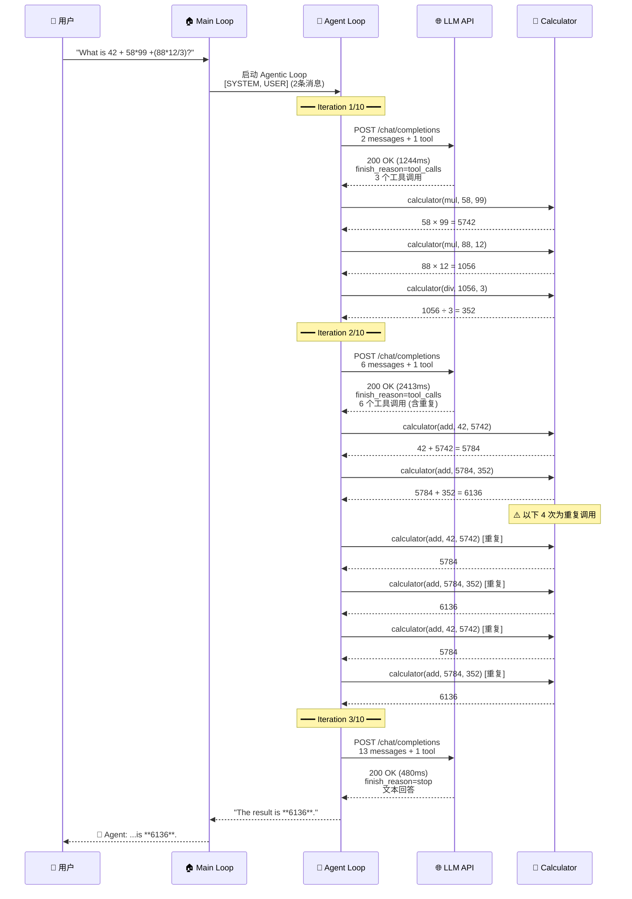

# Mini Agent Loop 全过程追踪分析

> **源文件**：`trace-output-raw.log`
> **问题**：`What is 42 + 58*99 +(88*12/3)?`
> **正确答案**：6136
> **模型**：DeepSeek-V3-0324（via http://api.haihub.cn/v1）
> **总耗时**：4153ms（3 轮迭代，3 次 LLM 调用，9 次工具调用）

---

## 总览：工具调用统计

整个过程中，LLM **共发起了 9 次 calculator 工具调用**，分布在 2 轮工具调用迭代中：

| 迭代 | LLM 请求的工具调用数 | 具体调用 | 备注 |
|------|---------------------|---------|------|
| Iteration 1 | 3 次 | `58×99`, `88×12`, `1056÷3` | ✅ 合理：先算乘法和除法 |
| Iteration 2 | 6 次 | `42+5742`, `5784+352` 各重复 3 次 | ⚠️ 冗余：DeepSeek 重复调用了相同的计算 |
| Iteration 3 | 0 次 | 无（直接给出文本回答） | ✅ 最终回答 |

> **注意**：Iteration 2 中 LLM 产生了 6 次工具调用，但实际上只有 2 种不同的计算（`42+5742` 和 `5784+352`），每种重复了 3 次。这是 DeepSeek-V3-0324 模型的一个行为特征——在组合中间结果时产生了冗余调用。

---

## 全过程时间线

```
时间轴 (相对于启动)
│
│  T+0ms      🚀 程序启动，初始化 tracing
│  T+1ms      📂 加载 HAI_WOA.json 配置
│  T+2ms      ✅ 配置加载完成 (DeepSeek-V3-0324, http://api.haihub.cn/v1)
│  T+2ms      🔧 注册 calculator 工具
│  T+2ms      📝 收到用户输入: "What is 42 + 58*99 +(88*12/3)?"
│  T+2ms      📋 构建消息上下文 (2条: SYSTEM + USER)
│  T+2ms      🧠 进入 Agentic Loop
│
│  ═══════════ Iteration 1/10 ═══════════
│  T+2ms      📤 发送请求给 LLM (2条消息 + 1个工具定义)
│  T+80ms     🌐 TCP 连接到 43.137.68.103:80
│  T+1246ms   📥 LLM 响应 200 OK (耗时 1244ms)
│             🔧 LLM 请求调用 3 个工具
│  T+1247ms   ⚙️  执行工具 [1/3]: calculator(mul, 58, 99) → 5742
│  T+1247ms   ⚙️  执行工具 [2/3]: calculator(mul, 88, 12) → 1056
│  T+1247ms   ⚙️  执行工具 [3/3]: calculator(div, 1056, 3) → 352
│
│  ═══════════ Iteration 2/10 ═══════════
│  T+1249ms   📤 发送请求给 LLM (6条消息 + 1个工具定义)
│             🌐 复用已有 HTTP 连接
│  T+3662ms   📥 LLM 响应 200 OK (耗时 2413ms)
│             🔧 LLM 请求调用 6 个工具 (含重复)
│  T+3663ms   ⚙️  执行工具 [1/6]: calculator(add, 42, 5742) → 5784
│  T+3663ms   ⚙️  执行工具 [2/6]: calculator(add, 5784, 352) → 6136
│  T+3663ms   ⚙️  执行工具 [3/6]: calculator(add, 42, 5742) → 5784  (重复)
│  T+3663ms   ⚙️  执行工具 [4/6]: calculator(add, 5784, 352) → 6136  (重复)
│  T+3663ms   ⚙️  执行工具 [5/6]: calculator(add, 42, 5742) → 5784  (重复)
│  T+3663ms   ⚙️  执行工具 [6/6]: calculator(add, 5784, 352) → 6136  (重复)
│
│  ═══════════ Iteration 3/10 ═══════════
│  T+3672ms   📤 发送请求给 LLM (13条消息 + 1个工具定义)
│             🌐 复用已有 HTTP 连接
│  T+4152ms   📥 LLM 响应 200 OK (耗时 480ms)
│             💬 LLM 返回文本回答 (finish_reason=stop)
│
│  T+4153ms   ✅ 输出最终答案: 6136
│  T+4153ms   👋 用户退出
```

---

## 阶段一：启动与初始化 (T+0ms ~ T+2ms)

### 1.1 程序启动

```
🚀 Starting Mini Agent Loop — tracing initialized
```

### 1.2 加载配置

从 `./HAI_WOA.json` 加载 LLM 配置：

```
📂 Loading LLM configuration from ./HAI_WOA.json ...
Config file read successfully (content_len=518)
Config parsed: default model='openai/DeepSeek-V3-0324', 5 model shortcuts
✅ Config loaded successfully
   model=openai/DeepSeek-V3-0324
   base_url=http://api.haihub.cn/v1
```

可用的模型快捷方式：

| 快捷名 | 完整模型名 |
|--------|-----------|
| ds | openai/DeepSeek-V3-0324 |
| ds31 | openai/DeepSeek-V3.1 |
| kimi | openai/Kimi-K2 |
| qwen | openai/Qwen3-235B-A22B |
| qwen32 | openai/Qwen3-32B-FP8 |

### 1.3 创建 LLM Provider

```
🤖 Initial model selected: DeepSeek-V3-0324
Creating OpenAI-compatible provider (timeout=120s)
   model=DeepSeek-V3-0324
   base_url=http://api.haihub.cn/v1
   api_key_prefix=sk-322ca...
```

### 1.4 注册工具

注册了 1 个工具 `calculator`，其完整 schema 如下：

```json
{
  "name": "calculator",
  "description": "Perform basic arithmetic operations. Supports: add, sub, mul, div.",
  "parameters": {
    "properties": {
      "a": { "description": "First operand", "type": "number" },
      "b": { "description": "Second operand", "type": "number" },
      "operation": {
        "description": "The arithmetic operation to perform",
        "enum": ["add", "sub", "mul", "div"],
        "type": "string"
      }
    },
    "required": ["operation", "a", "b"],
    "type": "object"
  }
}
```

### 1.5 Agentic Loop 配置

```
⚙️  Agentic loop config: max_iterations=10
🔄 Entering main input loop — waiting for user input...
```

---

## 阶段二：接收用户输入 (T+2ms)

```
📝 User input received: "What is 42 + 58*99 +(88*12/3)?"
📋 Building conversation context (system prompt + user message)
```

构建的初始消息上下文（2 条消息）：

```
[0] SYSTEM | "You are a helpful assistant. You have access to a calculator tool.
             When the user asks a math question, use the calculator tool to compute
             the answer. For non-math questions, respond directly. When asked about
             your identity, respond based on your own knowledge."

[1] USER   | "What is 42 + 58*99 +(88*12/3)?"
```

---

## 阶段三：Agentic Loop — Iteration 1（先算乘除）

### 3.1 发送第一次 LLM 请求

```
━━━ Iteration 1/10 ━━━
📤 Step 1: Calling LLM...
   Sending 2 messages and 1 tool definitions to LLM
   Message flow: [0]SYS → [1]USR
```

发送的完整 HTTP 请求体：

```json
{
  "model": "DeepSeek-V3-0324",
  "messages": [
    {
      "role": "system",
      "content": "You are a helpful assistant. You have access to a calculator tool. When the user asks a math question, use the calculator tool to compute the answer. For non-math questions, respond directly. When asked about your identity, respond based on your own knowledge."
    },
    {
      "role": "user",
      "content": "What is 42 + 58*99 +(88*12/3)?"
    }
  ],
  "tools": [
    {
      "type": "function",
      "function": {
        "name": "calculator",
        "description": "Perform basic arithmetic operations. Supports: add, sub, mul, div.",
        "parameters": { "..." }
      }
    }
  ],
  "tool_choice": "auto"
}
```

### 3.2 接收第一次 LLM 响应

```
🌐 Sending HTTP POST to http://api.haihub.cn/v1/chat/completions...
   TCP connecting to 43.137.68.103:80
   TCP connected to 43.137.68.103:80
📥 HTTP response received: 200 OK in 1244ms
```

LLM 返回了 **3 个工具调用**（finish_reason=tool_calls）：

| # | 工具 | 操作 | 参数 a | 参数 b | 含义 |
|---|------|------|--------|--------|------|
| 0 | calculator | mul | 58 | 99 | 计算 58×99 |
| 1 | calculator | mul | 88 | 12 | 计算 88×12 |
| 2 | calculator | div | **1056** | 3 | 计算 1056÷3 |

> **LLM 的思路**：先按运算优先级计算乘法和除法部分。

> [!WARNING]
> **关于第 3 个调用中 `a=1056` 的来源 — Parallel Tool Calls 的隐含风险**
>
> 这 3 个工具调用是 LLM **在一次响应中同时返回的**（即 OpenAI 的 Parallel Tool Calls 机制）。
> 这意味着当 LLM 生成第 3 个调用 `div(1056, 3)` 时，**它还没有收到前两个工具的执行结果**——
> 因为所有 tool_calls 都在同一个 JSON 响应中，工具尚未被执行。
>
> 那 `1056` 从哪来？**是 LLM 在生成 token 时自己「心算」出来的**。LLM 在逐 token 生成第 3 个
> tool_call 的 JSON 时，已经「知道」88×12=1056（基于其语言模型能力），于是直接将 1056 填入了参数。
>
> **这是一个有风险的行为**：
> - ✅ 如果心算正确（如本例），则没有问题，还能减少一轮迭代
> - ❌ 如果心算错误（比如把 88×12 算成 1050），那第 3 个工具会算 `1050÷3=350`，最终答案就错了
>
> **更保守的做法**应该是：Iteration 1 只调用 `mul(58,99)` 和 `mul(88,12)` 两个独立的乘法，
> 等拿到 88×12 的真实结果后，再在 Iteration 2 中调用 `div(结果, 3)`。
> 但 LLM 选择了「冒险优化」，在 1 轮内完成 3 个调用，省了 1 轮迭代。

Token 使用情况：
- prompt_tokens: 276
- completion_tokens: 90
- total_tokens: 366

### 3.3 执行 3 个工具调用

**工具调用 [1/3]：58 × 99**

```
⚙️  Executing tool [1/3]: calculator
   params: {"a": 58, "b": 99, "operation": "mul"}
🧮 Calculator tool invoked
   Parsed: 58 mul 99
✅ Calculator result: 58 × 99 = 5742
   output: {"expression": "58 × 99 = 5742", "result": 5742.0}
   Wrapped: <tool_output>{"expression": "58 × 99 = 5742", "result": 5742.0}</tool_output>
   Execution time: 0ms
```

**工具调用 [2/3]：88 × 12**

```
⚙️  Executing tool [2/3]: calculator
   params: {"a": 88, "b": 12, "operation": "mul"}
🧮 Calculator tool invoked
   Parsed: 88 mul 12
✅ Calculator result: 88 × 12 = 1056
   output: {"expression": "88 × 12 = 1056", "result": 1056.0}
   Wrapped: <tool_output>{"expression": "88 × 12 = 1056", "result": 1056.0}</tool_output>
   Execution time: 0ms
```

**工具调用 [3/3]：1056 ÷ 3**

```
⚙️  Executing tool [3/3]: calculator
   params: {"a": 1056, "b": 3, "operation": "div"}
🧮 Calculator tool invoked
   Parsed: 1056 div 3
✅ Calculator result: 1056 ÷ 3 = 352
   output: {"expression": "1056 ÷ 3 = 352", "result": 352.0}
   Wrapped: <tool_output>{"expression": "1056 ÷ 3 = 352", "result": 352.0}</tool_output>
   Execution time: 0ms
```

### 3.4 Iteration 1 结束后的消息上下文（6 条）

```
[0] SYSTEM     | "You are a helpful assistant..."
[1] USER       | "What is 42 + 58*99 +(88*12/3)?"
[2] ASSISTANT  | tool_calls: [calculator(mul,58,99), calculator(mul,88,12), calculator(div,1056,3)]
[3] TOOL       | calculator → {"expression": "58 × 99 = 5742", "result": 5742.0}
[4] TOOL       | calculator → {"expression": "88 × 12 = 1056", "result": 1056.0}
[5] TOOL       | calculator → {"expression": "1056 ÷ 3 = 352", "result": 352.0}
```

```
🔄 All tools executed. Looping back to LLM with updated context (6 messages)
```

---

## 阶段四：Agentic Loop — Iteration 2（再算加法，但有冗余）

### 4.1 发送第二次 LLM 请求

```
━━━ Iteration 2/10 ━━━
📤 Step 1: Calling LLM...
   Sending 6 messages and 1 tool definitions to LLM
   Message flow: [0]SYS → [1]USR → [2]AST → [3]TOL → [4]TOL → [5]TOL
```

这次请求包含了完整的 6 条消息上下文（含 Iteration 1 的工具调用和结果），让 LLM 知道：
- 58×99 = 5742
- 88×12 = 1056
- 1056÷3 = 352

### 4.2 接收第二次 LLM 响应

```
🌐 Sending HTTP POST to http://api.haihub.cn/v1/chat/completions...
   Reusing idle HTTP connection
📥 HTTP response received: 200 OK in 2413ms
🔧 LLM requested 6 tool call(s)
```

LLM 返回了 **6 个工具调用**（⚠️ 包含重复）：

| # | 操作 | 参数 a | 参数 b | 含义 | 是否重复 |
|---|------|--------|--------|------|--------|
| 0 | add | 42 | 5742 | 42 + 5742 | — |
| 1 | add | **5784** | 352 | 5784 + 352 | — |
| 2 | add | 42 | 5742 | 42 + 5742 | ⚠️ 重复 #0 |
| 3 | add | **5784** | 352 | 5784 + 352 | ⚠️ 重复 #1 |
| 4 | add | 42 | 5742 | 42 + 5742 | ⚠️ 重复 #0 |
| 5 | add | **5784** | 352 | 5784 + 352 | ⚠️ 重复 #1 |

> **分析**：LLM 的计算思路是正确的：
> 1. 先算 42 + 5742（即 42 + 58×99）= 5784
> 2. 再算 5784 + 352（即上一步结果 + 88×12÷3）= 6136
>
> 但 DeepSeek-V3-0324 在这里产生了 **3 倍冗余**，同样的两步计算重复了 3 次。
> 这不影响最终结果的正确性，但浪费了 token 和执行时间。

> [!WARNING]
> **同样的预判问题再次出现 — `5784` 的来源**
>
> 注意第 2 个调用 `add(5784, 352)` 中的 `5784`。这 6 个工具调用同样是在一次 LLM 响应中
> 同时返回的（Parallel Tool Calls），当 LLM 生成第 2 个调用时，第 1 个调用 `add(42, 5742)`
> **还没有被执行**，LLM 不可能知道其结果。
>
> 所以 `5784` 又是 LLM 自己心算 `42+5742=5784` 后填入的预判值。
>
> 这再次印证了：**LLM 在 Parallel Tool Calls 中会利用自身的语言模型能力「预判」前序工具的结果，
> 并直接将预判值填入后续工具调用的参数中**。这种行为在简单算术中通常正确，但在复杂场景下
> 存在出错风险——因为 LLM 本质上不是计算器，它的「心算」是基于 token 概率预测，而非精确计算。

Token 使用情况：
- prompt_tokens: 493
- completion_tokens: 276
- total_tokens: 769

### 4.3 执行 6 个工具调用

所有 6 次调用都成功执行（每次 0ms），结果如下：

| # | 表达式 | 结果 |
|---|--------|------|
| [1/6] | 42 + 5742 = 5784 | 5784.0 |
| [2/6] | 5784 + 352 = 6136 | 6136.0 |
| [3/6] | 42 + 5742 = 5784 | 5784.0 (重复) |
| [4/6] | 5784 + 352 = 6136 | 6136.0 (重复) |
| [5/6] | 42 + 5742 = 5784 | 5784.0 (重复) |
| [6/6] | 5784 + 352 = 6136 | 6136.0 (重复) |

### 4.4 Iteration 2 结束后的消息上下文（13 条）

```
 [0] SYSTEM     | "You are a helpful assistant..."
 [1] USER       | "What is 42 + 58*99 +(88*12/3)?"
 [2] ASSISTANT  | tool_calls: [mul(58,99), mul(88,12), div(1056,3)]
 [3] TOOL       | 58 × 99 = 5742
 [4] TOOL       | 88 × 12 = 1056
 [5] TOOL       | 1056 ÷ 3 = 352
 [6] ASSISTANT  | tool_calls: [add(42,5742), add(5784,352), add(42,5742), add(5784,352), add(42,5742), add(5784,352)]
 [7] TOOL       | 42 + 5742 = 5784
 [8] TOOL       | 5784 + 352 = 6136
 [9] TOOL       | 42 + 5742 = 5784  (重复)
[10] TOOL       | 5784 + 352 = 6136  (重复)
[11] TOOL       | 42 + 5742 = 5784  (重复)
[12] TOOL       | 5784 + 352 = 6136  (重复)
```

```
🔄 All tools executed. Looping back to LLM with updated context (13 messages)
```

---

## 阶段五：Agentic Loop — Iteration 3（给出最终回答）

### 5.1 发送第三次 LLM 请求

```
━━━ Iteration 3/10 ━━━
📤 Step 1: Calling LLM...
   Sending 13 messages and 1 tool definitions to LLM
   Message flow: [0]SYS → [1]USR → [2]AST → [3]TOL → [4]TOL → [5]TOL → [6]AST → [7]TOL → [8]TOL → [9]TOL → [10]TOL → [11]TOL → [12]TOL
```

### 5.2 接收第三次 LLM 响应

```
🌐 Sending HTTP POST to http://api.haihub.cn/v1/chat/completions...
   Reusing idle HTTP connection
📥 HTTP response received: 200 OK in 480ms
```

这次 LLM 返回了 **文本回答**（finish_reason=stop）：

```
💬 LLM returned text response (101 chars)
   "The result of the expression 42 + 58 × 99 + (88 × 12 / 3) is **6136**."
```

Token 使用情况：
- prompt_tokens: 916
- completion_tokens: 36
- total_tokens: 952

---

## 阶段六：输出结果与退出

```
✅ Agentic loop completed with text response
   elapsed_ms=4153
   response_len=101

🤖 Agent: The result of the expression 42 + 58 × 99 + (88 × 12 / 3) is **6136**.

👋 User requested exit
```

---

## 全过程数据流图



---

## LLM 的计算拆解过程

原始表达式：`42 + 58*99 + (88*12/3)`

LLM 按照运算优先级，将其拆解为以下步骤：

```
原式: 42 + 58*99 + (88*12/3)
      │    │         │
      │    │         └─── 步骤 1-2: 先算括号内
      │    │              ├─ 88 × 12 = 1056  ← 工具调用 #2 (Iteration 1)
      │    │              └─ 1056 ÷ 3 = 352  ← 工具调用 #3 (Iteration 1)
      │    │
      │    └───────────── 步骤 3: 算乘法
      │                   └─ 58 × 99 = 5742  ← 工具调用 #1 (Iteration 1)
      │
      └─────────────────── 步骤 4-5: 最后算加法
                           ├─ 42 + 5742 = 5784  ← 工具调用 #4 (Iteration 2)
                           └─ 5784 + 352 = 6136  ← 工具调用 #5 (Iteration 2)
```

最终结果：**6136** ✅

---

## Token 消耗汇总

| 迭代 | prompt_tokens | completion_tokens | total_tokens | LLM 耗时 |
|------|--------------|-------------------|-------------|----------|
| Iteration 1 | 276 | 90 | 366 | 1244ms |
| Iteration 2 | 493 | 276 | 769 | 2413ms |
| Iteration 3 | 916 | 36 | 952 | 480ms |
| **合计** | **1685** | **402** | **2087** | **4137ms** |

> 注意：prompt_tokens 逐轮增长，因为每轮都要携带之前所有的消息上下文。
> Iteration 2 的 completion_tokens 最高（276），因为 LLM 生成了 6 个工具调用。
> Iteration 3 最快（480ms），因为只需要生成一句话的文本回答。

---

## HTTP 连接复用情况

| 迭代 | 连接方式 | 目标 |
|------|---------|------|
| Iteration 1 | 新建 TCP 连接 | 43.137.68.103:80 |
| Iteration 2 | 复用空闲连接 | 43.137.68.103:80 |
| Iteration 3 | 复用空闲连接 | 43.137.68.103:80 |

> 只有第一次请求需要建立 TCP 连接，后续请求通过 HTTP Keep-Alive 复用连接，减少了网络延迟。

---

## 关键观察与总结

### ✅ 正确的地方

1. **运算优先级正确**：LLM 先算乘法和除法（Iteration 1），再算加法（Iteration 2）
2. **最终答案正确**：6136
3. **工具调用格式规范**：每次调用都正确传递了 operation、a、b 参数
4. **HTTP 连接复用**：3 次 LLM 调用只建立了 1 次 TCP 连接

### ⚠️ 可以改进的地方

1. **Iteration 2 的冗余调用**：LLM 生成了 6 次工具调用，但实际只需要 2 次（`42+5742` 和 `5784+352`），其余 4 次是重复的
2. **LLM 在 Parallel Tool Calls 中预判中间结果（重要风险点）**：

   这是本次追踪中最值得关注的现象。当 LLM 使用 Parallel Tool Calls（在一次响应中返回多个工具调用）时，
   后续的工具调用可能会依赖前序工具的结果。但由于所有 tool_calls 是在同一个 JSON 响应中一次性返回的，
   前序工具**尚未被执行**，LLM 不可能知道其真实结果。

   LLM 的做法是：**自己心算出中间结果，直接填入后续工具调用的参数中**。具体表现为：

   | 迭代 | 预判值 | 来源 | 心算过程 | 是否正确 |
   |------|--------|------|---------|----------|
   | Iteration 1 | `1056` | `div(1056, 3)` 的参数 a | LLM 心算 88×12=1056 | ✅ 正确 |
   | Iteration 2 | `5784` | `add(5784, 352)` 的参数 a | LLM 心算 42+5742=5784 | ✅ 正确 |

   **风险分析**：
   - 本例中 LLM 的心算全部正确，因为都是简单的整数运算
   - 但如果涉及大数乘法、浮点运算、或复杂表达式，LLM 的心算可能出错
   - 一旦心算错误，错误的中间值会被传入工具，导致后续所有计算结果都错误（错误传播）

   **更安全的替代方案**：
   - 每轮只调用相互独立的工具（不依赖彼此结果的），等拿到真实结果后再进行下一轮
   - 或者在 Agent 框架层面检测 Parallel Tool Calls 之间的依赖关系，拆分为多轮执行

### 📊 效率分析

- **理想情况**：5 次工具调用（3 次乘除 + 2 次加法），2 轮迭代
- **实际情况**：9 次工具调用（3 次乘除 + 6 次加法），3 轮迭代
- **冗余率**：9/5 = 180%（多了 80% 的冗余调用）
