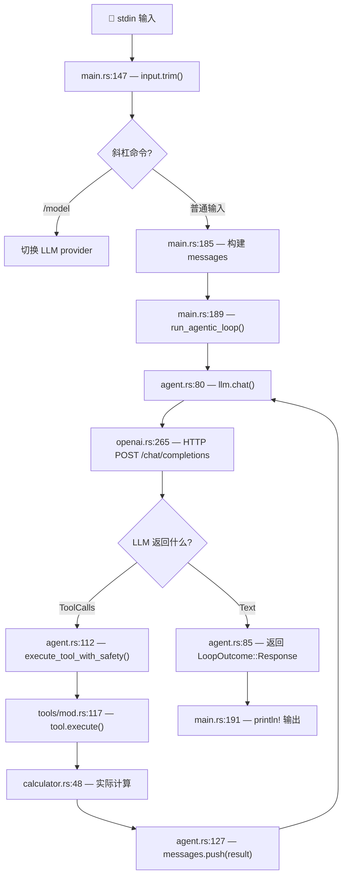

# Mini Agent Loop — LLDB 调试指南

> 目标：用 LLDB 逐步跟踪 Agent 的完整链路，搞清楚从用户输入到 LLM 调用再到工具执行的全过程。

## 启动调试

```bash
# 先编译 debug 版本
cargo build

# 启动 LLDB
lldb target/debug/mini-agent-loop
```

---

## 🗺️ 完整 Agent 链路总览



### 数据流文字版

```
stdin → input.trim() → 构建 [system_prompt, user_msg]
  → run_agentic_loop()
    → llm.chat(messages, tool_defs)
      → HTTP POST /v1/chat/completions
      → 解析 OpenAI 响应
    → 如果是 Text → 返回 LoopOutcome::Response → 打印
    → 如果是 ToolCalls → execute_tool_with_safety()
      → registry.get(name) → tool.execute(params)
      → 结果加入 messages → 回到 llm.chat() 再来一轮
```

---

## 🔧 断点设置详解

### 阶段 1：处理输入

观察用户输入如何被读取和处理。

```lldb
# 断点 1: 读取 stdin 输入后，trim 去掉首尾空白
# main.rs 第 147 行 — let input = input.trim();
(lldb) b main.rs:147

# 断点 2: 检查是否是斜杠命令 /model
# main.rs 第 163 行 — if input.starts_with("/model ")
(lldb) b main.rs:163

# 断点 3: 构建 messages 数组（system prompt + user message）
# main.rs 第 185 行 — let mut messages = vec![...]
(lldb) b main.rs:185
```

**到断点时查看变量：**

```lldb
# 断点 1 — 查看用户输入
(lldb) frame variable input

# 断点 3 — 查看构建的消息
(lldb) p messages
(lldb) p messages.len()
```

### 阶段 2：Agent 循环逻辑

这是核心！观察 agentic loop 如何迭代。

```lldb
# 断点 4: 进入 agentic loop 的 for 循环
# agent.rs 第 73 行 — for iteration in 1..=config.max_iterations
(lldb) b agent.rs:73

# 断点 5: 调用 LLM 前（最关键的断点！）
# agent.rs 第 80 行 — let response = llm.chat(messages, &tool_defs).await?;
(lldb) b agent.rs:80

# 断点 6: LLM 返回纯文本（对话结束）
# agent.rs 第 85 行 — LlmOutput::Text(text) =>
(lldb) b agent.rs:85

# 断点 7: LLM 返回工具调用请求
# agent.rs 第 91 行 — LlmOutput::ToolCalls { tool_calls, content } =>
(lldb) b agent.rs:91

# 断点 8: 执行工具
# agent.rs 第 112 行 — execute_tool_with_safety(registry, &tc.name, ...)
(lldb) b agent.rs:112

# 断点 9: 工具结果加入 messages（为下一轮 LLM 调用准备上下文）
# agent.rs 第 127 行 — messages.push(result_msg)
(lldb) b agent.rs:127
```

**到断点时查看变量：**

```lldb
# 断点 5 — 查看发给 LLM 的完整消息和工具定义
(lldb) p messages
(lldb) p tool_defs

# 断点 7 — 查看 LLM 要调用什么工具
(lldb) p tool_calls
(lldb) p content

# 断点 8 — 查看工具名和参数
(lldb) frame variable tc
```

### 阶段 3：发给 LLM（HTTP 调用细节）

深入 OpenAI 兼容 provider，观察 HTTP 请求和响应。

```lldb
# 断点 10: 构建 OpenAI 请求体
# openai.rs 第 258 行 — let body = OpenAiRequest { ... }
(lldb) b openai.rs:258

# 断点 11: 发送 HTTP POST 请求
# openai.rs 第 271 行 — .send()
(lldb) b openai.rs:271

# 断点 12: 解析 LLM JSON 响应
# openai.rs 第 283 行 — let openai_resp: OpenAiResponse = resp.json()...
(lldb) b openai.rs:283

# 断点 13: 检查响应中是否有 tool_calls
# openai.rs 第 299 行 — if let Some(tool_calls_in) = choice.message.tool_calls
(lldb) b openai.rs:299
```

**到断点时查看变量：**

```lldb
# 断点 10 — 查看请求体
(lldb) p body.model
(lldb) p body.messages.len()
(lldb) p body.tools.len()

# 断点 12 — 查看原始响应
(lldb) p openai_resp

# 断点 13 — 查看 finish_reason 和 tool_calls
(lldb) frame variable choice
```

### 阶段 4：工具执行细节

观察工具如何被查找、执行、结果如何处理。

```lldb
# 断点 14: 从 registry 中查找工具
# tools/mod.rs 第 117 行 — let tool = registry.get(tool_name)
(lldb) b mod.rs:117

# 断点 15: Calculator 工具实际执行计算
# calculator.rs 第 48 行 — let op = params["operation"]...
(lldb) b calculator.rs:48

# 断点 16: 工具结果包装成 ChatMessage
# tools/mod.rs 第 149 行 — process_tool_result(...)
(lldb) b mod.rs:149
```

**到断点时查看变量：**

```lldb
# 断点 14 — 查看要找的工具名
(lldb) frame variable tool_name
(lldb) frame variable params

# 断点 15 — 查看计算参数
(lldb) frame variable op
(lldb) frame variable a
(lldb) frame variable b
```

---

## 🚀 快速开始：一键设置所有断点

把下面的命令一次性粘贴到 LLDB 中：

```lldb
# === 阶段 1: 输入处理 ===
b main.rs:147
b main.rs:185

# === 阶段 2: Agent 循环 ===
b agent.rs:80
b agent.rs:85
b agent.rs:91
b agent.rs:112
b agent.rs:127

# === 阶段 3: LLM HTTP 调用 ===
b openai.rs:258
b openai.rs:271
b openai.rs:283

# === 阶段 4: 工具执行 ===
b calculator.rs:48
b mod.rs:149

# 查看所有断点
br list

# 开始运行
run
```

---

## 🎯 推荐的调试场景

### 场景 A：输入 "Hello"（纯文本响应，不调用工具）

**预期命中断点顺序：**

```
main.rs:147       ← 读取输入 "Hello"
  ↓
main.rs:185       ← 构建 messages = [system_prompt, "Hello"]
  ↓
agent.rs:80       ← 调用 llm.chat()
  ↓
openai.rs:258     ← 构建 HTTP 请求体
  ↓
openai.rs:271     ← 发送 POST /chat/completions
  ↓
openai.rs:283     ← 解析 JSON 响应
  ↓
agent.rs:85       ← LLM 返回 Text → LoopOutcome::Response
  ↓
main.rs:191       ← println! 打印结果
```

**特点：** 只有 1 轮 LLM 调用，LLM 直接返回文本。

### 场景 B：输入 "What is 42 + 58?"（触发工具调用）

**预期命中断点顺序：**

```
main.rs:147       ← 读取输入 "What is 42 + 58?"
  ↓
main.rs:185       ← 构建 messages = [system_prompt, "What is 42 + 58?"]
  ↓
=== 第 1 轮 LLM 调用 ===
agent.rs:80       ← 调用 llm.chat()
  ↓
openai.rs:258     ← 构建 HTTP 请求体（包含 calculator 工具定义）
  ↓
openai.rs:271     ← 发送 POST
  ↓
openai.rs:283     ← 解析响应
  ↓
agent.rs:91       ← LLM 返回 ToolCalls（要调用 calculator）
  ↓
agent.rs:112      ← execute_tool_with_safety("calculator", {op:"add", a:42, b:58})
  ↓
calculator.rs:48  ← 实际执行 42 + 58 = 100
  ↓
agent.rs:127      ← 工具结果 "100" 加入 messages
  ↓
=== 第 2 轮 LLM 调用（带着工具结果） ===
agent.rs:80       ← 再次调用 llm.chat()（messages 现在包含工具结果）
  ↓
openai.rs:258     ← 构建请求体（messages 多了 assistant+tool_calls 和 tool_result）
  ↓
openai.rs:271     ← 发送 POST
  ↓
openai.rs:283     ← 解析响应
  ↓
agent.rs:85       ← LLM 返回 Text "42 + 58 = 100"
  ↓
main.rs:191       ← println! 打印最终结果
```

**特点：** 2 轮 LLM 调用。第 1 轮 LLM 说"我要用计算器"，第 2 轮 LLM 看到计算结果后给出最终回答。这是完整的 Agent 链路。

---

## 📋 LLDB 常用命令速查

### 执行控制

| 命令 | 简写 | 作用 |
|------|------|------|
| `run` | `r` | 启动程序 |
| `continue` | `c` | 继续执行到下一个断点 |
| `next` | `n` | 单步执行（不进入函数） |
| `step` | `s` | 单步执行（进入函数） |
| `finish` | `f` | 执行完当前函数并返回 |

### 查看变量

| 命令 | 简写 | 作用 |
|------|------|------|
| `frame variable` | `fr v` | 查看当前栈帧所有局部变量 |
| `frame variable <name>` | `fr v <name>` | 查看指定变量（推荐，比 `p` 更可靠） |
| `frame variable --show-types <name>` | `fr v -T <name>` | 查看变量及其类型 |
| `p <expr>` | — | 通过表达式引擎打印（可调用函数） |

### 断点管理

| 命令 | 简写 | 作用 |
|------|------|------|
| `breakpoint list` | `br list` | 列出所有断点 |
| `breakpoint delete <N>` | `br del <N>` | 删除第 N 个断点 |
| `breakpoint disable <N>` | `br dis <N>` | 临时禁用第 N 个断点 |
| `breakpoint enable <N>` | `br en <N>` | 重新启用断点 |

### 调用栈

| 命令 | 简写 | 作用 |
|------|------|------|
| `bt` | — | 查看完整调用栈 |
| `bt 5` | — | 只看最近 5 层调用栈 |
| `frame select <N>` | `fr s <N>` | 切换到第 N 层栈帧 |
| `up` | — | 上移一层栈帧 |
| `down` | — | 下移一层栈帧 |

### 提示

- Rust 调试时优先用 `frame variable`，因为 LLDB 对 Rust 表达式求值支持有限，`p` 命令经常报错。
- `frame variable` 直接从内存读取，不执行表达式，更快更可靠。
- 如果 `p` 报错，换 `frame variable` 试试。

---

## 📁 源码文件与行号对照表

| 文件 | 路径 | 关键行号 | 作用 |
|------|------|----------|------|
| `main.rs` | `src/main.rs` | 147, 163, 185, 189 | 输入处理、消息构建、启动 loop |
| `agent.rs` | `src/agent.rs` | 73, 80, 85, 91, 112, 127 | Agentic loop 核心逻辑 |
| `openai.rs` | `src/llm/openai.rs` | 258, 271, 283, 299 | HTTP 请求构建、发送、响应解析 |
| `provider.rs` | `src/llm/provider.rs` | — | LlmProvider trait 定义 |
| `mod.rs` | `src/tools/mod.rs` | 117, 149 | 工具查找、执行、结果处理 |
| `calculator.rs` | `src/tools/calculator.rs` | 48 | Calculator 工具实际计算 |
