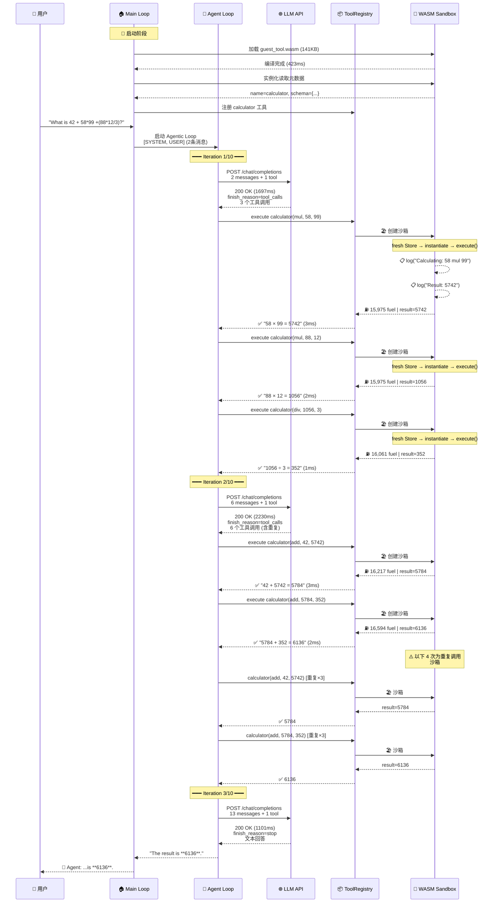

# Mini Agent Loop + WASM Sandbox 全过程追踪分析

> **源文件**：`trace-output-raw.log`
> **问题**：`What is 42 + 58*99 +(88*12/3)?`
> **正确答案**：6136
> **模型**：DeepSeek-V3-0324（via http://api.haihub.cn/v1）
> **总耗时**：5067ms（3 轮迭代，3 次 LLM 调用，9 次工具调用）
> **WASM 沙箱**：guest_tool.wasm（141,583 bytes），Fuel 限制 1,000,000 units/次

---

## 总览：工具调用统计

整个过程中，LLM **共发起了 9 次 calculator 工具调用**（全部在 WASM 沙箱中执行），分布在 2 轮工具调用迭代中：

| 迭代 | LLM 请求的工具调用数 | 具体调用 | WASM 沙箱实例数 | 备注 |
|------|---------------------|---------|----------------|------|
| Iteration 1 | 3 次 | `58×99`, `88×12`, `1056÷3` | 3 个独立沙箱 | ✅ 合理：先算乘法和除法 |
| Iteration 2 | 6 次 | `42+5742`, `5784+352` 各重复 3 次 | 6 个独立沙箱 | ⚠️ 冗余：DeepSeek 重复调用了相同的计算 |
| Iteration 3 | 0 次 | 无（直接给出文本回答） | — | ✅ 最终回答 |

> **注意**：Iteration 2 中 LLM 产生了 6 次工具调用，但实际上只有 2 种不同的计算（`42+5742` 和 `5784+352`），每种重复了 3 次。这是 DeepSeek-V3-0324 模型的一个行为特征——在组合中间结果时产生了冗余调用。

> **WASM 沙箱特性**：每次工具调用都会创建一个全新的 WASM Store（完全隔离），即使是相同的计算也不会复用之前的沙箱实例。这保证了安全性但也意味着 9 次调用 = 9 次独立的沙箱创建 + 实例化。

---

## 全过程时间线

```
时间轴 (相对于启动 T=09:41:51.450)
│
│  T+0ms       🚀 程序启动，初始化 tracing
│  T+1ms       🔧 开始加载 WASM 工具
│  T+1ms       ┌─ 创建 WASM 引擎 (fuel_limit=1,000,000)
│  T+4ms       │  读取 WASM 文件 (141,583 bytes)
│  T+5ms       │  开始编译 WASM 组件...
│  T+428ms     │  ✅ WASM 组件编译完成 (耗时 ~423ms)
│  T+428ms     │  实例化 WASM 读取元数据...
│  T+429ms     └─ ✅ 元数据加载: name='calculator'
│  T+430ms     📂 加载 HAI_WOA.json 配置
│  T+431ms     ✅ 配置加载完成 (DeepSeek-V3-0324)
│  T+431ms     🤖 创建 LLM Provider (timeout=120s)
│  T+435ms     🔧 注册 calculator 工具到 ToolRegistry
│  T+435ms     📝 收到用户输入: "What is 42 + 58*99 +(88*12/3)?"
│  T+435ms     📋 构建消息上下文 (2条: SYSTEM + USER)
│  T+435ms     🧠 进入 Agentic Loop (max_iterations=10)
│
│  ═══════════ Iteration 1/10 ═══════════
│  T+435ms     📤 发送请求给 LLM (2条消息 + 1个工具定义)
│  T+2133ms    📥 LLM 响应 200 OK (耗时 1697ms)
│              🔧 LLM 请求调用 3 个工具
│  T+2134ms    ⚙️  WASM 沙箱 #1: calculator(mul, 58, 99)
│              ┌─ 创建 fresh WASM store → 实例化 guest → execute()
│              │  📋 Guest Log: "Calculating: 58 mul 99"
│              │  📋 Guest Log: "Result: 5742"
│              │  ⛽ Fuel: 15,975 / 1,000,000
│              └─ ✅ 结果: 5742 (3ms)
│  T+2138ms    ⚙️  WASM 沙箱 #2: calculator(mul, 88, 12)
│              ┌─ 创建 fresh WASM store → 实例化 guest → execute()
│              │  📋 Guest Log: "Calculating: 88 mul 12"
│              │  📋 Guest Log: "Result: 1056"
│              │  ⛽ Fuel: 15,975 / 1,000,000
│              └─ ✅ 结果: 1056 (2ms)
│  T+2141ms    ⚙️  WASM 沙箱 #3: calculator(div, 1056, 3)
│              ┌─ 创建 fresh WASM store → 实例化 guest → execute()
│              │  📋 Guest Log: "Calculating: 1056 div 3"
│              │  📋 Guest Log: "Result: 352"
│              │  ⛽ Fuel: 16,061 / 1,000,000
│              └─ ✅ 结果: 352 (1ms)
│
│  ═══════════ Iteration 2/10 ═══════════
│  T+2143ms    📤 发送请求给 LLM (6条消息 + 1个工具定义)
│  T+4374ms    📥 LLM 响应 200 OK (耗时 2230ms)
│              🔧 LLM 请求调用 6 个工具 (含重复)
│  T+4376ms    ⚙️  WASM 沙箱 #4: calculator(add, 42, 5742) → 5784 (3ms)
│  T+4380ms    ⚙️  WASM 沙箱 #5: calculator(add, 5784, 352) → 6136 (2ms)
│  T+4383ms    ⚙️  WASM 沙箱 #6: calculator(add, 42, 5742) → 5784 (2ms) [重复]
│  T+4386ms    ⚙️  WASM 沙箱 #7: calculator(add, 5784, 352) → 6136 (2ms) [重复]
│  T+4389ms    ⚙️  WASM 沙箱 #8: calculator(add, 42, 5742) → 5784 (2ms) [重复]
│  T+4392ms    ⚙️  WASM 沙箱 #9: calculator(add, 5784, 352) → 6136 (2ms) [重复]
│
│  ═══════════ Iteration 3/10 ═══════════
│  T+4395ms    📤 发送请求给 LLM (13条消息 + 1个工具定义)
│  T+5497ms    📥 LLM 响应 200 OK (耗时 1101ms)
│              💬 LLM 返回文本回答 (finish_reason=stop)
│
│  T+5503ms    ✅ 输出最终答案: 6136
│  T+5503ms    👋 用户退出
```

---

## 阶段一：启动与 WASM 组件加载 (T+0ms ~ T+435ms)

### 1.1 程序启动

```
🚀 Starting Mini Agent Loop + WASM Sandbox — tracing initialized
```

### 1.2 WASM 工具加载（⭐ WASM 特有流程）

这是 WASM 版本与普通版本最大的区别——工具不是本地 Rust 函数，而是从 `.wasm` 文件加载的沙箱化组件。

**Step 1: 创建 WASM 引擎**

```
🔧 Loading WASM tool from: guest/target/wasm32-wasip2/release/guest_tool.wasm
🔧 Creating WASM tool engine
   wasm_path=guest/target/wasm32-wasip2/release/guest_tool.wasm
   fuel_limit=1000000
```

> Fuel 是 Wasmtime 的资源限制机制，每条 WASM 指令消耗一定量的 fuel。设置 fuel_limit=1,000,000 可以防止 WASM guest 中的无限循环或过度计算。

**Step 2: 读取并编译 WASM 文件**

```
Loading WASM bytes from file...
WASM file loaded (141583 bytes)
   wasm_size=141583

Compiling WASM component...
✅ WASM component compiled successfully
```

> 编译耗时约 423ms（从 T+5ms 到 T+428ms），这是一次性的开销。编译后的组件会被缓存，后续每次工具调用只需要实例化（instantiate），不需要重新编译。

**Step 3: 实例化并读取元数据**

```
Instantiating WASM component to read metadata...
✅ WASM tool metadata loaded:
   name='calculator'
   tool_description='A sandboxed calculator tool. Performs basic math operations
                     (add, sub, mul, div) inside a WASM sandbox.'
```

**Step 4: 读取工具 Schema**

WASM guest 导出的工具 schema（这个 schema 会被发送给 LLM，让 LLM 知道如何调用工具）：

```json
{
  "properties": {
    "a": {
      "description": "First operand",
      "type": "number"
    },
    "b": {
      "description": "Second operand",
      "type": "number"
    },
    "operation": {
      "description": "Math operation: add, sub, mul, div",
      "enum": ["add", "sub", "mul", "div"],
      "type": "string"
    }
  },
  "required": ["operation", "a", "b"],
  "type": "object"
}
```

**加载完成摘要**

```
✅ WASM tool loaded and compiled
   Name: calculator
   Description: A sandboxed calculator tool. Performs basic math operations
                (add, sub, mul, div) inside a WASM sandbox.
   Fuel limit: 1000000 units per execution
```

### 1.3 加载 LLM 配置

从 `./HAI_WOA.json` 加载 LLM 配置：

```
📂 Loading LLM configuration from HAI_WOA.json ...
Config file read successfully (content_len=518)
Config parsed: default model='openai/DeepSeek-V3-0324', 5 model shortcuts
✅ Config loaded successfully
   model=openai/DeepSeek-V3-0324
   base_url=http://api.haihub.cn/v1
```

可用的模型快捷方式：

| 快捷名 | 完整模型名 |
|--------|-----------|
| ds | openai/DeepSeek-V3-0324 |
| ds31 | openai/DeepSeek-V3.1 |
| kimi | openai/Kimi-K2 |
| qwen | openai/Qwen3-235B-A22B |
| qwen32 | openai/Qwen3-32B-FP8 |

### 1.4 创建 LLM Provider

```
🤖 Initial model selected: DeepSeek-V3-0324
Creating OpenAI-compatible provider (timeout=120s)
   model=DeepSeek-V3-0324
   base_url=http://api.haihub.cn/v1
   api_key_prefix=sk-322ca...
```

### 1.5 注册工具到 ToolRegistry

```
Creating new ToolRegistry
Registering tool: 'calculator'
   tool_name=calculator
   description=A sandboxed calculator tool. Performs basic math operations
               (add, sub, mul, div) inside a WASM sandbox.
```

发送给 LLM 的完整工具定义：

```json
[
  {
    "description": "A sandboxed calculator tool. Performs basic math operations (add, sub, mul, div) inside a WASM sandbox.",
    "name": "calculator",
    "parameters": {
      "properties": {
        "a": { "description": "First operand", "type": "number" },
        "b": { "description": "Second operand", "type": "number" },
        "operation": {
          "description": "Math operation: add, sub, mul, div",
          "enum": ["add", "sub", "mul", "div"],
          "type": "string"
        }
      },
      "required": ["operation", "a", "b"],
      "type": "object"
    }
  }
]
```

### 1.6 Agentic Loop 配置

```
⚙️  Agentic loop config: max_iterations=10
🔄 Entering main input loop — waiting for user input...
```

---

## 阶段二：接收用户输入 (T+435ms)

```
📝 User input received: "What is 42 + 58*99 +(88*12/3)?"
📋 Building conversation context (system prompt + user message)
```

构建的初始消息上下文（2 条消息）：

```
[0] SYSTEM | "You are a helpful assistant powered by the DeepSeek-V3-0324 model.
             You have access to a calculator tool. When the user asks a math
             question, use the calculator tool to compute the answer. For non-math
             questions, respond directly. When asked about your identity, truthfully
             state that you are based on DeepSeek-V3-0324."

[1] USER   | "What is 42 + 58*99 +(88*12/3)?"
```

```
🧠 Starting agentic loop (model=DeepSeek-V3-0324, max_iterations=10)
🔄 Entering agentic loop
   tool_count=1
   tools=["calculator"]
   initial_message_count=2
```

---

## 阶段三：Agentic Loop — Iteration 1（先算乘除）

### 3.1 发送第一次 LLM 请求

```
━━━ Iteration 1/10 ━━━
📤 Step 1: Calling LLM...
   Sending 2 messages and 1 tool definitions to LLM
   Message flow: [0]SYS → [1]USR
```

发送的完整 HTTP 请求体：

```json
{
  "model": "DeepSeek-V3-0324",
  "messages": [
    {
      "role": "system",
      "content": "You are a helpful assistant powered by the DeepSeek-V3-0324 model. You have access to a calculator tool. When the user asks a math question, use the calculator tool to compute the answer. For non-math questions, respond directly. When asked about your identity, truthfully state that you are based on DeepSeek-V3-0324."
    },
    {
      "role": "user",
      "content": "What is 42 + 58*99 +(88*12/3)?"
    }
  ],
  "tools": [
    {
      "type": "function",
      "function": {
        "name": "calculator",
        "description": "A sandboxed calculator tool. Performs basic math operations (add, sub, mul, div) inside a WASM sandbox.",
        "parameters": {
          "properties": {
            "a": { "description": "First operand", "type": "number" },
            "b": { "description": "Second operand", "type": "number" },
            "operation": {
              "description": "Math operation: add, sub, mul, div",
              "enum": ["add", "sub", "mul", "div"],
              "type": "string"
            }
          },
          "required": ["operation", "a", "b"],
          "type": "object"
        }
      }
    }
  ],
  "tool_choice": "auto"
}
```

### 3.2 接收第一次 LLM 响应

```
🌐 Sending HTTP POST to http://api.haihub.cn/v1/chat/completions...
📥 HTTP response received: 200 OK in 1697ms
   status=200 OK
   elapsed_ms=1697
```

LLM 原始响应体（940 bytes）：

```json
{
  "id": "99bd3df2905440a8a99910b4f9ca1ea8",
  "model": "DeepSeek-V3-0324",
  "choices": [{
    "message": {
      "role": "assistant",
      "content": null,
      "tool_calls": [
        {
          "id": "call_a2692f5195fe4959b826feea",
          "type": "function",
          "function": {
            "name": "calculator",
            "arguments": "{\"a\": 58, \"b\": 99, \"operation\": \"mul\"}"
          }
        },
        {
          "id": "call_71b4f044098742e2b42d3c14",
          "type": "function",
          "function": {
            "name": "calculator",
            "arguments": "{\"a\": 88, \"b\": 12, \"operation\": \"mul\"}"
          }
        },
        {
          "id": "call_17524402ed354144b7117b95",
          "type": "function",
          "function": {
            "name": "calculator",
            "arguments": "{\"a\": 1056, \"b\": 3, \"operation\": \"div\"}"
          }
        }
      ]
    },
    "finish_reason": "tool_calls"
  }],
  "usage": {
    "prompt_tokens": 316,
    "completion_tokens": 90,
    "total_tokens": 406
  }
}
```

LLM 返回了 **3 个工具调用**（finish_reason=tool_calls）：

| # | tool_call_id | 操作 | 参数 a | 参数 b | 含义 |
|---|-------------|------|--------|--------|------|
| 0 | call_a269...feea | mul | 58 | 99 | 计算 58×99 |
| 1 | call_71b4...3c14 | mul | 88 | 12 | 计算 88×12 |
| 2 | call_1752...7b95 | div | **1056** | 3 | 计算 1056÷3 |

> **LLM 的思路**：先按运算优先级计算乘法和除法部分。

> [!WARNING]
> **关于第 3 个调用中 `a=1056` 的来源 — Parallel Tool Calls 的隐含风险**
>
> 这 3 个工具调用是 LLM **在一次响应中同时返回的**（即 OpenAI 的 Parallel Tool Calls 机制）。
> 这意味着当 LLM 生成第 3 个调用 `div(1056, 3)` 时，**它还没有收到前两个工具的执行结果**——
> 因为所有 tool_calls 都在同一个 JSON 响应中，工具尚未被执行。
>
> 那 `1056` 从哪来？**是 LLM 在生成 token 时自己「心算」出来的**。LLM 在逐 token 生成第 3 个
> tool_call 的 JSON 时，已经「知道」88×12=1056（基于其语言模型能力），于是直接将 1056 填入了参数。
>
> **这是一个有风险的行为**：
> - ✅ 如果心算正确（如本例），则没有问题，还能减少一轮迭代
> - ❌ 如果心算错误（比如把 88×12 算成 1050），那第 3 个工具会算 `1050÷3=350`，最终答案就错了

Token 使用情况：
- prompt_tokens: 316
- completion_tokens: 90
- total_tokens: 406

### 3.3 在 WASM 沙箱中执行 3 个工具调用（⭐ WASM 核心交互）

每次工具调用都经历以下 WASM 沙箱生命周期：

```
Host 端                              WASM Guest 端
────────                             ──────────────
1. 查找工具注册表                      
2. 设置 30s 超时                      
3. dispatch 到 WASM sandbox           
   ┌──────────────────────────────────────────────┐
   │ 4. 创建 fresh WASM Store (完全隔离)           │
   │ 5. 实例化 WASM guest                         │
   │ 6. 调用 guest execute() ──────────→ 7. 解析参数│
   │                                    8. 执行计算 │
   │ 9. host::log() ←──────────────── 输出日志     │
   │ 10. host::now_millis() ←──────── 获取时间戳   │
   │ 11. host::log() ←──────────────── 输出结果    │
   │ 12. 返回 JSON 结果 ←──────────── 返回值       │
   └──────────────────────────────────────────────┘
13. 统计 Fuel 消耗                     
14. 收集 guest 日志                    
15. 包装为 <tool_output>               
16. 创建 Tool ChatMessage              
```

---

**WASM 沙箱 #1：58 × 99 = 5742**

```
⚙️  Executing tool [1/3]: calculator
   tool_call_id=call_a2692f5195fe4959b826feea
   arguments={"a": 58, "b": 99, "operation": "mul"}

🔍 Looking up tool in registry: calculator → Found
⏱️  Executing tool with 30s timeout
🔧 WasmTool::execute() — dispatching to WASM sandbox
   params={"a":58,"b":99,"operation":"mul"}
```

**进入 WASM 沙箱（tokio-rt-worker 线程）：**

```
🏖️  Executing tool in WASM sandbox
   tool=calculator
   params={"a":58,"b":99,"operation":"mul"}
   fuel_limit=1000000

Creating fresh WASM store (complete isolation)
Instantiating WASM guest in sandbox...
📤 Calling WASM guest execute() function
```

**Guest 日志（通过 host::log() 跨 WASM 边界传递）：**

```
📋 [WASM LOG] [INFO] Calculating: 58 mul 99
📋 [WASM LOG] [INFO] Result: 5742 (at timestamp 1774863713587)
```

> 注意：Guest 调用了 `host::now_millis()` 获取当前时间戳（1774863713587），这是 WASM guest 获取外部时间的唯一途径——因为沙箱内没有系统时钟访问权限。

**Fuel 消耗统计：**

```
⛽ Fuel consumed: 15,975 / 1,000,000 units
   fuel_consumed=15975
   fuel_remaining=984025
```

> 一次乘法运算消耗了 15,975 fuel（约 1.6% 的配额），说明 calculator 工具的计算量很小。

**结果返回：**

```
✅ WASM tool execution succeeded (77 chars output)
Full WASM tool output:
   {"expression":"58 × 99 = 5742","result":5742.0,"timestamp_ms":1774863713587}

WASM sandbox execution completed in 3ms
```

**包装为 tool_output 并加入对话上下文：**

```
Wrapping tool output in <tool_output> tags (117 chars)
<tool_output>{
  "expression": "58 × 99 = 5742",
  "result": 5742.0,
  "timestamp_ms": 1774863713587
}</tool_output>

📝 Creating tool result ChatMessage (role=Tool)
   tool_call_id=call_a2692f5195fe4959b826feea
   is_error=false

✅ Tool 'calculator' succeeded in 4ms (90 chars output)
Context now has 4 messages
```

---

**WASM 沙箱 #2：88 × 12 = 1056**

```
⚙️  Executing tool [2/3]: calculator
   tool_call_id=call_71b4f044098742e2b42d3c14
   arguments={"a": 88, "b": 12, "operation": "mul"}

🏖️  Executing tool in WASM sandbox (fuel_limit=1000000)
   Creating fresh WASM store (complete isolation)
   Instantiating WASM guest in sandbox...
   📤 Calling WASM guest execute() function

📋 [WASM LOG] [INFO] Calculating: 88 mul 12
📋 [WASM LOG] [INFO] Result: 1056 (at timestamp 1774863713590)

⛽ Fuel consumed: 15,975 / 1,000,000 units

✅ WASM tool execution succeeded
   output: {"expression":"88 × 12 = 1056","result":1056.0,"timestamp_ms":1774863713590}
   WASM sandbox execution completed in 2ms

✅ Tool 'calculator' succeeded in 2ms
Context now has 5 messages
```

---

**WASM 沙箱 #3：1056 ÷ 3 = 352**

```
⚙️  Executing tool [3/3]: calculator
   tool_call_id=call_17524402ed354144b7117b95
   arguments={"a": 1056, "b": 3, "operation": "div"}

🏖️  Executing tool in WASM sandbox (fuel_limit=1000000)
   Creating fresh WASM store (complete isolation)
   Instantiating WASM guest in sandbox...
   📤 Calling WASM guest execute() function

📋 [WASM LOG] [INFO] Calculating: 1056 div 3
📋 [WASM LOG] [INFO] Result: 352 (at timestamp 1774863713592)

⛽ Fuel consumed: 16,061 / 1,000,000 units
```

> 注意：除法消耗了 16,061 fuel，比乘法的 15,975 多了 86 fuel。这是因为除法运算在 WASM 指令层面比乘法稍复杂。

```
✅ WASM tool execution succeeded
   output: {"expression":"1056 ÷ 3 = 352","result":352.0,"timestamp_ms":1774863713592}
   WASM sandbox execution completed in 1ms

✅ Tool 'calculator' succeeded in 1ms
Context now has 6 messages
```

### 3.4 Iteration 1 结束后的消息上下文（6 条）

```
[0] SYSTEM     | "You are a helpful assistant powered by the DeepSeek-V3-0324 model..."
[1] USER       | "What is 42 + 58*99 +(88*12/3)?"
[2] ASSISTANT  | tool_calls: [calculator(mul,58,99), calculator(mul,88,12), calculator(div,1056,3)]
[3] TOOL       | calculator → "58 × 99 = 5742"   (result: 5742.0)
[4] TOOL       | calculator → "88 × 12 = 1056"   (result: 1056.0)
[5] TOOL       | calculator → "1056 ÷ 3 = 352"   (result: 352.0)
```

```
🔄 All tools executed. Looping back to LLM with updated context (6 messages)
```

---

## 阶段四：Agentic Loop — Iteration 2（再算加法，但有冗余）

### 4.1 发送第二次 LLM 请求

```
━━━ Iteration 2/10 ━━━
📤 Step 1: Calling LLM...
   Sending 6 messages and 1 tool definitions to LLM
   Message flow: [0]SYS → [1]USR → [2]AST → [3]TOL → [4]TOL → [5]TOL
```

这次请求包含了完整的 6 条消息上下文（含 Iteration 1 的工具调用和结果），让 LLM 知道：
- 58×99 = 5742
- 88×12 = 1056
- 1056÷3 = 352

完整请求体中的 messages 部分（展示 tool 消息的格式）：

```json
{
  "role": "assistant",
  "content": "",
  "tool_calls": [
    { "id": "call_a269...feea", "function": { "name": "calculator", "arguments": "{\"a\":58,\"b\":99,\"operation\":\"mul\"}" } },
    { "id": "call_71b4...3c14", "function": { "name": "calculator", "arguments": "{\"a\":88,\"b\":12,\"operation\":\"mul\"}" } },
    { "id": "call_1752...7b95", "function": { "name": "calculator", "arguments": "{\"a\":1056,\"b\":3,\"operation\":\"div\"}" } }
  ]
},
{
  "role": "tool",
  "content": "<tool_output>{\"expression\": \"58 × 99 = 5742\", \"result\": 5742.0, ...}</tool_output>",
  "tool_call_id": "call_a269...feea",
  "name": "calculator"
},
{
  "role": "tool",
  "content": "<tool_output>{\"expression\": \"88 × 12 = 1056\", \"result\": 1056.0, ...}</tool_output>",
  "tool_call_id": "call_71b4...3c14",
  "name": "calculator"
},
{
  "role": "tool",
  "content": "<tool_output>{\"expression\": \"1056 ÷ 3 = 352\", \"result\": 352.0, ...}</tool_output>",
  "tool_call_id": "call_1752...7b95",
  "name": "calculator"
}
```

### 4.2 接收第二次 LLM 响应

```
🌐 Sending HTTP POST to http://api.haihub.cn/v1/chat/completions...
📥 HTTP response received: 200 OK in 2230ms
   status=200 OK
   elapsed_ms=2230
```

LLM 原始响应体（1441 bytes）：

```json
{
  "id": "c56886a2c19c4f6ba8b85cad0a58bf20",
  "model": "DeepSeek-V3-0324",
  "choices": [{
    "message": {
      "role": "assistant",
      "content": null,
      "tool_calls": [
        { "id": "call_ec9a...88ac", "function": { "name": "calculator", "arguments": "{\"a\": 42, \"b\": 5742, \"operation\": \"add\"}" } },
        { "id": "call_d5ba...8ef8", "function": { "name": "calculator", "arguments": "{\"a\": 5784, \"b\": 352, \"operation\": \"add\"}" } },
        { "id": "call_f19f...926a", "function": { "name": "calculator", "arguments": "{\"a\": 42, \"b\": 5742, \"operation\": \"add\"}" } },
        { "id": "call_9825...b91c", "function": { "name": "calculator", "arguments": "{\"a\": 5784, \"b\": 352, \"operation\": \"add\"}" } },
        { "id": "call_f5f5...f770", "function": { "name": "calculator", "arguments": "{\"a\": 42, \"b\": 5742, \"operation\": \"add\"}" } },
        { "id": "call_4ee8...f418", "function": { "name": "calculator", "arguments": "{\"a\": 5784, \"b\": 352, \"operation\": \"add\"}" } }
      ]
    },
    "finish_reason": "tool_calls"
  }],
  "usage": {
    "prompt_tokens": 569,
    "completion_tokens": 220,
    "total_tokens": 789
  }
}
```

LLM 返回了 **6 个工具调用**（⚠️ 包含重复）：

| # | tool_call_id | 操作 | 参数 a | 参数 b | 含义 | 是否重复 |
|---|-------------|------|--------|--------|------|--------|
| 0 | call_ec9a...88ac | add | 42 | 5742 | 42 + 5742 | — |
| 1 | call_d5ba...8ef8 | add | **5784** | 352 | 5784 + 352 | — |
| 2 | call_f19f...926a | add | 42 | 5742 | 42 + 5742 | ⚠️ 重复 #0 |
| 3 | call_9825...b91c | add | **5784** | 352 | 5784 + 352 | ⚠️ 重复 #1 |
| 4 | call_f5f5...f770 | add | 42 | 5742 | 42 + 5742 | ⚠️ 重复 #0 |
| 5 | call_4ee8...f418 | add | **5784** | 352 | 5784 + 352 | ⚠️ 重复 #1 |

> **分析**：LLM 的计算思路是正确的：
> 1. 先算 42 + 5742（即 42 + 58×99）= 5784
> 2. 再算 5784 + 352（即上一步结果 + 88×12÷3）= 6136
>
> 但 DeepSeek-V3-0324 在这里产生了 **3 倍冗余**，同样的两步计算重复了 3 次。
> 这不影响最终结果的正确性，但浪费了 token 和执行时间。

> [!WARNING]
> **同样的预判问题再次出现 — `5784` 的来源**
>
> 注意第 2 个调用 `add(5784, 352)` 中的 `5784`。这 6 个工具调用同样是在一次 LLM 响应中
> 同时返回的（Parallel Tool Calls），当 LLM 生成第 2 个调用时，第 1 个调用 `add(42, 5742)`
> **还没有被执行**，LLM 不可能知道其结果。
>
> 所以 `5784` 又是 LLM 自己心算 `42+5742=5784` 后填入的预判值。

Token 使用情况：
- prompt_tokens: 569
- completion_tokens: 220
- total_tokens: 789

### 4.3 在 WASM 沙箱中执行 6 个工具调用

每次调用都创建全新的 WASM 沙箱实例。以下展示每个沙箱的完整执行过程：

**WASM 沙箱 #4：42 + 5742 = 5784**

```
⚙️  Executing tool [1/6]: calculator
   tool_call_id=call_ec9a266e95d84676993188ac
   arguments={"a": 42, "b": 5742, "operation": "add"}

🏖️  Executing tool in WASM sandbox (fuel_limit=1000000)
   Creating fresh WASM store (complete isolation)
   Instantiating WASM guest in sandbox...
   📤 Calling WASM guest execute() function

📋 [WASM LOG] [INFO] Calculating: 42 add 5742
📋 [WASM LOG] [INFO] Result: 5784 (at timestamp 1774863715828)

⛽ Fuel consumed: 16,217 / 1,000,000 units

✅ output: {"expression":"42 + 5742 = 5784","result":5784.0,"timestamp_ms":1774863715828}
   WASM sandbox execution completed in 3ms
Context now has 8 messages
```

**WASM 沙箱 #5：5784 + 352 = 6136**

```
⚙️  Executing tool [2/6]: calculator
   tool_call_id=call_d5bae0fdaffe4f2e86b48ef8
   arguments={"a": 5784, "b": 352, "operation": "add"}

🏖️  Executing tool in WASM sandbox (fuel_limit=1000000)
   Creating fresh WASM store (complete isolation)
   Instantiating WASM guest in sandbox...
   📤 Calling WASM guest execute() function

📋 [WASM LOG] [INFO] Calculating: 5784 add 352
📋 [WASM LOG] [INFO] Result: 6136 (at timestamp 1774863715832)

⛽ Fuel consumed: 16,594 / 1,000,000 units

✅ output: {"expression":"5784 + 352 = 6136","result":6136.0,"timestamp_ms":1774863715832}
   WASM sandbox execution completed in 2ms
Context now has 9 messages
```

**WASM 沙箱 #6 ~ #9：重复调用（省略详细日志，结果相同）**

| 沙箱 # | 调用 | 结果 | Fuel 消耗 | 耗时 |
|--------|------|------|----------|------|
| #6 | add(42, 5742) | 5784 | 16,217 | 2ms |
| #7 | add(5784, 352) | 6136 | 16,594 | 2ms |
| #8 | add(42, 5742) | 5784 | 16,217 | 2ms |
| #9 | add(5784, 352) | 6136 | 16,594 | 2ms |

> 每个重复调用都创建了全新的 WASM Store，完全独立执行。虽然结果相同，但沙箱隔离保证了安全性。

### 4.4 Iteration 2 结束后的消息上下文（13 条）

```
 [0] SYSTEM     | "You are a helpful assistant powered by the DeepSeek-V3-0324 model..."
 [1] USER       | "What is 42 + 58*99 +(88*12/3)?"
 [2] ASSISTANT  | tool_calls: [mul(58,99), mul(88,12), div(1056,3)]
 [3] TOOL       | 58 × 99 = 5742
 [4] TOOL       | 88 × 12 = 1056
 [5] TOOL       | 1056 ÷ 3 = 352
 [6] ASSISTANT  | tool_calls: [add(42,5742), add(5784,352), add(42,5742), add(5784,352), add(42,5742), add(5784,352)]
 [7] TOOL       | 42 + 5742 = 5784
 [8] TOOL       | 5784 + 352 = 6136
 [9] TOOL       | 42 + 5742 = 5784  (重复)
[10] TOOL       | 5784 + 352 = 6136  (重复)
[11] TOOL       | 42 + 5742 = 5784  (重复)
[12] TOOL       | 5784 + 352 = 6136  (重复)
```

```
🔄 All tools executed. Looping back to LLM with updated context (13 messages)
```

---

## 阶段五：Agentic Loop — Iteration 3（给出最终回答）

### 5.1 发送第三次 LLM 请求

```
━━━ Iteration 3/10 ━━━
📤 Step 1: Calling LLM...
   Sending 13 messages and 1 tool definitions to LLM
   Message flow: [0]SYS → [1]USR → [2]AST → [3]TOL → [4]TOL → [5]TOL
                → [6]AST → [7]TOL → [8]TOL → [9]TOL → [10]TOL → [11]TOL → [12]TOL
```

### 5.2 接收第三次 LLM 响应

```
🌐 Sending HTTP POST to http://api.haihub.cn/v1/chat/completions...
📥 HTTP response received: 200 OK in 1101ms
   status=200 OK
   elapsed_ms=1101
```

LLM 原始响应体（710 bytes）：

```json
{
  "id": "87bd1bbbbca34e848dd970b13e7bdf6c",
  "model": "DeepSeek-V3-0324",
  "choices": [{
    "message": {
      "role": "assistant",
      "content": "The result of the expression \\(42 + 58 \\times 99 + (88 \\times 12 \\div 3)\\) is **6136**. Here's the breakdown:\n\n1. \\(58 \\times 99 = 5742\\)\n2. \\(88 \\times 12 = 1056\\)\n3. \\(1056 \\div 3 = 352\\)\n4. \\(42 + 5742 = 5784\\)\n5. \\(5784 + 352 = 6136\\)",
      "tool_calls": null
    },
    "finish_reason": "stop"
  }],
  "usage": {
    "prompt_tokens": 1064,
    "completion_tokens": 106,
    "total_tokens": 1170
  }
}
```

这次 LLM 返回了 **文本回答**（finish_reason=stop）：

```
💬 LLM returned text response (238 chars)

The result of the expression 42 + 58 × 99 + (88 × 12 ÷ 3) is **6136**.
Here's the breakdown:

1. 58 × 99 = 5742
2. 88 × 12 = 1056
3. 1056 ÷ 3 = 352
4. 42 + 5742 = 5784
5. 5784 + 352 = 6136
```

Token 使用情况：
- prompt_tokens: 1064
- completion_tokens: 106
- total_tokens: 1170

---

## 阶段六：输出结果与退出

```
✅ Agentic loop completed with text response
   elapsed_ms=5067
   response_len=238

🤖 Agent: The result of the expression 42 + 58 × 99 + (88 × 12 ÷ 3) is **6136**.
Here's the breakdown:
1. 58 × 99 = 5742
2. 88 × 12 = 1056
3. 1056 ÷ 3 = 352
4. 42 + 5742 = 5784
5. 5784 + 352 = 6136

👋 User requested exit
```

### 最终消息上下文快照

Agentic Loop 结束后的完整消息链（TRACE 级别日志记录）：

```
 [0] SYSTEM     | "You are a helpful assistant powered by the DeepSeek-V3-0324 model..."
 [1] USER       | "What is 42 + 58*99 +(88*12/3)?"
 [2] ASSISTANT  | tool_calls: [mul(58,99), mul(88,12), div(1056,3)]
 [3] TOOL       | calculator → "58 × 99 = 5742"
 [4] TOOL       | calculator → "88 × 12 = 1056"
 [5] TOOL       | calculator → "1056 ÷ 3 = 352"
 [6] ASSISTANT  | tool_calls: [add(42,5742), add(5784,352), ×3 重复]
 [7] TOOL       | calculator → "42 + 5742 = 5784"
 [8] TOOL       | calculator → "5784 + 352 = 6136"
 [9] TOOL       | calculator → "42 + 5742 = 5784"  (重复)
[10] TOOL       | calculator → "5784 + 352 = 6136"  (重复)
[11] TOOL       | calculator → "42 + 5742 = 5784"  (重复)
[12] TOOL       | calculator → "5784 + 352 = 6136"  (重复)
```

---

## 全过程数据流图



---

## WASM 沙箱交互详解（⭐ 核心特性）

### Host ↔ Guest 接口

WASM guest 只能通过以下两个 host 函数与外界交互：

| Host 函数 | 方向 | 用途 | 调用次数 |
|-----------|------|------|---------|
| `host::log(level, message)` | Guest → Host | 输出日志 | 每次工具调用 2 次（计算开始 + 结果） |
| `host::now_millis()` | Guest → Host | 获取当前时间戳 | 每次工具调用 1 次 |

> Guest 没有文件系统访问、网络访问、环境变量访问等能力。这是 WASM 沙箱的核心安全保证。

### 沙箱生命周期（每次工具调用）

```
┌─────────────────────────────────────────────────────────────────┐
│                    WASM 沙箱生命周期                              │
├─────────────────────────────────────────────────────────────────┤
│                                                                 │
│  1. Host: ToolRegistry 查找工具 "calculator"                     │
│  2. Host: 设置 30 秒超时                                        │
│  3. Host: WasmTool::execute() — dispatch 到 tokio-rt-worker     │
│                                                                 │
│  ┌─────────────── tokio-rt-worker 线程 ───────────────────┐     │
│  │                                                         │     │
│  │  4. 创建 fresh WASM Store                               │     │
│  │     • 设置 fuel_limit = 1,000,000                       │     │
│  │     • 完全隔离，无状态泄漏                                │     │
│  │                                                         │     │
│  │  5. 实例化 WASM guest                                   │     │
│  │     • 从已编译的 Component 创建新实例                     │     │
│  │     • 绑定 host::log() 和 host::now_millis()            │     │
│  │                                                         │     │
│  │  6. 调用 guest.execute(params_json)                     │     │
│  │     ┌─────── WASM Guest 内部 ──────────┐               │     │
│  │     │  • 解析 JSON 参数                  │               │     │
│  │     │  • 调用 host::log(INFO, "Calc...") │ ←── 跨边界   │     │
│  │     │  • 执行数学运算                    │               │     │
│  │     │  • 调用 host::now_millis()         │ ←── 跨边界   │     │
│  │     │  • 调用 host::log(INFO, "Result..")│ ←── 跨边界   │     │
│  │     │  • 返回 JSON 结果                  │               │     │
│  │     └────────────────────────────────────┘               │     │
│  │                                                         │     │
│  │  7. 统计 Fuel 消耗                                      │     │
│  │  8. 收集 guest 日志消息                                  │     │
│  │  9. 返回结果给 Host                                     │     │
│  │                                                         │     │
│  └─────────────────────────────────────────────────────────┘     │
│                                                                 │
│  10. Host: 包装为 <tool_output>...</tool_output>                │
│  11. Host: 创建 Tool ChatMessage (role=Tool)                    │
│  12. Host: 加入对话上下文                                       │
│                                                                 │
└─────────────────────────────────────────────────────────────────┘
```

### Fuel 消耗统计

| 沙箱 # | 运算 | Fuel 消耗 | 占配额 | 说明 |
|--------|------|----------|--------|------|
| #1 | 58 × 99 | 15,975 | 1.60% | 乘法 |
| #2 | 88 × 12 | 15,975 | 1.60% | 乘法 |
| #3 | 1056 ÷ 3 | 16,061 | 1.61% | 除法（略高于乘法） |
| #4 | 42 + 5742 | 16,217 | 1.62% | 加法（4位数+4位数） |
| #5 | 5784 + 352 | 16,594 | 1.66% | 加法（4位数+3位数） |
| #6 | 42 + 5742 | 16,217 | 1.62% | 重复 |
| #7 | 5784 + 352 | 16,594 | 1.66% | 重复 |
| #8 | 42 + 5742 | 16,217 | 1.62% | 重复 |
| #9 | 5784 + 352 | 16,594 | 1.66% | 重复 |
| **合计** | — | **146,444** | **14.64%** | 9 次调用总计 |

> **观察**：
> - 所有运算的 fuel 消耗都在 15,975 ~ 16,594 之间，差异很小
> - 除法比乘法多消耗 86 fuel（16,061 vs 15,975）
> - 加法的 fuel 消耗与操作数大小有关（16,217 vs 16,594）
> - 即使 9 次调用，总 fuel 消耗也只占配额的 14.64%，说明 calculator 工具非常轻量

### 线程模型

```
main 线程                          tokio-rt-worker 线程
──────────                         ─────────────────────
Agent Loop                         
  │                                
  ├─ LLM 调用 (HTTP)              
  │                                
  ├─ 工具执行 dispatch ──────────→ WASM 沙箱执行
  │    (等待结果)                    │
  │                                  ├─ 创建 Store
  │                                  ├─ 实例化 Guest
  │                                  ├─ 调用 execute()
  │                                  ├─ 收集结果
  │                                  │
  │  ←────────────────────────────── 返回结果
  │                                
  ├─ 处理结果，更新上下文           
  ├─ 下一个工具调用...             
```

> 注意日志中的线程标识：
> - `main` — Agent Loop 主线程
> - `tokio-rt-worker` — WASM 沙箱执行线程

---

## LLM 的计算拆解过程

原始表达式：`42 + 58*99 + (88*12/3)`

LLM 按照运算优先级，将其拆解为以下步骤：

```
原式: 42 + 58*99 + (88*12/3)
      │    │         │
      │    │         └─── 步骤 1-2: 先算括号内
      │    │              ├─ 88 × 12 = 1056  ← WASM 沙箱 #2 (Iteration 1)
      │    │              └─ 1056 ÷ 3 = 352  ← WASM 沙箱 #3 (Iteration 1)
      │    │
      │    └───────────── 步骤 3: 算乘法
      │                   └─ 58 × 99 = 5742  ← WASM 沙箱 #1 (Iteration 1)
      │
      └─────────────────── 步骤 4-5: 最后算加法
                           ├─ 42 + 5742 = 5784  ← WASM 沙箱 #4 (Iteration 2)
                           └─ 5784 + 352 = 6136  ← WASM 沙箱 #5 (Iteration 2)
```

最终结果：**6136** ✅

---

## Token 消耗汇总

| 迭代 | prompt_tokens | completion_tokens | total_tokens | LLM 耗时 |
|------|--------------|-------------------|-------------|----------|
| Iteration 1 | 316 | 90 | 406 | 1697ms |
| Iteration 2 | 569 | 220 | 789 | 2230ms |
| Iteration 3 | 1064 | 106 | 1170 | 1101ms |
| **合计** | **1949** | **416** | **2365** | **5028ms** |

> 注意：prompt_tokens 逐轮增长，因为每轮都要携带之前所有的消息上下文。
> Iteration 2 的 completion_tokens 最高（220），因为 LLM 生成了 6 个工具调用。
> Iteration 3 的 prompt_tokens 最高（1064），因为要携带 13 条消息的完整上下文。

---

## 耗时分解

| 阶段 | 耗时 | 占比 |
|------|------|------|
| WASM 编译 | ~423ms | 8.4% |
| LLM 调用 #1 | 1697ms | 33.5% |
| WASM 工具执行 (Iter 1, 3次) | ~7ms | 0.1% |
| LLM 调用 #2 | 2230ms | 44.1% |
| WASM 工具执行 (Iter 2, 6次) | ~14ms | 0.3% |
| LLM 调用 #3 | 1101ms | 21.7% |
| 其他（网络、序列化等） | ~31ms | 0.6% |

> **关键发现**：LLM API 调用占总耗时的 **99.3%**，WASM 沙箱执行仅占 **0.4%**。
> WASM 沙箱的开销（创建 Store + 实例化 + 执行）每次只需 1~3ms，非常高效。

---

## 与 mini-agent-loop-log（非 WASM 版本）的对比

| 特性 | loop-log（原生工具） | wasm-log（WASM 沙箱工具） |
|------|---------------------|--------------------------|
| 工具加载 | 直接注册 Rust 函数 | 加载 .wasm 文件 → 编译 → 读取元数据 |
| 编译开销 | 无 | ~423ms（一次性） |
| 工具执行 | 直接调用 Rust 函数 (0ms) | 创建 Store → 实例化 → 调用 (1~3ms) |
| 隔离性 | 无隔离，共享进程内存 | 完全隔离，每次 fresh Store |
| 资源限制 | 无 | Fuel 限制 (1,000,000/次) |
| 工具日志 | 直接 println! | 通过 host::log() 跨 WASM 边界 |
| 时间获取 | 直接 SystemTime | 通过 host::now_millis() 跨 WASM 边界 |
| 安全性 | 工具可访问文件系统/网络 | 工具无法访问任何系统资源 |
| 线程模型 | 单线程 | main + tokio-rt-worker |

---

## 关键观察与总结

### ✅ 正确的地方

1. **运算优先级正确**：LLM 先算乘法和除法（Iteration 1），再算加法（Iteration 2）
2. **最终答案正确**：6136
3. **WASM 沙箱隔离有效**：每次工具调用都在独立沙箱中执行，无状态泄漏
4. **Fuel 限制正常工作**：所有调用的 fuel 消耗都远低于限制，未触发中断
5. **Guest 日志正确传递**：通过 host::log() 跨 WASM 边界的日志全部正确收集

### ⚠️ 可以改进的地方

1. **Iteration 2 的冗余调用**：LLM 生成了 6 次工具调用，但实际只需要 2 次（`42+5742` 和 `5784+352`），其余 4 次是重复的。这导致创建了 4 个不必要的 WASM 沙箱实例。

2. **LLM 在 Parallel Tool Calls 中预判中间结果（重要风险点）**：

   | 迭代 | 预判值 | 来源 | 心算过程 | 是否正确 |
   |------|--------|------|---------|----------|
   | Iteration 1 | `1056` | `div(1056, 3)` 的参数 a | LLM 心算 88×12=1056 | ✅ 正确 |
   | Iteration 2 | `5784` | `add(5784, 352)` 的参数 a | LLM 心算 42+5742=5784 | ✅ 正确 |

   **风险**：如果 LLM 心算错误，错误的中间值会被传入 WASM 沙箱，导致后续所有计算结果都错误。

### 📊 效率分析

- **理想情况**：5 次工具调用（3 次乘除 + 2 次加法），2 轮迭代，5 个 WASM 沙箱
- **实际情况**：9 次工具调用（3 次乘除 + 6 次加法），3 轮迭代，9 个 WASM 沙箱
- **冗余率**：9/5 = 180%（多了 80% 的冗余调用）
- **WASM 额外开销**：~423ms 编译 + 9×2ms 沙箱执行 ≈ 441ms（占总耗时 8.7%）
