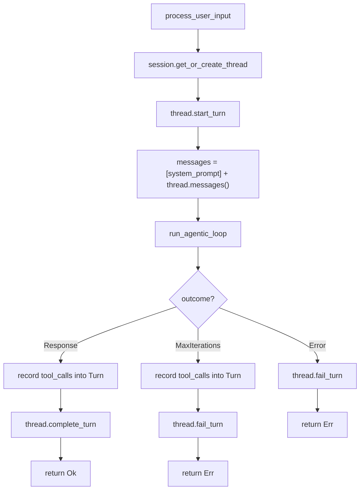

# Mini Agent WASM Session — 逐行精读教程

> **读者画像**：你是一个 C/C++ 程序员，懂 Python 和 Erlang，已经读过 mini-agent-loop 和 mini-agent-wasm 的教程。
> 本教程聚焦 **Session/Thread/Turn 会话管理模型**——这是从"玩具"到"产品"的关键一步。

---

## 目录

1. [项目全景：从无状态到有状态](#1-项目全景)
2. [工程结构与新增依赖](#2-工程结构)
3. [PART 1: LLM 层（不变）](#3-part-1-llm-层)
4. [PART 2: Session / Thread / Turn 模型（★ 核心新增）](#4-part-2-session-thread-turn)
5. [PART 3: Tool Trait & WASM 沙箱（不变）](#5-part-3-wasm-沙箱)
6. [PART 4: Tool 执行管线（Turn 感知）](#6-part-4-tool-执行管线)
7. [PART 5: Agentic Loop（Turn 集成）](#7-part-5-agentic-loop)
8. [PART 6: process_user_input — 编排层（★ 核心新增）](#8-part-6-process-user-input)
9. [PART 7: Mock LLM Provider（多轮感知）](#9-part-7-mock-llm)
10. [PART 8: OpenAI Provider（不变）](#10-part-8-openai-provider)
11. [PART 9: Main 入口（Session 管理命令）](#11-part-9-main)
12. [数据流全景图：一次多轮对话](#12-数据流全景图)
13. [Session 模型深度解析](#13-session-模型深度解析)
14. [LLDB 调试指南](#14-lldb-调试指南)
15. [与 mini-agent-wasm 的对比总结](#15-对比总结)

---

## 1. 项目全景

### 问题：mini-agent-wasm 缺什么？

mini-agent-wasm 每次用户输入都是 **从零开始**：

```
用户: "What is 42 + 58?"
Agent: "100"

用户: "Now multiply that by 3"
Agent: "I don't know what 'that' refers to."  ← 没有上下文！
```

LLM 是无状态的——它不记得上一轮对话。要实现多轮对话，你必须 **每次都把完整的对话历史发给 LLM**。

mini-agent-wasm-session 解决了这个问题，引入了三层会话模型：

```
Session (会话 — 每个用户一个)
└── Thread (线程 — 每个对话一个，可以有多个)
    └── Turn (轮次 — 每次问答一个)
        ├── user_input: "What is 42 + 58?"
        ├── response: "42 + 58 = 100"
        ├── tool_calls: [{calculator, add, 42, 58 → 100}]
        └── state: Completed
```

### 用 C 的思维理解

这就是一个 **状态管理系统**。在 C 中，你可能会这样设计：

```c
// 最简单的方案：一个全局数组存历史消息
char* message_history[1000];
int message_count = 0;

// 问题：
// 1. 多个对话怎么办？（需要多个数组）
// 2. 工具调用的中间状态怎么记录？
// 3. 怎么知道哪些消息属于同一轮问答？
```

Session/Thread/Turn 模型就是对这些问题的结构化回答：

```c
// Session/Thread/Turn 方案
struct Turn {
    char* user_input;
    char* response;
    ToolCall tool_calls[10];
    int tool_call_count;
    TurnState state;
    time_t started_at;
};

struct Thread {
    uuid_t id;
    Turn turns[100];
    int turn_count;
    ThreadState state;
};

struct Session {
    uuid_t id;
    char* user_id;
    Thread threads[10];
    int thread_count;
    int active_thread;
};
```

### 用 Erlang 的思维理解

Erlang 程序员会立刻想到 **gen_server 的 State**：

```erlang
%% mini-agent-wasm: 无状态
handle_call({user_input, Input}, _From, State) ->
    Messages = [system_prompt(), {user, Input}],  % 每次从零开始
    {reply, run_loop(Messages), State}.

%% mini-agent-wasm-session: 有状态
handle_call({user_input, Input}, _From, #state{session = Session} = State) ->
    Thread = get_active_thread(Session),
    Turn = start_turn(Thread, Input),
    Messages = rebuild_messages(Thread),  % 从 Turn 历史重建
    Result = run_loop(Messages),
    complete_turn(Turn, Result),
    {reply, Result, State#state{session = updated_session}}.
```

Session 就是 gen_server 的 State，Thread 就是一个对话上下文，Turn 就是一次 handle_call。

### 架构图

```
┌─────────────────────────────────────────────────────────────────────┐
│                        Host Process                                 │
│                                                                     │
│  ┌──────────┐    ┌──────────────────────────────────────────────┐  │
│  │  stdin    │───▶│  Main Loop (command dispatch)                │  │
│  │  stdout   │◀──│    /new, /threads, /switch, /history         │  │
│  └──────────┘    └──────────────┬───────────────────────────────┘  │
│                                 │ user input                        │
│                                 ▼                                   │
│  ┌──────────────────────────────────────────────────────────────┐  │
│  │  process_user_input()  ← ★ NEW orchestration layer           │  │
│  │    1. session.get_or_create_thread()                         │  │
│  │    2. thread.start_turn(input)                               │  │
│  │    3. messages = [system_prompt] + thread.messages()          │  │
│  │    4. outcome = run_agentic_loop(messages)                   │  │
│  │    5. record tool_calls into Turn                            │  │
│  │    6. thread.complete_turn(response)                         │  │
│  └──────────────────────┬───────────────────────────────────────┘  │
│                         │                                           │
│                         ▼                                           │
│  ┌──────────────────────────────────────────────────────────────┐  │
│  │  Agentic Loop  →  LLM  ←→  WASM Sandbox Tool                │  │
│  └──────────────────────────────────────────────────────────────┘  │
│                                                                     │
│  ┌──────────────────────────────────────────────────────────────┐  │
│  │  Session                                                      │  │
│  │  ├── Thread #1 (active)                                      │  │
│  │  │   ├── Turn 0: "Hi" → "Hello!"                            │  │
│  │  │   ├── Turn 1: "42+58?" → [calc] → "100"                  │  │
│  │  │   └── Turn 2: "×3?" → [calc] → "300"                     │  │
│  │  └── Thread #2                                                │  │
│  │      └── Turn 0: "Tell me a joke" → "..."                   │  │
│  └──────────────────────────────────────────────────────────────┘  │
└─────────────────────────────────────────────────────────────────────┘
```

---

## 2. 工程结构

### 目录结构

```
mini-agent-wasm-session/
├── Makefile                    # 构建脚本（与 mini-agent-wasm 几乎相同）
├── wit/
│   └── tool.wit                # WIT 接口定义（完全相同）
├── guest/                      # WASM 插件端（完全相同）
│   ├── Cargo.toml
│   └── src/
│       └── lib.rs              # Calculator 工具（完全相同）
└── host/                       # 宿主端（★ 核心变化在这里）
    ├── Cargo.toml              # 新增 uuid + chrono 依赖
    └── src/
        └── main.rs             # 1720 行，分 9 个 PART
```

### 与 mini-agent-wasm 的结构对比

Guest 端和 WIT 完全没变——沙箱的"合同"和"插件"不需要知道 Host 端有没有 Session 管理。变化全部在 Host 端。

### 新增依赖

```toml
# mini-agent-wasm 的 Cargo.toml 没有这两个：
uuid = { version = "1", features = ["v4"] }    # 生成唯一 ID
chrono = { version = "0.4", features = ["serde"] }  # 时间戳
```

- `uuid` — 为 Session、Thread 生成全局唯一 ID。`v4` 特性启用随机 UUID 生成。
- `chrono` — 时间处理库，比标准库的 `SystemTime` 更好用。`serde` 特性支持序列化。

**C 类比**：
- `uuid` ≈ `uuid_generate()` (libuuid)
- `chrono` ≈ `strftime()` + `gettimeofday()` 的高级封装

### host/src/main.rs 的 9 个 PART

| PART | 行数范围 | 内容 | 与 mini-agent-wasm 的关系 |
|------|---------|------|--------------------------|
| 1 | ~70-160 | LLM Types & Provider Trait | 完全相同 |
| **2** | **~160-540** | **Session / Thread / Turn** | **★ 全新** |
| 3 | ~540-780 | Tool Trait & WASM Sandbox | 完全相同 |
| **4** | **~780-830** | **Tool Execution Pipeline** | **微调（Turn 记录）** |
| **5** | **~830-920** | **Agentic Loop** | **微调（返回 tool_calls）** |
| **6** | **~920-1000** | **process_user_input** | **★ 全新** |
| 7 | ~1000-1100 | Mock LLM Provider | 微调（多轮感知） |
| 8 | ~1100-1380 | OpenAI Provider | 完全相同 |
| **9** | **~1380-1720** | **Main（Session 命令）** | **大幅扩展** |

**加粗的是需要重点阅读的部分。**

---

## 3. PART 1: LLM 层

与 mini-agent-wasm 完全相同。定义了 `Role`、`ChatMessage`、`ToolCall`、`LlmProvider` trait 等。

**已在 mini-agent-wasm 教程中详细讲解，这里不再重复。**

唯一值得注意的新增 import：

```rust
use chrono::{DateTime, Utc};
use uuid::Uuid;
```

这两个类型会在 PART 2 的 Session 模型中大量使用。

---

## 4. PART 2: Session / Thread / Turn 模型

**这是整个项目最重要的新增部分。** 约 380 行代码，定义了完整的会话管理层。

### 映射关系

```
本项目                          IronClaw 完整版
────────────────────────────    ────────────────────────────
TurnState                   →  src/agent/session.rs → TurnState
TurnToolCall                →  src/agent/session.rs → TurnToolCall
Turn                        →  src/agent/session.rs → Turn
ThreadState                 →  src/agent/session.rs → ThreadState
Thread                      →  src/agent/session.rs → Thread
Thread::messages()          →  src/agent/session.rs → Thread::messages()
Session                     →  src/agent/session.rs → Session
process_user_input()        →  src/agent/thread_ops.rs → process_user_input()
```

### TurnState — 轮次状态机

```rust
#[derive(Debug, Clone, Copy, PartialEq, Eq)]
pub enum TurnState {
    Processing,  // 正在处理
    Completed,   // 成功完成
    Failed,      // 失败
}
```

这是一个简单的三态状态机：

```
Processing ──成功──▶ Completed
     │
     └──失败──▶ Failed
```

**C 类比**：
```c
typedef enum { PROCESSING, COMPLETED, FAILED } TurnState;
```

**Erlang 类比**：
```erlang
-type turn_state() :: processing | completed | failed.
```

### TurnToolCall — 工具调用记录

```rust
#[derive(Debug, Clone)]
pub struct TurnToolCall {
    pub name: String,
    pub parameters: serde_json::Value,
    pub result: Option<serde_json::Value>,
    pub error: Option<String>,
}
```

记录一次工具调用的完整信息：调了什么工具、传了什么参数、返回了什么结果（或错误）。

**为什么要记录这些？** 因为当 LLM 需要看到对话历史时，我们需要重建完整的消息序列，包括工具调用和结果。

### Turn — 一轮问答

```rust
pub struct Turn {
    pub turn_number: usize,
    pub user_input: String,
    pub response: Option<String>,
    pub tool_calls: Vec<TurnToolCall>,
    pub state: TurnState,
    pub started_at: DateTime<Utc>,
    pub completed_at: Option<DateTime<Utc>>,
    pub error: Option<String>,
}
```

一个 Turn 代表 **一次完整的用户问答**，包括：
- 用户说了什么（`user_input`）
- Agent 回答了什么（`response`）
- 中间调用了哪些工具（`tool_calls`）
- 当前状态（`state`）
- 时间戳（`started_at`, `completed_at`）

**C 类比**：
```c
struct Turn {
    int turn_number;
    char* user_input;
    char* response;          // NULL if not completed
    TurnToolCall tool_calls[10];
    int tool_call_count;
    TurnState state;
    struct timespec started_at;
    struct timespec completed_at;  // {0,0} if not completed
    char* error;             // NULL if no error
};
```

**Erlang 类比**：
```erlang
-record(turn, {
    turn_number :: non_neg_integer(),
    user_input :: binary(),
    response :: binary() | undefined,
    tool_calls :: [turn_tool_call()],
    state :: turn_state(),
    started_at :: calendar:datetime(),
    completed_at :: calendar:datetime() | undefined,
    error :: binary() | undefined
}).
```

### Turn 的方法

```rust
impl Turn {
    pub fn new(turn_number: usize, user_input: impl Into<String>) -> Self {
        Self {
            turn_number,
            user_input: user_input.into(),
            response: None,
            tool_calls: Vec::new(),
            state: TurnState::Processing,
            started_at: Utc::now(),
            completed_at: None,
            error: None,
        }
    }
```

`impl Into<String>` — 接受任何可以转换为 `String` 的类型（`&str`、`String`、`Cow<str>` 等）。这是 Rust 的惯用模式，避免调用者手动 `.to_string()`。

**C 类比**：相当于函数接受 `const char*` 参数，内部 `strdup()` 一份。

```rust
    pub fn record_tool_call(&mut self, name: &str, parameters: serde_json::Value) {
        self.tool_calls.push(TurnToolCall {
            name: name.to_string(),
            parameters,
            result: None,
            error: None,
        });
    }

    pub fn record_tool_result(&mut self, result: serde_json::Value) {
        if let Some(tc) = self.tool_calls.last_mut() {
            tc.result = Some(result);
        }
    }

    pub fn record_tool_error(&mut self, error: String) {
        if let Some(tc) = self.tool_calls.last_mut() {
            tc.error = Some(error);
        }
    }
```

工具调用的记录是 **两步走**：
1. `record_tool_call()` — 记录"开始调用"（此时还没有结果）
2. `record_tool_result()` 或 `record_tool_error()` — 记录结果

`self.tool_calls.last_mut()` — 获取最后一个工具调用的可变引用。`last_mut()` 返回 `Option<&mut TurnToolCall>`，如果列表为空则返回 `None`。

**为什么用 `last_mut()` 而不是索引？** 因为 `record_tool_result` 总是紧跟在 `record_tool_call` 之后调用，所以最后一个元素就是刚刚记录的那个。这避免了传递索引的复杂性。

```rust
    pub fn complete(&mut self, response: impl Into<String>) {
        self.response = Some(response.into());
        self.state = TurnState::Completed;
        self.completed_at = Some(Utc::now());
    }

    pub fn fail(&mut self, error: impl Into<String>) {
        self.error = Some(error.into());
        self.state = TurnState::Failed;
        self.completed_at = Some(Utc::now());
    }
```

状态转换方法。注意 `complete` 和 `fail` 都设置了 `completed_at`——无论成功还是失败，Turn 都"结束"了。

### Thread — 对话线程

```rust
pub struct Thread {
    pub id: Uuid,
    pub session_id: Uuid,
    pub state: ThreadState,
    pub turns: Vec<Turn>,
    pub created_at: DateTime<Utc>,
    pub updated_at: DateTime<Utc>,
}
```

Thread 是 **Turn 的有序容器**。一个 Thread 代表一个完整的对话（类似 ChatGPT 的一个对话窗口）。

`Uuid` — 128 位的全局唯一标识符。`Uuid::new_v4()` 生成随机 UUID（如 `550e8400-e29b-41d4-a716-446655440000`）。

**C 类比**：`Uuid` ≈ `uuid_t`（16 字节数组）。

### Thread::start_turn() — 开始新轮次

```rust
pub fn start_turn(&mut self, user_input: impl Into<String>) -> &mut Turn {
    let turn_number = self.turns.len();
    let turn = Turn::new(turn_number, user_input);
    self.turns.push(turn);
    self.state = ThreadState::Processing;
    self.updated_at = Utc::now();
    &mut self.turns[turn_number]
}
```

返回 `&mut Turn` — 新创建的 Turn 的可变引用，调用者可以继续操作它。

`self.turns.len()` 作为 `turn_number` — 第一个 Turn 是 0，第二个是 1，以此类推。

### Thread::messages() — ★ 最关键的方法

```rust
pub fn messages(&self) -> Vec<ChatMessage> {
    let mut messages = Vec::new();

    for (turn_idx, turn) in self.turns.iter().enumerate() {
        // 1. User message
        messages.push(ChatMessage::user(&turn.user_input));

        // 2. Tool calls (if any)
        if !turn.tool_calls.is_empty() {
            // Generate synthetic tool call IDs
            let tool_calls_with_ids: Vec<(String, &TurnToolCall)> = turn
                .tool_calls
                .iter()
                .enumerate()
                .map(|(tc_idx, tc)| {
                    (format!("call_{turn_idx}_{tc_idx}"), tc)
                })
                .collect();

            // Assistant message declaring the tool calls
            let tool_calls: Vec<ToolCall> = tool_calls_with_ids
                .iter()
                .map(|(call_id, tc)| ToolCall {
                    id: call_id.clone(),
                    name: tc.name.clone(),
                    arguments: tc.parameters.clone(),
                })
                .collect();
            messages.push(ChatMessage::assistant_with_tool_calls(None, tool_calls));

            // Tool result messages
            for (call_id, tc) in &tool_calls_with_ids {
                let content = if let Some(ref err) = tc.error {
                    format!("Error: {}", err)
                } else if let Some(ref res) = tc.result {
                    match res {
                        serde_json::Value::String(s) => s.clone(),
                        other => other.to_string(),
                    }
                } else {
                    "OK".to_string()
                };
                messages.push(ChatMessage::tool_result(call_id, &tc.name, content));
            }
        }

        // 3. Assistant response (if completed)
        if let Some(ref response) = turn.response {
            messages.push(ChatMessage::assistant(response));
        }
    }

    messages
}
```

**这是整个 Session 模型最核心的方法。** 它把结构化的 Turn 历史"展平"成 LLM 期望的 ChatMessage 列表。

#### 为什么需要这个转换？

LLM API 期望的消息格式是一个 **扁平的消息列表**：

```json
[
  {"role": "system", "content": "You are a helpful assistant..."},
  {"role": "user", "content": "What is 42 + 58?"},
  {"role": "assistant", "tool_calls": [{"id": "call_0_0", "name": "calculator", ...}]},
  {"role": "tool", "tool_call_id": "call_0_0", "content": "100"},
  {"role": "assistant", "content": "42 + 58 = 100"},
  {"role": "user", "content": "Now multiply that by 3"},
  {"role": "assistant", "tool_calls": [{"id": "call_1_0", "name": "calculator", ...}]},
  {"role": "tool", "tool_call_id": "call_1_0", "content": "300"},
  {"role": "assistant", "content": "100 × 3 = 300"}
]
```

但我们存储的是 **结构化的 Turn**：

```
Turn 0: input="What is 42+58?", tool_calls=[{calc, add, 42, 58 → 100}], response="42+58=100"
Turn 1: input="Now multiply that by 3", tool_calls=[{calc, mul, 100, 3 → 300}], response="100×3=300"
```

`messages()` 方法就是做这个转换的。

#### 合成 tool_call_id

```rust
(format!("call_{turn_idx}_{tc_idx}"), tc)
```

原始的 tool_call_id（如 `call_001`）在 Turn 中没有保存——因为它是 LLM 生成的临时 ID，对于历史重建不重要。这里用 `turn_idx` 和 `tc_idx` 合成一个确定性的 ID。

**关键洞察**：tool_call_id 只需要在 **同一次 LLM 调用中** 保持一致（assistant 消息中的 id 和 tool 消息中的 tool_call_id 匹配）。用确定性的合成 ID 完全满足这个要求。

#### 每个 Turn 生成的消息序列

```
Turn (有工具调用):
  → User message          ("What is 42 + 58?")
  → Assistant message     (tool_calls: [{calculator, add, 42, 58}])
  → Tool message          (tool_call_id: "call_0_0", content: "100")
  → Assistant message     ("42 + 58 = 100")

Turn (无工具调用):
  → User message          ("Hello!")
  → Assistant message     ("Hi there!")
```

**C 类比**：这就像一个序列化函数，把内存中的结构体转换成网络协议的字节流：

```c
// 伪代码
int thread_to_messages(Thread* thread, Message* out_messages) {
    int count = 0;
    for (int i = 0; i < thread->turn_count; i++) {
        Turn* turn = &thread->turns[i];
        out_messages[count++] = make_user_msg(turn->user_input);
        if (turn->tool_call_count > 0) {
            out_messages[count++] = make_assistant_tool_calls(turn->tool_calls);
            for (int j = 0; j < turn->tool_call_count; j++) {
                out_messages[count++] = make_tool_result(&turn->tool_calls[j]);
            }
        }
        if (turn->response) {
            out_messages[count++] = make_assistant_msg(turn->response);
        }
    }
    return count;
}
```

### Session — 会话

```rust
pub struct Session {
    pub id: Uuid,
    pub user_id: String,
    pub active_thread: Option<Uuid>,
    pub threads: HashMap<Uuid, Thread>,
    pub created_at: DateTime<Utc>,
    pub last_active_at: DateTime<Utc>,
}
```

Session 是 **Thread 的容器**。一个用户可以有多个 Thread（多个对话），但同一时间只有一个 `active_thread`。

`HashMap<Uuid, Thread>` — 用 UUID 作为 key 的哈希表。

**C 类比**：
```c
struct Session {
    uuid_t id;
    char* user_id;
    uuid_t active_thread;       // 当前活跃线程的 ID
    HashTable* threads;          // uuid → Thread* 的哈希表
    struct timespec created_at;
    struct timespec last_active_at;
};
```

**Erlang 类比**：
```erlang
-record(session, {
    id :: binary(),
    user_id :: binary(),
    active_thread :: binary() | undefined,
    threads :: #{binary() => thread()},  % map
    created_at :: calendar:datetime()
}).
```

### Session 的关键方法

```rust
pub fn get_or_create_thread(&mut self) -> &mut Thread {
    match self.active_thread {
        Some(id) if self.threads.contains_key(&id) => {
            self.threads.get_mut(&id).unwrap()
        }
        _ => self.create_thread(),
    }
}
```

`match` 中的 `Some(id) if self.threads.contains_key(&id)` — 这是 **match guard**（匹配守卫）。先匹配 `Some(id)`，然后检查额外条件。如果 `active_thread` 有值但对应的 Thread 不存在（不应该发生，但防御性编程），就创建新的。

```rust
pub fn list_threads(&self) -> Vec<ThreadSummary> {
    let mut summaries: Vec<_> = self.threads.values().map(|t| {
        let first_input = t.turns.first().map(|turn| {
            let s = &turn.user_input;
            if s.len() > 40 { format!("{}...", &s[..40]) } else { s.clone() }
        });
        ThreadSummary {
            id: t.id,
            is_active: self.active_thread == Some(t.id),
            turn_count: t.turns.len(),
            state: t.state,
            created_at: t.created_at,
            first_input,
        }
    }).collect();
    summaries.sort_by(|a, b| a.created_at.cmp(&b.created_at));
    summaries
}
```

`t.turns.first().map(|turn| { ... })` — 获取第一个 Turn 的用户输入作为预览。`first()` 返回 `Option<&Turn>`，`map` 在有值时转换。

`if s.len() > 40 { format!("{}...", &s[..40]) }` — 截断长文本。注意 `&s[..40]` 在 UTF-8 字符串中可能 panic（如果第 40 字节在多字节字符中间）。这里假设输入主要是 ASCII，生产代码应该用 `s.chars().take(40)` 代替。

`summaries.sort_by(|a, b| a.created_at.cmp(&b.created_at))` — 按创建时间排序。`cmp` 返回 `Ordering`（Less/Equal/Greater），`sort_by` 用它来排序。

---

## 5. PART 3: WASM 沙箱

与 mini-agent-wasm 完全相同。包括：
- `ToolOutput`、`Tool` trait、`ToolRegistry`
- `wasmtime::component::bindgen!`
- `StoreData`、`WasiView`、`Host` trait 实现
- `WasmToolEngine`、`WasmTool`

**已在 mini-agent-wasm 教程中详细讲解，这里不再重复。**

---

## 6. PART 4: Tool 执行管线

与 mini-agent-wasm 相同的两个函数：

```rust
async fn execute_tool_with_safety(
    registry: &ToolRegistry,
    tool_name: &str,
    params: serde_json::Value,
) -> Result<String, String> { ... }

fn process_tool_result(
    tool_name: &str,
    tool_call_id: &str,
    result: &Result<String, String>,
) -> ChatMessage { ... }
```

这两个函数本身没有变化。但它们的 **调用者**（Agentic Loop）现在会把结果记录到 Turn 中。

---

## 7. PART 5: Agentic Loop（Turn 集成）

### LoopOutcome — 新增 tool_calls 记录

```rust
pub enum LoopOutcome {
    Response {
        text: String,
        tool_calls: Vec<(String, serde_json::Value, Result<String, String>)>,
    },
    MaxIterations {
        tool_calls: Vec<(String, serde_json::Value, Result<String, String>)>,
    },
}
```

与 mini-agent-wasm 的区别：`LoopOutcome` 现在携带了 `tool_calls` 信息。

`Vec<(String, serde_json::Value, Result<String, String>)>` — 一个三元组的列表：
- `String` — 工具名
- `serde_json::Value` — 参数
- `Result<String, String>` — 结果或错误

**为什么要返回 tool_calls？** 因为 `process_user_input()` 需要把它们记录到 Turn 中。Agentic Loop 本身不知道 Turn 的存在——它只负责执行循环，把结果"上报"给调用者。

**这是一个很好的关注点分离**：
- Agentic Loop 负责 LLM ↔ Tool 的循环
- `process_user_input()` 负责 Session/Turn 的管理
- 两者通过 `LoopOutcome` 通信

### run_agentic_loop — 记录 tool_calls

```rust
async fn run_agentic_loop(
    llm: &dyn LlmProvider,
    registry: &ToolRegistry,
    messages: &mut Vec<ChatMessage>,
    config: &AgenticLoopConfig,
) -> Result<LoopOutcome, String> {
    let tool_defs = registry.definitions();
    let mut recorded_tool_calls: Vec<(String, serde_json::Value, Result<String, String>)> = Vec::new();
```

新增了 `recorded_tool_calls` 向量，在循环中收集所有工具调用。

```rust
                for tc in &tool_calls {
                    let result = execute_tool_with_safety(registry, &tc.name, tc.arguments.clone()).await;
                    let result_msg = process_tool_result(&tc.name, &tc.id, &result);

                    // Record for Turn  ← 这是新增的一行
                    recorded_tool_calls.push((tc.name.clone(), tc.arguments.clone(), result));

                    messages.push(result_msg);
                }
```

每次工具执行后，除了把结果加入 messages（给 LLM 看），还记录到 `recorded_tool_calls`（给 Turn 看）。

---

## 8. PART 6: process_user_input — 编排层

**这是 mini-agent-wasm-session 最核心的新增函数。** 它把 Session 管理和 Agentic Loop 串联起来。

```rust
async fn process_user_input(
    session: &mut Session,
    llm: &dyn LlmProvider,
    registry: &ToolRegistry,
    system_prompt: &ChatMessage,
    loop_config: &AgenticLoopConfig,
    user_input: &str,
) -> Result<String, String> {
```

参数列表比 mini-agent-wasm 多了 `session`。这个函数是 **Session 感知的**。

### Step 1: 获取或创建 Thread

```rust
    let thread = session.get_or_create_thread();
    let thread_id = thread.id;
```

如果 Session 已经有活跃的 Thread，就用它；否则创建一个新的。

### Step 2: 开始新 Turn

```rust
    thread.start_turn(user_input);
    println!("  📝 Turn #{} started in thread {}", thread.turns.len(), &thread_id.to_string()[..8]);
```

`&thread_id.to_string()[..8]` — UUID 太长（36 字符），只显示前 8 个字符。

### Step 3: 从 Turn 历史重建消息 ★

```rust
    let mut messages = vec![system_prompt.clone()];
    messages.extend(thread.messages());
```

**这是与 mini-agent-wasm 最关键的区别。**

mini-agent-wasm 的做法：
```rust
// 每次从零开始
let mut messages = vec![system_prompt.clone(), ChatMessage::user(input)];
```

mini-agent-wasm-session 的做法：
```rust
// 从 Turn 历史重建完整上下文
let mut messages = vec![system_prompt.clone()];
messages.extend(thread.messages());
// thread.messages() 已经包含了当前 Turn 的 user message
// 因为 start_turn() 已经把 user_input 记录到了 Turn 中
```

`messages.extend(thread.messages())` — `extend` 把一个迭代器的所有元素追加到 Vec 中。

**这意味着**：如果这是第 3 轮对话，LLM 会看到：
```
[system_prompt]
[Turn 0 的 user + tool_calls + response]
[Turn 1 的 user + tool_calls + response]
[Turn 2 的 user]  ← 当前轮，还没有 response
```

LLM 有了完整的上下文，就能理解"that"、"it"、"the result"等指代词了。

### Step 4: 运行 Agentic Loop

```rust
    let outcome = run_agentic_loop(llm, registry, &mut messages, loop_config).await;
```

和 mini-agent-wasm 一样，但 messages 现在包含了完整的历史。

### Step 5: 记录结果到 Turn

```rust
    let thread = session.threads.get_mut(&thread_id).unwrap();

    match outcome {
        Ok(LoopOutcome::Response { text, tool_calls }) => {
            if let Some(turn) = thread.last_turn_mut() {
                for (name, params, result) in &tool_calls {
                    turn.record_tool_call(name, params.clone());
                    match result {
                        Ok(output) => turn.record_tool_result(
                            serde_json::Value::String(output.clone())
                        ),
                        Err(e) => turn.record_tool_error(e.clone()),
                    }
                }
            }
            thread.complete_turn(&text);
            Ok(text)
        }
```

**为什么要重新获取 `thread`？** 因为在 Step 3 中，`thread.messages()` 借用了 `thread`，然后 `run_agentic_loop` 拿走了 `messages` 的所有权。Rust 的借用检查器要求我们在使用完借用后才能再次获取可变引用。

`session.threads.get_mut(&thread_id).unwrap()` — 用之前保存的 `thread_id` 重新获取 Thread 的可变引用。

**C 类比**：这就像你先用指针读取了数据，然后需要修改数据时重新获取指针。在 C 中你可以一直持有指针，但 Rust 的借用检查器不允许同时存在可变和不可变引用。

### 错误处理

```rust
        Ok(LoopOutcome::MaxIterations { tool_calls }) => {
            // ... 同样记录 tool_calls ...
            thread.fail_turn("Reached maximum iterations");
            Err("Reached maximum iterations without a final response.".to_string())
        }
        Err(e) => {
            thread.fail_turn(&e);
            Err(e)
        }
```

无论成功还是失败，Turn 都会被正确地标记状态。这保证了 Turn 历史的完整性。

### process_user_input 的完整流程图



---

## 9. PART 7: Mock LLM Provider

与 mini-agent-wasm 基本相同，但增加了 **多轮感知**：

```rust
// Count conversation history to show multi-turn awareness
let turn_count = messages.iter().filter(|m| m.role == Role::User).count();
Ok(LlmResponse {
    result: LlmOutput::Text(format!(
        "I'm a mini agent with WASM sandbox + session management! \
         This is turn #{} in our conversation. I can do math! \
         Try: 'What is 42 + 58?' You said: \"{}\"",
        turn_count, last_user
    )),
    finish_reason: FinishReason::Stop,
})
```

Mock LLM 现在会告诉你这是第几轮对话——证明它确实收到了完整的历史消息。

---

## 10. PART 8: OpenAI Provider

与 mini-agent-wasm 完全相同。**已在 mini-agent-wasm 教程中详细讲解。**

---

## 11. PART 9: Main 入口

### Step 1-3: 加载 WASM + LLM + 注册工具

与 mini-agent-wasm 相同。

### Step 4: 创建 Session ★

```rust
let mut session = Session::new("cli-user");
session.create_thread();
println!("✅ Session created: {}", &session.id.to_string()[..8]);
println!("   Thread: {}", &session.active_thread.unwrap().to_string()[..8]);
```

在 IronClaw 完整版中，`SessionManager` 会为每个用户创建 Session。这里只有一个 CLI 用户，所以直接创建。

### Step 5: 主循环 — Session 管理命令

主循环新增了大量斜杠命令：

#### /new — 创建新 Thread

```rust
if input == "/new" {
    let thread = session.create_thread();
    println!("✅ New thread created: {}", &thread.id.to_string()[..8]);
    continue;
}
```

创建一个新的空 Thread 并切换到它。之前的 Thread 保留在 Session 中，可以随时切回。

#### /threads — 列出所有 Thread

```rust
if input == "/threads" {
    let summaries = session.list_threads();
    println!("\n📋 Threads ({}):", summaries.len());
    for (i, s) in summaries.iter().enumerate() {
        let active = if s.is_active { " ← active" } else { "" };
        let preview = s.first_input.as_deref().unwrap_or("(empty)");
        println!("   #{} [{}] {} turn(s) — \"{}\"{}", 
            i + 1, &s.id.to_string()[..8], s.turn_count, preview, active);
    }
    continue;
}
```

`s.first_input.as_deref()` — `Option<String>` → `Option<&str>`。`as_deref()` 把 `Option<String>` 转换为 `Option<&str>`，避免移动所有权。

#### /switch <n> — 切换 Thread

```rust
if input.starts_with("/switch ") {
    let idx_str = input.strip_prefix("/switch ").unwrap().trim();
    if let Ok(idx) = idx_str.parse::<usize>() {
        let summaries = session.list_threads();
        if idx >= 1 && idx <= summaries.len() {
            let thread_id = summaries[idx - 1].id;
            if session.switch_thread(thread_id) { ... }
        }
    }
    continue;
}
```

用户输入 `/switch 2` 切换到第 2 个 Thread。注意用户看到的编号从 1 开始（`idx - 1` 转换为 0-based 索引）。

#### /history — 显示 Turn 历史

```rust
if input == "/history" {
    if let Some(thread) = session.active_thread() {
        for turn in &thread.turns {
            let state_icon = match turn.state {
                TurnState::Completed => "✅",
                TurnState::Processing => "⏳",
                TurnState::Failed => "❌",
            };
            println!("   Turn #{} {} [{}]",
                turn.turn_number + 1, state_icon,
                turn.started_at.format("%H:%M:%S"));
            println!("     🧑 \"{}\"", input_preview);
            // ... 显示工具调用和响应 ...
        }
    }
}
```

这个命令展示了 Turn 模型的价值——你可以看到每一轮对话的完整信息，包括工具调用的参数和结果。

#### /session — 显示 Session 信息

```rust
if input == "/session" {
    println!("   ID: {}", session.id);
    println!("   User: {}", session.user_id);
    println!("   Threads: {}", session.threads.len());
    println!("   Total turns: {}",
        session.threads.values().map(|t| t.turns.len()).sum::<usize>());
}
```

`session.threads.values().map(|t| t.turns.len()).sum::<usize>()` — 统计所有 Thread 的 Turn 总数。`.sum::<usize>()` 中的 `::<usize>` 是类型标注，告诉编译器求和的结果类型。

### 提示符中的 Thread 信息

```rust
let thread_info = session.active_thread()
    .map(|t| format!("T{}:{}", t.turns.len() + 1, &t.id.to_string()[..4]))
    .unwrap_or_else(|| "?".to_string());

print!("\n🧑 [{}] You: ", thread_info);
```

提示符显示 `[T3:a1b2]`，表示"当前是第 3 轮，Thread ID 前 4 位是 a1b2"。这让你随时知道自己在哪个 Thread 的第几轮。

### 退出时的统计

```rust
if input == "quit" || input == "exit" {
    println!("👋 Goodbye! Session had {} thread(s), {} total turn(s).",
        session.threads.len(),
        session.threads.values().map(|t| t.turns.len()).sum::<usize>());
    break;
}
```

### 用户输入处理 — 通过 Session 管线

```rust
match process_user_input(
    &mut session,
    llm.as_ref(),
    &registry,
    &system_prompt,
    &loop_config,
    input,
).await {
    Ok(text) => println!("\n🤖 Agent: {}", text),
    Err(e) => println!("\n❌ Error: {}", e),
}
```

与 mini-agent-wasm 的区别：
- mini-agent-wasm 直接调用 `run_agentic_loop()`
- mini-agent-wasm-session 调用 `process_user_input()`，后者管理 Turn 并调用 `run_agentic_loop()`

---

## 12. 数据流全景图

### 一次多轮对话的完整流程

```mermaid
sequenceDiagram
    participant User as 用户
    participant Main as Main Loop
    participant PUI as process_user_input
    participant Session as Session/Thread
    participant Loop as Agentic Loop
    participant LLM as LLM
    participant WASM as WASM Sandbox

    Note over User,WASM: ═══ Turn 1: "What is 42 + 58?" ═══

    User->>Main: "What is 42 + 58?"
    Main->>PUI: process_user_input(session, input)
    PUI->>Session: thread.start_turn("What is 42+58?")
    PUI->>Session: thread.messages()
    Session-->>PUI: [User("What is 42+58?")]
    PUI->>PUI: messages = [system_prompt, User("What is 42+58?")]
    PUI->>Loop: run_agentic_loop(messages)
    Loop->>LLM: chat(messages)
    LLM-->>Loop: ToolCalls [{calculator, add, 42, 58}]
    Loop->>WASM: execute({add, 42, 58})
    WASM-->>Loop: "100"
    Loop->>LLM: chat(messages + tool_result)
    LLM-->>Loop: Text("42 + 58 = 100")
    Loop-->>PUI: Response {text, tool_calls}
    PUI->>Session: turn.record_tool_call + record_tool_result
    PUI->>Session: thread.complete_turn("42 + 58 = 100")
    PUI-->>Main: Ok("42 + 58 = 100")
    Main->>User: "🤖 Agent: 42 + 58 = 100"

    Note over User,WASM: ═══ Turn 2: "Now multiply that by 3" ═══

    User->>Main: "Now multiply that by 3"
    Main->>PUI: process_user_input(session, input)
    PUI->>Session: thread.start_turn("Now multiply that by 3")
    PUI->>Session: thread.messages()
    Session-->>PUI: [User("42+58?"), Asst(tool_calls), Tool(100), Asst("42+58=100"), User("multiply by 3")]
    PUI->>PUI: messages = [system_prompt] + 5 history messages
    PUI->>Loop: run_agentic_loop(messages)
    Loop->>LLM: chat(messages with full history)
    Note over LLM: LLM sees "that" = 100 from history
    LLM-->>Loop: ToolCalls [{calculator, mul, 100, 3}]
    Loop->>WASM: execute({mul, 100, 3})
    WASM-->>Loop: "300"
    Loop->>LLM: chat(messages + tool_result)
    LLM-->>Loop: Text("100 × 3 = 300")
    Loop-->>PUI: Response {text, tool_calls}
    PUI->>Session: record + complete_turn
    PUI-->>Main: Ok("100 × 3 = 300")
    Main->>User: "🤖 Agent: 100 × 3 = 300"
```

### messages 数组在 Turn 2 中的完整内容

```
Turn 2 发给 LLM 的 messages:
  [0] System: "You are a helpful assistant..."
  [1] User: "What is 42 + 58?"                          ← Turn 0
  [2] Assistant: {tool_calls: [{calculator, add, 42, 58}]}  ← Turn 0
  [3] Tool: {content: "100"}                              ← Turn 0
  [4] Assistant: "42 + 58 = 100"                          ← Turn 0
  [5] User: "Now multiply that by 3"                      ← Turn 1 (当前)
```

LLM 看到了完整的 Turn 0 历史，所以它知道"that"指的是 100。

---

## 13. Session 模型深度解析

### 为什么不直接存 ChatMessage 列表？

你可能会问：既然最终要转换成 ChatMessage 列表，为什么不直接存 ChatMessage？

```rust
// 方案 A：直接存消息（简单但有问题）
struct Thread {
    messages: Vec<ChatMessage>,
}

// 方案 B：存结构化的 Turn（本项目的做法）
struct Thread {
    turns: Vec<Turn>,
}
```

方案 B 的优势：

| 需求 | 方案 A（存消息） | 方案 B（存 Turn） |
|------|-----------------|------------------|
| 显示对话历史 | 需要解析消息序列 | 直接遍历 turns |
| 统计工具调用次数 | 需要过滤 + 解析 | `turn.tool_calls.len()` |
| 重试失败的 Turn | 不知道哪些消息属于同一轮 | 直接重试最后一个 Turn |
| 截断历史（token 限制） | 可能截断到一半的工具调用 | 按 Turn 粒度截断 |
| 持久化到数据库 | 需要额外的元数据 | Turn 本身就是完整的记录 |

**C 类比**：这就像数据库设计中的 **范式化 vs 反范式化**。方案 A 是反范式化（冗余但查询简单），方案 B 是范式化（结构清晰但需要 JOIN/重建）。

### Session → Thread → Turn 的层次关系

```
Session (per user)
│
├── Thread #1 "Math homework"
│   ├── Turn 0: "42+58?" → calc(add,42,58)=100 → "100" ✅
│   ├── Turn 1: "×3?" → calc(mul,100,3)=300 → "300" ✅
│   └── Turn 2: "÷0?" → calc(div,300,0)=error → "Cannot divide by zero" ✅
│
├── Thread #2 "General chat"
│   ├── Turn 0: "Hello" → "Hi there!" ✅
│   └── Turn 1: "Tell me a joke" → "Why did the..." ✅
│
└── Thread #3 "New topic"
    └── (empty — just created with /new)
```

### 与 IronClaw 完整版的映射

```
本项目 (教学版)                    IronClaw (完整版)
─────────────────────────────    ─────────────────────────────
Session (in-memory struct)    →  Session (持久化到数据库)
Thread (in-memory struct)     →  Thread (持久化 + 并发安全)
Turn (in-memory struct)       →  Turn (持久化 + 审计日志)
process_user_input()          →  thread_ops::process_user_input()
                                  + 权限检查
                                  + token 计数
                                  + 历史截断
                                  + 并发锁
Session::new("cli-user")      →  SessionManager::create_session(user_id)
                                  + 认证
                                  + 配额检查
```

教学版省略了：
- **持久化**：Session 只在内存中，程序退出就丢失
- **并发安全**：单线程，不需要锁
- **Token 管理**：不限制历史长度
- **权限控制**：没有用户认证

但 **核心数据模型和流程完全一致**。

---

## 14. LLDB 调试指南

### 编译 Debug 版本

```bash
make debug
```

### 启动 LLDB

```bash
cd host
lldb target/debug/mini-agent-wasm-session -- ../guest/target/wasm32-wasip2/debug/guest_tool.wasm
```

### Session 模型相关断点

```lldb
# Turn 生命周期
b mini_agent_wasm_session::Turn::new
b mini_agent_wasm_session::Turn::record_tool_call
b mini_agent_wasm_session::Turn::record_tool_result
b mini_agent_wasm_session::Turn::complete
b mini_agent_wasm_session::Turn::fail

# Thread 操作
b mini_agent_wasm_session::Thread::start_turn
b mini_agent_wasm_session::Thread::complete_turn
b mini_agent_wasm_session::Thread::messages

# Session 操作
b mini_agent_wasm_session::Session::create_thread
b mini_agent_wasm_session::Session::switch_thread
b mini_agent_wasm_session::Session::get_or_create_thread

# 核心编排函数
b mini_agent_wasm_session::process_user_input
```

### 调试多轮对话

```lldb
# 在 process_user_input 设断点
b mini_agent_wasm_session::process_user_input
run

# 第一轮输入 "What is 42 + 58?"
# 命中断点后：

# 查看 session 状态
p session.threads.len()
p session.active_thread

# 单步到 thread.messages() 调用
n
n
n

# 查看重建的消息数量
p messages.len()
# 第一轮应该是 2（system + user）

# 继续执行
c

# 第二轮输入 "Now multiply that by 3"
# 再次命中断点

# 查看消息数量
p messages.len()
# 第二轮应该是 6（system + Turn0的4条 + Turn1的user）
```

### 调试 Thread::messages()

```lldb
# 在 messages() 方法设断点
b mini_agent_wasm_session::Thread::messages
run

# 输入两轮对话后，在第三轮命中断点

# 查看 turns 数量
p self.turns.len()

# 查看每个 turn 的状态
p self.turns[0].state
p self.turns[0].user_input
p self.turns[0].response
p self.turns[0].tool_calls.len()

p self.turns[1].state
p self.turns[1].user_input

# 单步执行，观察消息是如何构建的
n
p messages.len()  # 每次 push 后检查
```

### 调试 Thread 切换

```lldb
b mini_agent_wasm_session::Session::switch_thread
run

# 输入 /new 创建新 thread，然后 /switch 1 切回
# 命中断点后：

p thread_id
p self.threads.len()
p self.active_thread
```

---

## 15. 与 mini-agent-wasm 的对比总结

### 代码量对比

| | mini-agent-wasm | mini-agent-wasm-session | 差异 |
|---|---|---|---|
| host/src/main.rs | 1192 行 | 1720 行 | +528 行 |
| guest/src/lib.rs | 149 行 | 149 行 | 不变 |
| wit/tool.wit | 66 行 | 66 行 | 不变 |
| **总计** | **~1400 行** | **~1935 行** | **+535 行** |

新增的 535 行主要是：
- Session/Thread/Turn 模型定义：~380 行
- process_user_input 编排函数：~80 行
- Session 管理命令（/new, /threads, /switch, /history, /session）：~75 行

### 架构层次对比

```
mini-agent-wasm:
  Main Loop → Agentic Loop → WASM Tool
  (无状态，每次从零开始)

mini-agent-wasm-session:
  Main Loop → process_user_input → Agentic Loop → WASM Tool
       ↕              ↕
  Command Dispatch   Session/Thread/Turn
  (/new, /switch)    (状态管理)
```

### 关键差异总结

| 特性 | mini-agent-wasm | mini-agent-wasm-session |
|------|----------------|------------------------|
| 对话记忆 | ❌ 无（每次从零开始） | ✅ 完整历史 |
| 多线程对话 | ❌ 无 | ✅ /new, /switch |
| Turn 追踪 | ❌ 无 | ✅ 每轮记录 |
| 工具调用记录 | ❌ 只在消息中 | ✅ 结构化存储 |
| 消息来源 | 手动构建 | Thread::messages() 重建 |
| 编排层 | 无（Main 直接调 Loop） | process_user_input() |
| 退出统计 | 无 | Thread 数 + Turn 总数 |
| 提示符 | 简单 | 显示 Turn 编号 + Thread ID |

### 不变的部分

| 组件 | 变化 |
|------|------|
| WIT 接口 | 完全不变 |
| Guest WASM 插件 | 完全不变 |
| Tool trait | 完全不变 |
| WASM 沙箱基础设施 | 完全不变 |
| OpenAI Provider | 完全不变 |
| Agentic Loop 核心逻辑 | 微调（返回 tool_calls） |

**这证明了架构的分层设计是成功的**：
- 沙箱层（WIT + Guest + WASM 基础设施）完全不受影响
- LLM 层完全不受影响
- 只有 **编排层** 和 **状态管理层** 发生了变化

### 我的理解

这个项目展示了从"无状态"到"有状态"的演进路径：

1. **mini-agent-loop**：最小可行的 Agent（无沙箱、无状态）
2. **mini-agent-wasm**：加入安全沙箱（有沙箱、无状态）
3. **mini-agent-wasm-session**：加入会话管理（有沙箱、有状态）

每一步都只增加一个关注点，其他部分保持不变。这是 **增量式架构演进** 的典范。

从 C 程序员的角度看，Session/Thread/Turn 就是一个 **内存中的数据库**。Turn 是行，Thread 是表，Session 是数据库。`Thread::messages()` 就是一个 `SELECT` 查询，把结构化数据转换成 LLM 需要的格式。

从 Erlang 程序员的角度看，这就是 **gen_server 的 State 设计**。每次 `handle_call` 都读取 State 中的历史，处理完后更新 State。Session 就是 State，Thread 就是一个对话进程的状态，Turn 就是一次消息处理的记录。

最后一个洞察：**LLM 是无状态的，但用户期望有状态的体验。** Session 模型就是弥合这个差距的桥梁——它在 LLM 之外维护状态，每次调用时把状态"注入"到 LLM 的输入中。这个模式在所有 AI Agent 框架中都是通用的。
