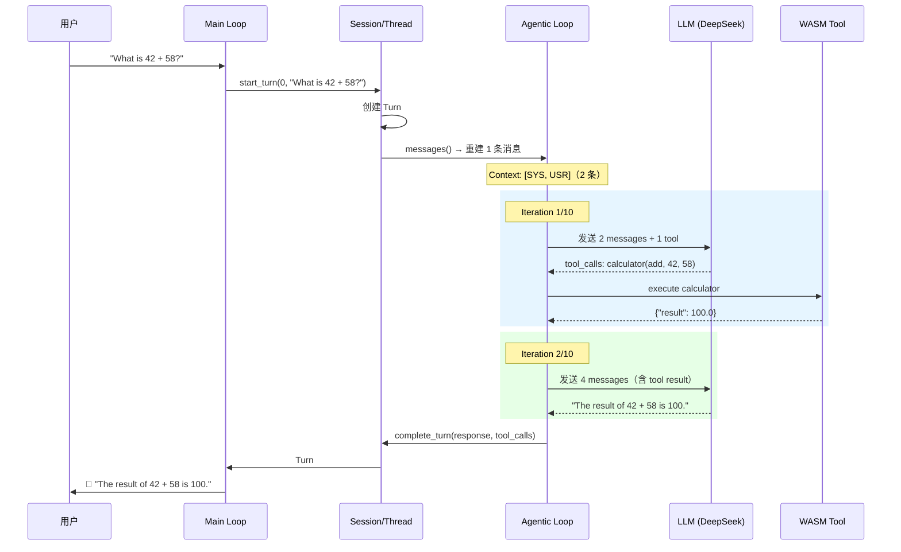

# Session Test 日志分析报告

> 基于 `session-test.log` 的完整流程分析
> 测试场景：`full`（综合测试：多轮记忆 + 多 Thread + 所有命令）
> 测试时间：2026-03-31 10:47:32
> 模型：DeepSeek-V3-0324（via http://api.haihub.cn/v1）

---

## 一、测试概览

### 输入序列（15 步）

| # | 输入 | 类型 | 目标 |
|---|------|------|------|
| 1 | `What is 42 + 58?` | 用户问题 | Thread #1 多轮记忆测试 |
| 2 | `Now multiply that result by 3` | 用户问题 | 引用上一轮结果 |
| 3 | `What was my first question?` | 用户问题 | 测试 LLM 是否记住历史 |
| 4 | `/history` | 命令 | 查看 Thread #1 的 Turn 历史 |
| 5 | `/new` | 命令 | 创建 Thread #2 |
| 6 | `What is 7 * 8?` | 用户问题 | Thread #2 独立对话 |
| 7 | `Now add 100 to that` | 用户问题 | Thread #2 多轮引用 |
| 8 | `/threads` | 命令 | 列出所有 Thread |
| 9 | `/switch 1` | 命令 | 切回 Thread #1 |
| 10 | `Do you remember what we calculated?` | 用户问题 | 验证 Thread #1 记忆完整 |
| 11 | `/history` | 命令 | 查看 Thread #1 的 4 轮历史 |
| 12 | `/switch 2` | 命令 | 切到 Thread #2 |
| 13 | `/history` | 命令 | 查看 Thread #2 的 2 轮历史 |
| 14 | `/session` | 命令 | 查看 Session 概览 |
| 15 | `quit` | 命令 | 退出 |

### 最终统计

| 指标 | 值 |
|------|-----|
| Session ID | `2c10fb56` |
| Thread 数量 | 2 |
| 总 Turn 数 | 6（Thread #1: 4 轮，Thread #2: 2 轮） |
| 总工具调用 | 6 次 calculator |
| 总 LLM 调用 | 12 次（每个 Turn 2 次：tool_call + final response） |
| 总耗时 | ~5 秒（02:47:35 → 02:47:40） |
| 错误 | 0 |

---

## 二、系统启动阶段

启动过程按顺序完成 5 个步骤：

```
┌─────────────────────────────────────────────────────────────┐
│  1. 初始化 tracing 日志系统                                   │
│     🚀 Starting Mini Agent Loop + WASM Sandbox + Session     │
├─────────────────────────────────────────────────────────────┤
│  2. 加载 WASM 工具                                           │
│     📦 guest_tool.wasm (141,583 bytes)                       │
│     ⏱️  编译耗时 ~380ms                                      │
│     🔧 工具名: calculator                                    │
│     📋 参数: operation(add/sub/mul/div), a(number), b(number)│
├─────────────────────────────────────────────────────────────┤
│  3. 加载 LLM 配置                                            │
│     📂 HAI_WOA.json                                          │
│     🤖 模型: DeepSeek-V3-0324                                │
│     🌐 API: http://api.haihub.cn/v1                          │
│     🔑 API Key: sk-322ca...                                  │
│     📋 快捷名: ds, ds31, kimi, qwen, qwen32                  │
├─────────────────────────────────────────────────────────────┤
│  4. 注册工具到 ToolRegistry                                   │
│     ✅ calculator 注册成功                                    │
│     📋 工具定义（含 JSON Schema）准备发送给 LLM               │
├─────────────────────────────────────────────────────────────┤
│  5. 创建 Session + 初始 Thread                                │
│     🆕 Session: 2c10fb56 (user: cli-user)                    │
│     🧵 Thread: a61a8f7f (Thread #1)                          │
│     ⚙️  Agentic loop: max 10 iterations                      │
└─────────────────────────────────────────────────────────────┘
```

**关键点**：Session 创建时自动创建了第一个 Thread（`a61a8f7f`），用户无需手动操作。

---

## 三、Thread #1 — 多轮记忆测试

### Turn #1：`What is 42 + 58?`



**详细数据**：

| 阶段 | 耗时 | 消息数 | Token 使用 |
|------|------|--------|-----------|
| LLM 第 1 次调用（获取 tool_call） | 740ms | 2 → LLM | prompt: 322, completion: 26 |
| WASM 工具执行 | 13ms | — | fuel: 15,668/1,000,000 |
| LLM 第 2 次调用（生成回复） | 269ms | 4 → LLM | prompt: 419, completion: 14 |
| **Turn 总耗时** | **1,028ms** | — | — |

**Session 状态变化**：
- Thread `a61a8f7f`: 0 turns → 1 turn
- Turn #0: Processing → Completed

---

### Turn #2：`Now multiply that result by 3`

**核心机制 — 多轮记忆的实现**：

这是 Session 模型最关键的一步。当用户说"that result"时，LLM 需要知道上一轮的结果是 100。

```
Thread::messages() 重建过程：
┌─────────────────────────────────────────────────────────┐
│ 从 2 个 Turn 重建 5 条 ChatMessage：                      │
│                                                         │
│ Turn #0 → [USR] "What is 42 + 58?"                      │
│         → [AST] tool_calls: calculator(add, 42, 58)     │
│         → [TOL] {"result": 100.0}                       │
│         → [AST] "The result of 42 + 58 is 100."         │
│ Turn #1 → [USR] "Now multiply that result by 3"         │
│                                                         │
│ 加上 System Prompt → 共 6 条消息发送给 LLM               │
│ 消息序列: SYS → USR → AST → TOL → AST → USR             │
└─────────────────────────────────────────────────────────┘
```

**LLM 正确理解了"that result"指的是 100**，调用了 `calculator(mul, 100, 3)` → 得到 300。

| 阶段 | 耗时 | 消息数 | Token 使用 |
|------|------|--------|-----------|
| LLM 第 1 次调用（获取 tool_call） | 368ms | 6 → LLM | prompt: 434, completion: 26 |
| WASM 工具执行 | 3ms | — | fuel: 15,640/1,000,000 |
| LLM 第 2 次调用（生成回复） | 269ms | 8 → LLM | prompt: 531, completion: 15 |
| **Turn 总耗时** | **646ms** | — | — |

---

### Turn #3：`What was my first question?`

这一轮测试 LLM 的**对话回忆能力**。

```
Thread::messages() 重建：3 个 Turn → 9 条 ChatMessage
消息序列: SYS → USR → AST → TOL → AST → USR → AST → TOL → AST → USR
共 10 条消息（含 System Prompt）
```

**LLM 回复**：`Your first question was: **"What is 42 + 58?"**` ✅ 正确！

| 阶段 | 耗时 | 消息数 | Token 使用 |
|------|------|--------|-----------|
| LLM 调用（直接回复，无工具调用） | 282ms | 10 → LLM | prompt: 546, completion: 17 |
| **Turn 总耗时** | **283ms** | — | — |

**注意**：这一轮 LLM 没有调用工具（不是数学问题），Agentic Loop 只迭代了 1 次就结束了。

---

### `/history` — 查看 Thread #1 历史

执行 `/history` 后显示了 Thread `a61a8f7f` 的 3 个 Turn：

```
📜 Turn history for thread a61a8f7f (3 turns):

   Turn #1 ✅ [02:47:35]
     🧑 "What is 42 + 58?"
     🔧 calculator(add, 42, 58) → 100
     🤖 "The result of 42 + 58 is 100."

   Turn #2 ✅ [02:47:36]
     🧑 "Now multiply that result by 3"
     🔧 calculator(mul, 100, 3) → 300
     🤖 "The result of 100 × 3 is 300."

   Turn #3 ✅ [02:47:37]
     🧑 "What was my first question?"
     🤖 "Your first question was: 'What is 42 + 58?'"
```

---

## 四、创建 Thread #2 — 对话隔离测试

### `/new` — 创建新 Thread

```
Session 状态变化：
  Thread 数量: 1 → 2
  新 Thread: e6c34b14
  Active Thread: a61a8f7f → e6c34b14（自动切换）
```

### Turn #1（Thread #2）：`What is 7 * 8?`

**关键观察 — Thread 隔离**：

```
Thread::messages() 重建：只有 1 个 Turn → 1 条 ChatMessage
消息序列: SYS → USR（只有 2 条！）
```

Thread #2 是全新的，**完全看不到 Thread #1 的任何历史**。LLM 收到的消息中没有 42+58、100、300 等任何 Thread #1 的信息。

| 阶段 | 耗时 | Token 使用 |
|------|------|-----------|
| LLM 第 1 次调用 | 385ms | prompt: 322, completion: 26 |
| WASM 工具执行 | 3ms | fuel: 15,419 |
| LLM 第 2 次调用 | 322ms | prompt: 419, completion: 15 |
| **Turn 总耗时** | **714ms** | — |

---

### Turn #2（Thread #2）：`Now add 100 to that`

**有趣的发现 — LLM 发出了重复的工具调用**：

LLM 返回了 **2 个完全相同的** tool_call（都是 `calculator(add, 56, 100)`），这是 DeepSeek 模型的一个小瑕疵。系统正确处理了这种情况——两个调用都执行了，都返回 156，最终 LLM 给出了正确答案。

```
LLM 返回的 tool_calls:
  [0] calculator(add, 56, 100) → 156  ← 正确
  [1] calculator(add, 56, 100) → 156  ← 重复，但不影响结果
```

| 阶段 | 耗时 | Token 使用 |
|------|------|-----------|
| LLM 第 1 次调用（2 个 tool_calls） | 898ms | prompt: 434, completion: 87 |
| WASM 工具执行 ×2 | 3ms + 3ms | fuel: 15,831 ×2 |
| LLM 第 2 次调用 | 292ms | prompt: 606, completion: 12 |
| **Turn 总耗时** | **1,204ms** | — |

---

## 五、Thread 切换与记忆验证

### `/threads` — 列出所有 Thread

```
📋 Threads (2):
   #1 [a61a8f7f] 3 turn(s) — "What is 42 + 58?"
   #2 [e6c34b14] 2 turn(s) — "What is 7 * 8?" ← active
```

### `/switch 1` — 切回 Thread #1

```
🔀 Switched active thread
   old_thread: e6c34b14 (Thread #2)
   new_thread: a61a8f7f (Thread #1, 3 turns)
```

### Turn #4（Thread #1）：`Do you remember what we calculated?`

**这是整个测试最关键的验证点**。

切回 Thread #1 后，系统从 4 个 Turn 重建了 11 条 ChatMessage：

```
Thread::messages() 重建：4 个 Turn → 11 条 ChatMessage
消息序列: SYS → USR → AST → TOL → AST → USR → AST → TOL → AST → USR → AST → USR
共 12 条消息（含 System Prompt）
```

**LLM 回复**：
```
Yes! Here's a summary of our calculations:
1. First, we calculated 42 + 58 and got 100.
2. Then, we multiplied that result (100) by 3 and got 300.
So, the final answer was **300**.
```

✅ **完美！** LLM 记住了 Thread #1 的完整计算历史（42+58=100, 100×3=300），没有混入 Thread #2 的内容（7×8=56, 56+100=156）。

---

## 六、最终验证

### `/history`（Thread #1）— 4 个 Turn

```
📜 Turn history for thread a61a8f7f (4 turns):
   Turn #1 ✅ "What is 42 + 58?"        → 🔧 calculator → 100
   Turn #2 ✅ "Now multiply that by 3"   → 🔧 calculator → 300
   Turn #3 ✅ "What was my first question?" → 直接回答
   Turn #4 ✅ "Do you remember...?"       → 直接回答（回忆 300）
```

### `/switch 2` + `/history`（Thread #2）— 2 个 Turn

```
📜 Turn history for thread e6c34b14 (2 turns):
   Turn #1 ✅ "What is 7 * 8?"           → 🔧 calculator → 56
   Turn #2 ✅ "Now add 100 to that"      → 🔧 calculator ×2 → 156
```

### `/session` — Session 概览

```
📊 Session info:
   ID: 2c10fb56-d2b8-4fb4-bdfd-0d1b6f0e928b
   User: cli-user
   Created: 2026-03-31 02:47:35
   Threads: 2
   Total turns: 6
   Active thread: e6c34b14 (2 turns, Idle)
   LLM: DeepSeek-V3-0324
```

---

## 七、Session 核心机制深度分析

### 7.1 消息重建机制（Thread::messages()）

这是 Session 模型的核心。每次用户输入时，系统不是简单地追加消息，而是**从结构化的 Turn 数据重建完整的 ChatMessage 列表**。

```
Turn 存储格式（结构化）          →    LLM 输入格式（扁平消息列表）
┌──────────────────────┐         ┌──────────────────────────┐
│ Turn #0              │         │ [SYS] system prompt      │
│   input: "42+58?"    │    →    │ [USR] "42+58?"           │
│   tool: calc(add)    │         │ [AST] tool_calls: [...]  │
│   result: 100        │         │ [TOL] {"result": 100}    │
│   response: "100"    │         │ [AST] "100"              │
├──────────────────────┤         ├──────────────────────────┤
│ Turn #1              │         │ [USR] "multiply by 3"    │
│   input: "×3"        │    →    │ [AST] tool_calls: [...]  │
│   tool: calc(mul)    │         │ [TOL] {"result": 300}    │
│   result: 300        │         │ [AST] "300"              │
│   response: "300"    │         │                          │
├──────────────────────┤         ├──────────────────────────┤
│ Turn #2 (当前)       │    →    │ [USR] "first question?"  │
│   input: "first?"    │         │                          │
└──────────────────────┘         └──────────────────────────┘
```

**消息数量增长规律**（从日志中提取）：

| Turn | 已有 Turn 数 | 重建消息数 | 总消息数（含 SYS） | 消息序列 |
|------|-------------|-----------|-------------------|---------|
| #1 | 0 → 1 | 1 | 2 | SYS → USR |
| #2 | 1 → 2 | 5 | 6 | SYS → USR → AST → TOL → AST → USR |
| #3 | 2 → 3 | 9 | 10 | SYS → USR → AST → TOL → AST → USR → AST → TOL → AST → USR |
| #4 | 3 → 4 | 11 | 12 | SYS → USR → AST → TOL → AST → USR → AST → TOL → AST → USR → AST → USR |

每个包含工具调用的 Turn 贡献 4 条消息（USR + AST_tool_call + TOL + AST_response），纯文本 Turn 贡献 2 条（USR + AST_response）。

### 7.2 Agentic Loop 机制

每个 Turn 内部运行一个 Agentic Loop（最多 10 次迭代）：

```
┌─────────────────────────────────────────────────────┐
│                  Agentic Loop                        │
│                                                     │
│  Iteration 1:                                       │
│    📤 发送消息给 LLM                                 │
│    📥 LLM 返回:                                     │
│       ├─ finish_reason=tool_calls → 执行工具 → 继续  │
│       └─ finish_reason=stop → 返回文本 → 结束循环    │
│                                                     │
│  Iteration 2:                                       │
│    📤 发送消息（含工具结果）给 LLM                    │
│    📥 LLM 返回:                                     │
│       └─ finish_reason=stop → 返回最终回复           │
│                                                     │
│  典型模式: 2 次迭代（1次工具调用 + 1次最终回复）      │
│  无工具时: 1 次迭代（直接回复）                       │
└─────────────────────────────────────────────────────┘
```

### 7.3 Thread 隔离验证

从日志中可以清晰看到隔离效果：

| 操作 | Thread | 重建消息数 | 包含的历史 |
|------|--------|-----------|-----------|
| Turn #1 (Thread #2) | e6c34b14 | 1 | 只有当前输入 |
| Turn #4 (Thread #1) | a61a8f7f | 11 | Thread #1 的全部 4 轮 |

切换到 Thread #2 时，LLM 的 context 中**完全没有** Thread #1 的 42+58=100 和 100×3=300。
切回 Thread #1 时，LLM 的 context 中**完全没有** Thread #2 的 7×8=56 和 56+100=156。

---

## 八、性能分析

### LLM 调用延迟

| Turn | 第 1 次 LLM 调用 | 第 2 次 LLM 调用 | 工具执行 | Turn 总耗时 |
|------|-----------------|-----------------|---------|------------|
| T1#1 (42+58) | 740ms | 269ms | 13ms | 1,028ms |
| T1#2 (×3) | 368ms | 269ms | 3ms | 646ms |
| T1#3 (first?) | 282ms | — | — | 283ms |
| T2#1 (7×8) | 385ms | 322ms | 3ms | 714ms |
| T2#2 (+100) | 898ms | 292ms | 3ms+3ms | 1,204ms |
| T1#4 (remember?) | 610ms | — | — | 612ms |

**观察**：
- 首次 LLM 调用较慢（740ms），后续稳定在 270-400ms
- WASM 工具执行极快（3-13ms），首次稍慢（冷启动）
- 无工具调用的 Turn 最快（~280ms，只需 1 次 LLM 调用）
- Turn #2 of Thread #2 最慢（1,204ms），因为 LLM 返回了 2 个重复的 tool_call

### Token 使用趋势

| Turn | Prompt Tokens | Completion Tokens | 总计 |
|------|--------------|-------------------|------|
| T1#1 iter1 | 322 | 26 | 348 |
| T1#1 iter2 | 419 | 14 | 433 |
| T1#2 iter1 | 434 | 26 | 460 |
| T1#2 iter2 | 531 | 15 | 546 |
| T1#3 | 546 | 17 | 563 |
| T1#4 | 578 | 58 | 636 |

**Prompt tokens 随 Turn 增长而线性增加**（因为每次都要发送完整历史），这是 Session 模型的固有成本。

### WASM 沙箱资源消耗

每次工具调用消耗约 15,000-16,000 fuel（总限额 1,000,000），即每次调用仅消耗 ~1.5% 的 fuel 配额。

---

## 九、完整时间线

```
02:47:35.219  🚀 系统启动
02:47:35.602  ✅ WASM 编译完成 (383ms)
02:47:35.605  ✅ LLM 配置加载
02:47:35.609  🆕 Session 2c10fb56 创建
02:47:35.609  🧵 Thread #1 a61a8f7f 创建
              ─── Thread #1 ───────────────────────────
02:47:35.609  📝 Turn #1 开始: "What is 42 + 58?"
02:47:36.351  📥 LLM → tool_call: calculator(add, 42, 58)
02:47:36.365  🔧 WASM 执行: 42 + 58 = 100
02:47:36.637  📥 LLM → "The result is 100."
02:47:36.639  ✅ Turn #1 完成 (1028ms)

02:47:36.639  📝 Turn #2 开始: "Now multiply that result by 3"
02:47:37.009  📥 LLM → tool_call: calculator(mul, 100, 3)
02:47:37.014  🔧 WASM 执行: 100 × 3 = 300
02:47:37.286  📥 LLM → "The result is 300."
02:47:37.287  ✅ Turn #2 完成 (646ms)

02:47:37.287  📝 Turn #3 开始: "What was my first question?"
02:47:37.571  📥 LLM → "Your first question was: 'What is 42 + 58?'"
02:47:37.571  ✅ Turn #3 完成 (283ms)

02:47:37.571  📋 /history → 显示 3 个 Turn
              ─── Thread #2 ───────────────────────────
02:47:37.571  🧵 /new → Thread #2 e6c34b14 创建

02:47:37.571  📝 Turn #1 开始: "What is 7 * 8?"
02:47:37.958  📥 LLM → tool_call: calculator(mul, 7, 8)
02:47:37.961  🔧 WASM 执行: 7 × 8 = 56
02:47:38.286  📥 LLM → "The result is 56."
02:47:38.287  ✅ Turn #1 完成 (714ms)

02:47:38.287  📝 Turn #2 开始: "Now add 100 to that"
02:47:39.187  📥 LLM → tool_calls: calculator(add, 56, 100) ×2
02:47:39.192  🔧 WASM 执行: 56 + 100 = 156 (×2)
02:47:39.491  📥 LLM → "Adding 100 to 56 gives you 156."
02:47:39.493  ✅ Turn #2 完成 (1204ms)
              ─── 切换与验证 ─────────────────────────
02:47:39.493  📋 /threads → 2 个 Thread
02:47:39.493  🔀 /switch 1 → 切回 Thread #1

02:47:39.493  📝 Turn #4 开始: "Do you remember what we calculated?"
02:47:40.104  📥 LLM → "Yes! 42+58=100, 100×3=300. Final answer: 300."
02:47:40.106  ✅ Turn #4 完成 (612ms)

02:47:40.106  📋 /history → Thread #1 的 4 个 Turn
02:47:40.106  🔀 /switch 2 → 切到 Thread #2
02:47:40.106  📋 /history → Thread #2 的 2 个 Turn
02:47:40.107  📊 /session → 2 threads, 6 turns
02:47:40.107  👋 quit → 退出
```

---

## 十、测试结论

### ✅ 通过的测试项

| 测试项 | 结果 | 证据 |
|--------|------|------|
| 多轮记忆 | ✅ | Turn #2 正确引用 Turn #1 的结果 100 |
| 对话回忆 | ✅ | Turn #3 正确回忆第一个问题 |
| Thread 隔离 | ✅ | Thread #2 的 context 中无 Thread #1 内容 |
| Thread 切换后记忆恢复 | ✅ | 切回 Thread #1 后 LLM 正确回忆 300 |
| /history 命令 | ✅ | 正确显示各 Thread 的 Turn 历史 |
| /threads 命令 | ✅ | 正确列出 2 个 Thread 及其摘要 |
| /switch 命令 | ✅ | 正确切换 Thread |
| /session 命令 | ✅ | 正确显示 Session 统计 |
| 工具调用 | ✅ | 6 次 calculator 调用全部成功 |
| WASM 沙箱 | ✅ | 所有工具在沙箱中安全执行 |

### ⚠️ 发现的问题

| 问题 | 严重程度 | 描述 |
|------|---------|------|
| LLM 重复工具调用 | 低 | Thread #2 Turn #2 中 LLM 返回了 2 个相同的 calculator 调用，浪费了一次执行 |
| 分析摘要 grep 不准确 | 低 | 日志末尾的 ANALYSIS SUMMARY 中 "Turn count" 显示 15（grep 匹配了所有包含 "User input received" 的行，包括命令），实际用户问题只有 6 个 |

### 核心结论

> **Session → Thread → Turn 三层模型完整工作**。多轮记忆通过 `Thread::messages()` 重建机制实现，Thread 之间完全隔离，切换后记忆完整恢复。整个测试在 ~5 秒内完成，无错误。
